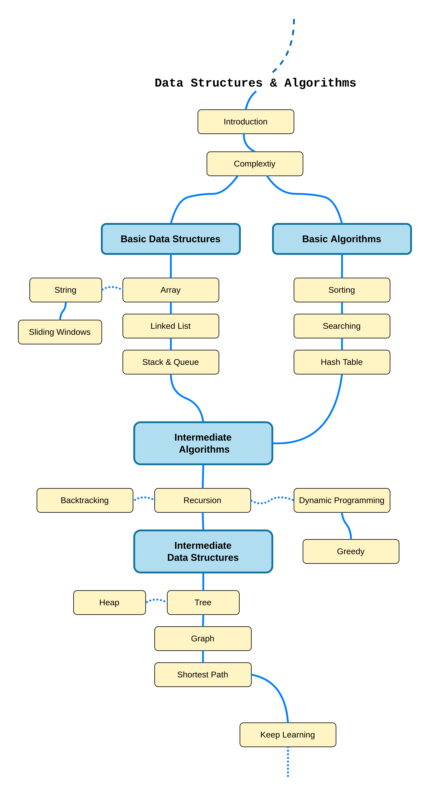

Data Structures & Algorithms
========

This project offers a curated collection of notes and resources covering fundamental and widely used data structures and algorithms. It is designed to help software engineers to prepare for coding interviews and learn more about computer science. For each topic, we provide a set of LeetCode problems and their solutions to practice after studying. You can follow the study path from beginner to intermediate level from the roadmap below, making your learning journey both structured and enjoyable. Happy coding!!

## Study Topics
- [Introduction](./topics/introduction.md)
- [Complexity](./topics/complexity.md)
- [Array & String](./topics/array.md)
- [Sorting](./topics/sorting.md)
- [Hash Table](./topics/hash-table.md)
- [Binary Search](./topics/binary-search.md)
- [Linked List](./topics/linked-list.md)
- [Stack & Queue](./topics/stack-queue.md)
- [Tree](./topics/tree.md)
- [Heap & Priority Queue](./topics/heap.md)
- [Graph](./topics/graph.md)
- [Recursion](./topics/recursion.md)
- [Dynamic Programming](./topics/dynamic-programming.md)
- [Greedy](./topics/greedy.md)
- [Shortest Path](./topics/shortest-path.md)
- [Backtracking](./topics/backtracking.md)

## Problems & Solutions
- [LeetCode Problem Listing](./leetcode/README.md)
- [Mistakes Notebooks](./leetcode/mistakes.md)
- [Problem Solving Techniques](./topics/problem-solving.md)

## Roadmap
This study path designed to guide you from a beginner to an intermediate level, covering the essential topics in this project. It's important to note that certain topics are prerequisites for others. For example, you should master "graph" before studying "shortest path".



## LICENSE

```
Copyright (c) 2022 Engine Bai

Permission is hereby granted, free of charge, to any person obtaining a copy
of this software and associated documentation files (the "Software"), to deal
in the Software without restriction, including without limitation the rights
to use, copy, modify, merge, publish, distribute, sublicense, and/or sell
copies of the Software, and to permit persons to whom the Software is
furnished to do so, subject to the following conditions:

The above copyright notice and this permission notice shall be included in all
copies or substantial portions of the Software.

THE SOFTWARE IS PROVIDED "AS IS", WITHOUT WARRANTY OF ANY KIND, EXPRESS OR
IMPLIED, INCLUDING BUT NOT LIMITED TO THE WARRANTIES OF MERCHANTABILITY,
FITNESS FOR A PARTICULAR PURPOSE AND NONINFRINGEMENT. IN NO EVENT SHALL THE
AUTHORS OR COPYRIGHT HOLDERS BE LIABLE FOR ANY CLAIM, DAMAGES OR OTHER
LIABILITY, WHETHER IN AN ACTION OF CONTRACT, TORT OR OTHERWISE, ARISING FROM,
OUT OF OR IN CONNECTION WITH THE SOFTWARE OR THE USE OR OTHER DEALINGS IN THE
SOFTWARE.
```
