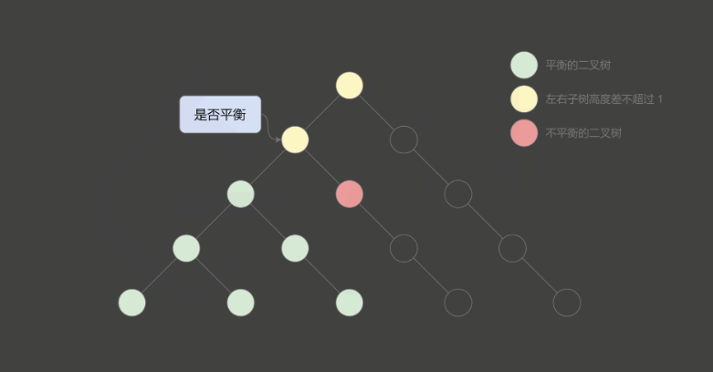

## [110. Balanced Binary Tree](https://leetcode.com/problems/balanced-binary-tree/)

### Top-Down Recursion
```kotlin
fun isBalanced(root: TreeNode?): Boolean {
    if (root == null) return true
    val leftHeight = height(root?.left)
    var rightHeight = height(root?.right)
    val diff = leftHeight - rightHeight
    return diff * diff <= 1 && isBalanced(root?.left) && isBalanced(root?.right)
}

private fun height(node: TreeNode?): Int {
    return if (node == null) 0
    else {
        1 + max(height(node?.left), height(node?.right))
    }
}

private fun max(n1: Int, n2: Int) = if (n1 > n2) n1 else n2
```

* **Time Complexity**: Calculate the height = `O(lg n)`, and we have to calculate every node `n`, the average case (every node has children) is `O(n lg n)`, but the worst case is `O(n^2)` when the tree is skewed because the height becomes `O(n)`.
* **Space Complexity**: `O(n)`.

> We can calculate the height and store it, then traversal to check. That would be `O(n)` time and space complexity.

### Bottom-Up Solution (Optimal)
* We calculate the height (left and right) and check if it is balanced at the same function call, and if it's not balanced then return -1 to indicate unbalanced.
* If it's not balanced from its child node, then it's not balanced as well for the current node.


> Source: [Solution](https://leetcode.cn/problems/balanced-binary-tree/solution/ping-heng-er-cha-shu-by-leetcode-solution/), please take a very close look at it explanation.
```kotlin
fun isBalanced(root: TreeNode?): Boolean {
    return getHeight(root) != -1
}

private fun getHeight(root: TreeNode?): Int {
    if (root == null) return 0
    
    val leftHeight = getHeight(root.left)
    val rightHeight = getHeight(root.right)
    
    if (leftHeight == -1 || rightHeight == -1 || abs(leftHeight - rightHeight) > 1) return -1
    else return 1 + max(leftHeight, rightHeight)
}
```
* **Time Complexity**: It becomes `O(n)` since we calculate the height only once for every node.
* **Space Complexity**: `O(n)`.

### My Solution (Accepted)
```kotlin
fun isBalanced(root: TreeNode?): Boolean {
    return checkBalanced(root?.left, root?.right)
}

private fun checkBalanced(n1: TreeNode?, n2: TreeNode?): Boolean {
    if (n1 == null && n2 == null) return true
    val diff = (height(n1) - height(n2))
    return (diff * diff <= 1) && checkBalanced(n1?.left, n1?.right) && checkBalanced(n2?.left, n2?.right)
}

private fun height(node: TreeNode?): Int {
    return if (node == null) 0
    else {
        1 + max(height(node?.left), height(node?.right))
    }
}

private fun max(n1: Int, n2: Int) = if (n1 > n2) n1 else n2
```

### Special Cases
It's not balanced.
```js
        1
       / \
      2   3
     /     \
    4       5
   /         \
  5           7
```