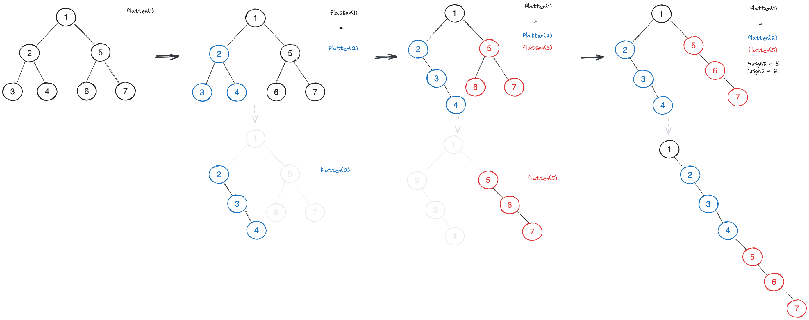
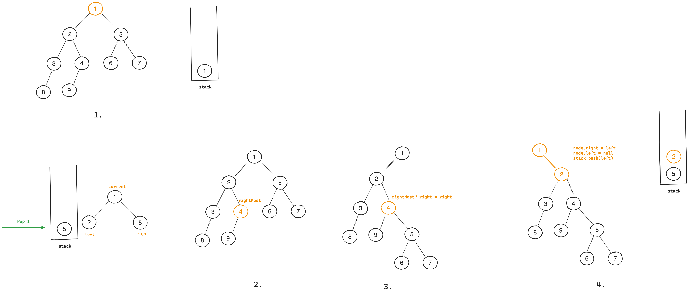
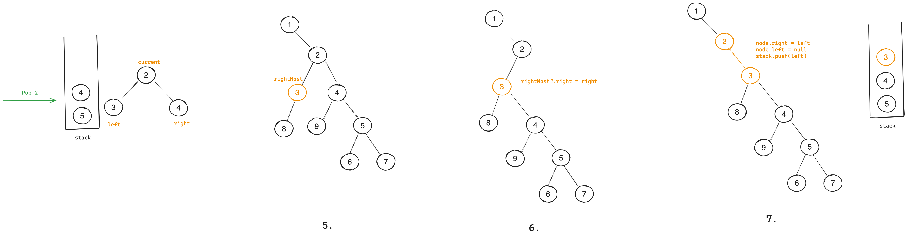
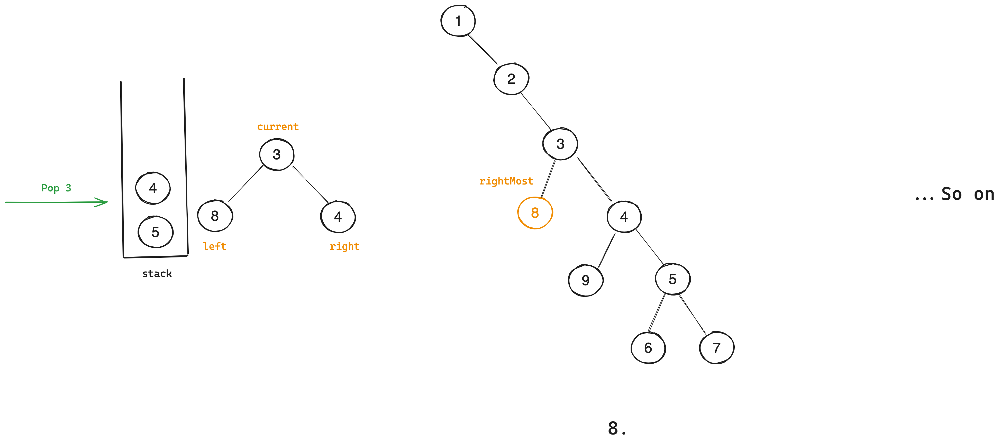

# [114. Flatten Binary Tree to Linked List](https://leetcode.com/problems/flatten-binary-tree-to-linked-list/)

## Test Cases
### Normal Cases
```
Input: 
    1
  /   \
 2     3
Output: 
    1
     \
      2
       \
        3

Input:
        1
     /     \
    2       3
   / \     / \
  4   5   6   7

Output:
        1
         \
          2
           \
            4
             \
              5
               \
                3
                 \
                  6
                   \
                    7
```
### Edge / Corner Cases
* Left skewed tree.
```
Input: 
    1
   /
  2
 /
3
Output: 
    1
     \
      2
       \
        3
```
* Right skewed tree with left child at last.
```
Input:
    1
     \
      2
     /
    3

Output:
    1
     \
      2
       \
        3
```

## Postorder
We can use postorder traversal to flatten the tree. We can abstract this problem as:
```js
dfs(root) = 

        root
      /      \
dfs(left)   dfs(right)
```

The idea is to flatten the left subtree and right subtree first, then we relink the result of `dfs(left)` after the right most node of `dfs(left)`.



```kotlin
fun flatten(root: TreeNode?) {
    if (root == null) return

    val left = root.left
    val right = root.right
    flatten(left)
    flatten(right)

    // We relink onlyl when left child is not null, 
    // otherwise, we will override right child with null.
    if (left != null) {
        root.right = left
        root.left = null

        val rightOfLeft = subtreeLast(left)
        rightOfLeft?.right = right
    }
}

private fun subtreeLast(node: TreeNode?): TreeNode? {
    return if (node?.right != null) subtreeLast(node.right!!)
    else node
}
```

## Preorder + Relink - Extra Space
We traverse the tree in preoder and store the nodes in a list. Then we relink the nodes in the list.
```kotlin
fun flatten(root: TreeNode?): Unit {
    if (root == null) return
    val preorderList = mutableListOf<TreeNode>()
    preorder(root, preorderList)
    
    for (i in 0 until preorderList.size - 1) {
        val current = preorderList[i]
        val next = preorderList[i + 1]
        
        current.right = next
        current.left = null
    }        
}

private fun preorder(root: TreeNode?, list: MutableList<TreeNode>) {
    if (root == null) return
    list.add(root!!)
    if (root.left != null) preorder(root.left!!, list)
    if (root.right != null) preorder(root.right!!, list)
}
```

* **Time Complexity**: `O(n)`, where `n` is the node of tree.
* **Space Complexity**: `O(n)`.

## Preorder + Relink - Iterative
We do a preorder traversal, and for every node, we relink the current node:
1. We relink the right subtree after the right most node of left child.
2. Move left child to right child.
3. Clear left child.
4. Go to next node.





```kotlin
// Follow the template of preorder traversal.
fun flatten(root: TreeNode?): Unit {
    if (root == null) return
    val stack = Stack<TreeNode>()
    stack.push(root)
    while (stack.isNotEmpty()) {
        val node = stack.pop()
        val left = node.left
        var right = node.right
        
        if (right != null) stack.push(right)
        if (left != null) {
            // Start of relink
            val rightMost: TreeNode? = left
            while (rightMost?.right != null) {
                rightMost = rightMost.right
            }
            rightMost?.right = right
            node.right = left
            node.left = null
            // End of relink

            stack.push(left)
        }
    }
}

private fun subtreeLast(root: TreeNode): TreeNode {
    if (root?.right != null) return subtreeLast(root.right!!)
    else return root
}
```
* **Time Complexity**: `O(n)`, where `n` is the node of tree.
* **Space Complexity**: `O(h)`, where `h` is the height of tree.

## Preorder + Relink - Space Optimization
Idea is the same, but we traversal with pointers only (removing stack or recursion).

> Nice illustration: https://leetcode.cn/problems/flatten-binary-tree-to-linked-list/solutions/356853/er-cha-shu-zhan-kai-wei-lian-biao-by-leetcode-solu/

```kotlin
fun flatten(root: TreeNode?): Unit {
    if (root == null) return
    var current: TreeNode? = root
    while (current != null) {
        val left = current.left
        val right = current.right
        if (left != null) {
            val rightMost = subtreeLast(left)
            rightMost?.right = right
            current.right = left
            current.left = null
        }
        // Here `current.right` is the "new" right child, which is original left child.
        // Because we have relinked the left child to right child above: `current.right = left`
        // This move can ensure we travese all possible (original) left child first then right child.
        current = current.right

        // This is wrong, because right is relinked to left child, we should move to the new right child.
        // current = right 
    }
}

private fun subtreeLast(root: TreeNode?): TreeNode? {
    var current: TreeNode? = root
    while (current?.right != null) {
        current = current.right
    }
    return current
}
```

* **Time Complexity**: `O(n)`, where `n` is the node of tree.
* **Space Complexity**: `O(1)`.

### Dry Run
```kotlin
        1
     /     \
    2       5
   / \     / \
  3   4   6   7

current = 1
val left = current.left                 // 1
val right = current.right               // 5
if (left != null) {
    val rightMost = subtreeLast(left)   // 4
    rightMost?.right = right            // 4.right = 5
    current.right = left                // 1.right = 2
    current.left = null                 // 1.left = null
}
current = current.right                 // 1 -> 2

        1
          \
           2
          / \
         3   4
              \
               5
              / \
             6   7 

current = 2
val left = current.left                 // 3
val right = current.right               // 4
if (left != null) {
    val rightMost = subtreeLast(left)   // 3
    rightMost?.right = right            // 3.right = 4
    current.right = left                // 2.right = 3
    current.left = null                 // 2.left = null
}
current = current.right                 // 2 -> 3

        1
          \
           2
            \
             3
              \
               4
                \
                 5
                / \
               6   7
// So on ...
```