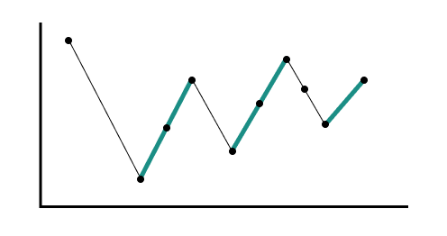

## [122. Best Time to Buy and Sell Stock II](https://leetcode.com/problems/best-time-to-buy-and-sell-stock-ii/)

### Greedy
We're going to find all the range of that prices go up. (The green line below)



We can break the profit by day, if the price of today is greater than previous day, then there will be some profit on that day.

```kotlin
fun maxProfit(prices: IntArray): Int {
    var profit = 0
    for (i in 1 until prices.size) {
        if (prices[i] > prices[i - 1]) {
            profit += prices[i] - prices[i - 1]
        }
    }
    return profit
}
```

### Dynamic Programming

```kotlin
fun maxProfit(prices: IntArray): Int {
    val dp = Array(prices.size) { _ -> IntArray(2) }
    dp[0][0] = 0
    dp[0][1] = -prices[0]
    for (i in 1 until prices.size) {
        dp[i][0] = max(dp[i - 1][0], dp[i - 1][1] + prices[i])
        dp[i][1] = max(dp[i - 1][1], dp[i - 1][0] - prices[i])
    }
    return dp[prices.size - 1][0]
}
```

```js
Day i       1	2	3	4	5	6	
Price i     7	1	5	3	6	4	
----------------------------------
dp[i][0]    0	0	4	4	7	7	
dp[i][1]    -7	-1	-1	1	1	3
```