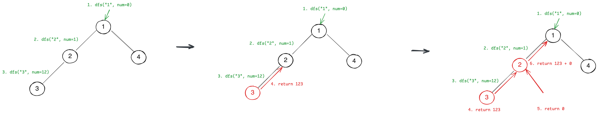
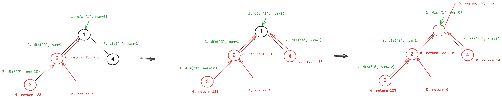

# [129. Sum Root to Leaf Numbers](https://leetcode.com/problems/sum-root-to-leaf-numbers/description/)

# Test Cases
### Normal Cases
```
Input: 
         1
      /     \
    2        3

Output: 12 + 13 = 25
```
### Edge / Corner Cases
* Not full or complete binary tree
```
Input: 
           2
        /     \ 
       3       4
     /   \
    5     7
         /
        1
Output: 235 + 2371 + 24 = 2630
```

## DFS
For `2 -> 3 -> 5`, we traverse to build the number `235`: 
* Start from `0`.
* At `2`, the number will become `0 * 10 + 2` -> `2`, then we go down to child node with `2`.
* At `3`, the number will become `2 * 10 + 3` -> `23`, then we go down to child node with `23`.
* At `5`, the number will become `23 * 10 + 5` -> `235`. And it's a leaf node, so we return `235`.


> Source: https://leetcode.cn/problems/sum-root-to-leaf-numbers/solutions/464666/qiu-gen-dao-xie-zi-jie-dian-shu-zi-zhi-he-by-leetc/

Steps by steps:


```kotlin
// Bottom-up approach
fun sumNumbers(root: TreeNode?): Int {
    return dfs(root, 0)
}

private fun dfs(root: TreeNode?, num: Int): Int {
    if (root == null) return 0
    var newNum = num * 10 + root.`val`

    if (root.left == null && root.right == null) {
        return newNum
    }

    val left = dfs(root.left, newNum)
    val right = dfs(root.right, newNum)
    return left + right
}

// Or top-down approach
private var sum = 0

fun sumNumbers(root: TreeNode?): Int {
    dfs(root, 0)
    return sum
}

private fun dfs(root: TreeNode?, num: Int) {
    if (root == null) return
    val newNum = num * 10 + root.`val`
    if (root.left == null && root.right == null) {
        sum += newNum
        return
    }
    dfs(root.left, newNum)
    dfs(root.right, newNum)
}
```

* **Time Complexity:** `O(n)`
* **Time Complexity:** `O(h)`, where `h` is the height of the tree.

## Backtracking
```kotlin
private var sum = 0
fun sumNumbers(root: TreeNode?): Int {
    dfs(root, ArrayDeque<Int>())
    return sum
}

private fun dfs(root: TreeNode?, numbers: ArrayDeque<Int>) {
    if (root == null) return

    numbers.addLast(root.`val`)
    if (root.left == null && root.right == null) {
        sum += numbers.toInt()
        numbers.removeLast()
        return
    }
    dfs(root.left, numbers)
    dfs(root.right, numbers)
    numbers.removeLast()
}

private fun ArrayDeque<Int>.toInt(): Int {
    var num = 0
    for (i in 0 until this.size) {
        num = num * 10 + this[i]
    }
    return num
}
```

* **Time Complexity:** `O(n)`
* **Time Complexity:** `O(n)`

## BFS
For every node, we enqueue the current number and the node to the queue. If the node is a leaf node, we sum the number.

* For `2 -> 3 -> 5`, we traverse to build the number `235`: 
  * We enqueue `(2 to 0)`.
  * At `2`, the number will become `0 * 10 + 2` -> `2`. We enqueue `(3 to 2)`.
  * At `3`, the number will become `2 * 10 + 3` -> `23`. We enqueue `(5 to 23)`.
  * At `5`, the number will become `23 * 10 + 5` -> `235`. And it's a leaf node, so we sum it.

```kotlin
fun sumNumbers(root: TreeNode?): Int {
    if (root == null) return 0
    var totalSum = 0
    val queue = ArrayDeque<Pair<TreeNode, Int>>()
    queue.addLast(root to 0)
    while (queue.isNotEmpty()) {
        val pair = queue.removeFirst()
        val node = pair.first
        val sum = pair.second

        val newSum = sum * 10 + node.`val`
        if (node.left == null && node.right == null) {
            totalSum += newSum
            continue
        }

        if (node.left != null) {
            queue.addLast(node.left to newSum)
        }

        if (node.right != null) {
            queue.addLast(node.right to newSum)
        }
    }
    return totalSum
}
```

* **Time Complexity:** `O(n)`
* **Time Complexity:** `O(n)`, where `n` is the number of nodes in the tree.