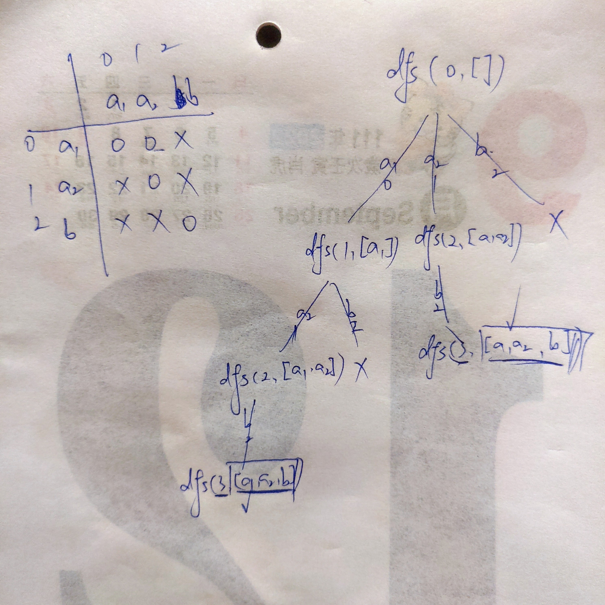

## [131. Palindrome Partitioning](https://leetcode.com/problems/palindrome-partitioning)

```kotlin
class Solution {

    private val results = mutableListOf<List<String>>()

    fun partition(s: String): List<List<String>> {
        val dp = findAllPalindromes(s)
        dfs(s, 0, mutableListOf<String>(), dp)
        return results
    }

    private fun findAllPalindromes(s: String): Array<BooleanArray> {
        val dp = Array(s.length) { _ -> BooleanArray(s.length) }
        for (i in s.length - 1 downTo 0) {
            for (j in i until s.length) {
                if (i == j) dp[i][j] = true
                else if (j == i + 1) dp[i][j] = s[i] == s[j]
                else dp[i][j] = dp[i + 1][j - 1] && s[i] == s[j]
            }
        }
        return dp
    }

    private fun dfs(s: String, startIndex: Int, partition: MutableList<String>, dp: Array<BooleanArray>) {
        if (startIndex == s.length) {
            results.add(ArrayList(partition))
            return
        }
        for (i in startIndex until s.length) {
            if (dp[startIndex][i]) {
                partition.add(s.substring(startIndex..i))
                dfs(s, i + 1, partition, dp)
                partition.removeAt(partition.size - 1)
            }
        }
    }
}
```

