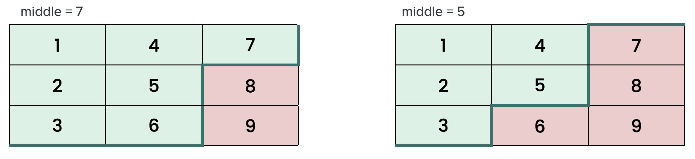

# [1351. Count Negative Numbers in a Sorted Matrix](https://leetcode.com/problems/count-negative-numbers-in-a-sorted-matrix/description/)

## Brute Force
We can count the negative numbers in the matrix by iterating each element.

```python
def countNegatives(self, grid: List[List[int]]) -> int:
    m, n = len(grid), len(grid[0])
    count = 0
    for i in range(m):
        for j in range(n):
            if grid[i][j] < 0:
                count += 1
    return count
```
* **Time Complexity**: `O(m * n)`.
* **Space Complexity**: `O(1)`.

## Count in Z-shape
Since each row (column) is sorted, we can count the negative numbers in a Z-shape.

```
++++++
++++--
++++--
+++---
+-----
+-----
```



We start from left-botton corner, and move up to right-top corner, and count the negative numbers in each column.

```python
def countNegatives(self, grid: List[List[int]]) -> int:
    m = len(grid)
    n = len(grid[0])

    r = m - 1
    c = 0
    count = 0
    while c < n:
        while 0 <= r and grid[r][c] < 0:
            r -= 1
        count += m - r - 1
        c += 1
        
    return count

## Equivalently, starting from right-top corner, and move down to left-bottom corner.
def countNegatives(self, grid: List[List[int]]) -> int:
    count = 0
    n = len(grid[0])
    negIndex = n - 1

    for r in grid:
        while negIndex >= 0 and r[negIndex] < 0:
            negIndex -= 1
        
        count += (n - negIndex - 1)
    
    return count
```

* **Time Complexity**: `O(m + n)`.
* **Space Complexity**: `O(1)`.

## Binary Search in Each Row (Column)
For each row (column), we can use binary search to find the first negative number, and the count of negative numbers will be `n - index`.

```kotlin
fun countNegatives(grid: Array<IntArray>): Int {
    var count = 0
    for (i in 0 until grid.size) {
        val index = binarySearch(grid[i])
        println(index)
        count += grid[i].size - index
    }
    return count
}

private fun binarySearch(array: IntArray): Int {
    var left = 0
    var right = array.size - 1
    while (left <= right) {
        val middle = left + (right - left) / 2
        if (0 <= array[middle]) {
            left = middle + 1
        } else {
            right = middle - 1
        }
    }
    return left
}
```

* **Time Complexity**: `O(m * lg(n))`.
* **Space Complexity**: `O(1)`.