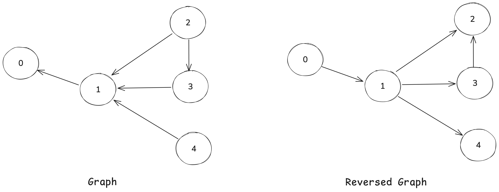
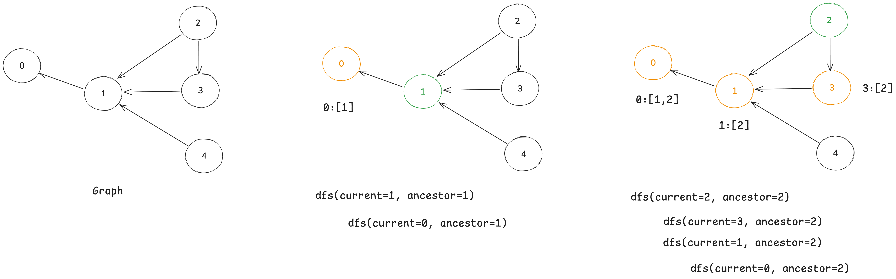

# [2192. All Ancestors of a Node in a Directed Acyclic Graph](https://leetcode.com/problems/all-ancestors-of-a-node-in-a-directed-acyclic-graph/description/)

> NOTE: (Problem description) Return a list answer, where `answer[i]` is the list of ancestors of the `ith` node, **sorted in ascending order**.

## DFS on Reversed Graph

The path `u -> ... -> v` indicates `u` is ancestor of `v`, and `answer[v]` = all ancestors of `v` node, which is all the nodes `u` that can reach `v`.

For the graph `{U -> V}`, `U` is an ancestor of `V`. We can build a reversed graph `{V -> U}` and do a DFS from each node (`V`) to find all ancestors (`U`), **all the visited node druing the traversal** are ancestors of the current node.



```js
Graph: A -> B -> C
Reversed: A <- B <- C

A: []
B: [A]
C: [A, B]
```

```kotlin
fun getAncestors(n: Int, edges: Array<IntArray>): List<List<Int>> {
    val graph = buildReversedGraph(n, edges)
    val answer = mutableListOf<List<Int>>()
    for (i in 0 until n) {
        val visited = HashSet<Int>()
        dfs(graph, i, visited)

        // We need to sort the ancestors in ascending order
        // And node itself is not an ancestor of itself
        visited.remove(i)
        val ancestors = visited.toList().sorted()
        answer.add(ancestors)
    }
    return answer
}

// Simple DFS
private fun dfs(graph: Array<HashSet<Int>>, current: Int, visited: HashSet<Int>) {
    if (current !in visited) return
    visited.add(current)
    graph[current].forEach { adj ->
        dfs(graph, adj, visited)
    }
}

private fun buildReversedGraph(n: Int, edges: Array<IntArray>): Array<HashSet<Int>> {
    // Or we can use adjacent list to build the graph: `Array(n) { hashSetOf<Int>() }`
    val graph = Array(n) { hashSetOf<Int>() }
    for (e in edges) {
        val from = e[0]
        val to = e[1]
        graph[to].add(from)
    }
    return graph
}
```

- **Time Complexity:** `O(n * m + n^2)` where `n` is the number of nodes and `m` is the number of edges.
  - `O(n + m)` to build the reversed graph.
  - `O(n) * O(n + m)` to find all ancestors for each node.
- **Space Complexity:** `O(n + m)` for the graph and `O(n)` for the answer.

## DFS on Original Graph

Node `0` is ancestor of which nodes? Start a DFS (or BFS) from node `0` as source, and add `0` as ancestor to all reachable nodes during traversal. We iteate each node as ascentor, and do a DFS to find all descendants of the current node, add the current node to all descendants.



```js
// Iterate from 0 to n - 1
dfs(0) // add 0 to all descendants: adding 0 to a, b, c, x, y
    dfs(a)
        dfs(x)
        dfs(y)
    dfs(b)
    dfs(c)
dfs(1) // add 1 to all descendants: adding 1 to a, c, x, z
    dfs(a)
        dfs(z)
    dfs(c)
    dfs(x)
...
dfs(n - 1)
    ...
```

```kotlin
fun getAncestors(n: Int, edges: Array<IntArray>): List<List<Int>> {
val graph = buildGraph(n, edges)
    val ans = Array(n) { mutableListOf<Int>() }
    for (i in 0 until n) {
        dfs(graph, i, i, hashSetOf(), ans)

        // Here we don't have to sort the ancestors, because we add them in ascending order
        // ans[i].sort()
    }
    return ans.toList()
}

private fun dfs(graph: Array<HashSet<Int>>, i: Int, ancestor: Int, visited: HashSet<Int>, ans: Array<MutableList<Int>>) {
    if (i in visited) return
    visited.add(i)
    if (i != ancestor) ans[i].add(ancestor)
    graph[i].forEach { adj ->
        dfs(graph, adj, ancestor, visited, ans)
    }
}
private fun buildGraph(n: Int, edges: Array<IntArray>): Array<HashSet<Int>> {
    val adjArray = Array(n) { hashSetOf<Int>() }
    for ((from, to) in edges) {
        adjArray[from].add(to)
    }
    return adjArray
}
```

- **Time Complexity:** `O(n * m + n^2)` where `n` is the number of nodes and `m` is the number of edges.
  - `O(n + m)` to build the reversed graph.
  - `O(n) * O(n + m)` to find all ancestors for each node.
- **Space Complexity:** `O(n + m)` for the graph and `O(n)` for the answer.

## Topological Sort (BFS)

A _topological sort_ of a directed acyclic graph (DAG) is a _linear ordering_ of all vertices such that `x -> y` which `x` is the ancestor of `y`. In the topological order, all the ancestors of the node `i` are the nodes that come before `i` in the topological order. (0 ~ i - 1)

```js
// If we have a graph and topological order:
topological order: [0 -> 1 -> 2 -> 3 -> 4]

// Then the ancestors of node 2 are 0 and 1
answer[0] = []
answer[1] = [0]
answer[2] = [0, 1]
answer[3] = [0, 1, 2]
answer[4] = [0, 1, 2, 3]
```

We add the topological order during the BFS traversal:

```js
A -> B
c    adj
topologicalOrder[A] = []

topologicalOrder[B].add(A)
topologicalOrder[B].addAll(topologicalOrder[A]) = addAll([]) = [A]

// --------------------------------
A -> B -> C
     c    adj
topologicalOrder[A] = []
topologicalOrder[B] = [A]

topologicalOrder[C].add(B)
topologicalOrder[C].addAll(topologicalOrder[B]) = addAll([A]) = [A, B]

// --------------------------------
A -> B -> C -> D
          c    adj
topologicalOrder[A] = []
topologicalOrder[B] = [A]
topologicalOrder[C] = [A, B]

topologicalOrder[D].add(C)
topologicalOrder[D].addAll(topologicalOrder[C]) = addAll([A, B]) = [A, B, C]
```

```kotlin
fun getAncestors(n: Int, edges: Array<IntArray>): List<List<Int>> {
    val indegree = IntArray(n)
    val adjacentList = Array(n) { mutableListOf<Int>() }
    for ((from, to) in edges) {
        indegree[to]++
        adjacentList[from].add(to)
    }

    val queue = ArrayDeque<Int>()
    // We use set to store the ancestors to avoid duplicates
    val topologicalOrder = Array(n) { HashSet<Int>() }
    for (i in 0 until n) {
        if (indegree[i] == 0) queue.addLast(i)
    }

    while (queue.isNotEmpty()) {
        val current = queue.removeFirst()
        adjacentList[current].forEach { adj ->
            // See above explanation:
            // Topological order:
            // A -> B -> C -> D
            //           ^ parent
            //                ^ adj
            // Then C is ancestor of D, and all ancestors of C are ancestors of D
            // See above example
            // O(n^2)
            topologicalOrder[adj].add(current)
            topologicalOrder[adj].addAll(topologicalOrder[current])

            if (--indegree[adj] == 0) queue.addLast(adj)
        }
    }

    val answer = mutableListOf<MutableList<Int>>()
    for (i in 0 until n) {
        // We convert the topological order to a sorted list by using `TreeSet`
        answer.add(ArrayList(TreeSet(topologicalOrder[i])))
    }
    return answer
}
```

- **Time Complexity:** `O(m * n + n^2 log n)` where `n` is the number of nodes and `m` is the number of edges.
    - Building the adjacency list and indegree array: `O(m)`, where `m` is the number of edges.
    - BFS traversal (topological sort): Each node is processed once, and each edge is processed once, so `O(n + m)`.
    - For each edge (from current to adj), we merge ancestor sets:
        - In the worst case, each node could have up to `O(n)` ancestors, and for each edge, we may add up to `O(n)` elements.
        - There are `O(m)` edges, so the total cost for all addAll operations is `O(m * n)` in the worst case.
    - Sorting the ancestor sets for each node: For each node, sorting up to `O(n)` ancestors is `O(n log n)`, for `n` nodes: `O(n^2 log n)`.

- **Space Complexity:** `O(n^2 + n + m)`.
    - Each node can have up to `O(n)` ancestors, so `O(n^2)` for the ancestor sets.
    - `O(n + m)` for the graph representation.

## Topological Sort (DFS)

> TODO: Copied from ChatGPT, it's AC, but not fully understand yet.

```kotlin
fun getAncestorsDFS(n: Int, edges: Array<IntArray>): List<List<Int>> {
    val graph = Array(n) { mutableListOf<Int>() }
    val ancestors = Array(n) { sortedSetOf<Int>() } // Use SortedSet for automatic sorting
    val visited = BooleanArray(n)

    // Step 1: Build Graph
    for ((from, to) in edges) {
        graph[to].add(from) // Reverse graph for easier ancestor lookup
    }

    // Step 2: DFS with Memoization
    fun dfs(node: Int) {
        if (visited[node]) return
        visited[node] = true
        for (parent in graph[node]) {
            dfs(parent)
            ancestors[node].addAll(ancestors[parent]) // Merge ancestor lists
            ancestors[node].add(parent)
        }
    }

    // Step 3: Run DFS on each node
    for (i in 0 until n) {
        dfs(i)
    }

    return ancestors.map { it.toList() } // Convert to sorted list
}
```
