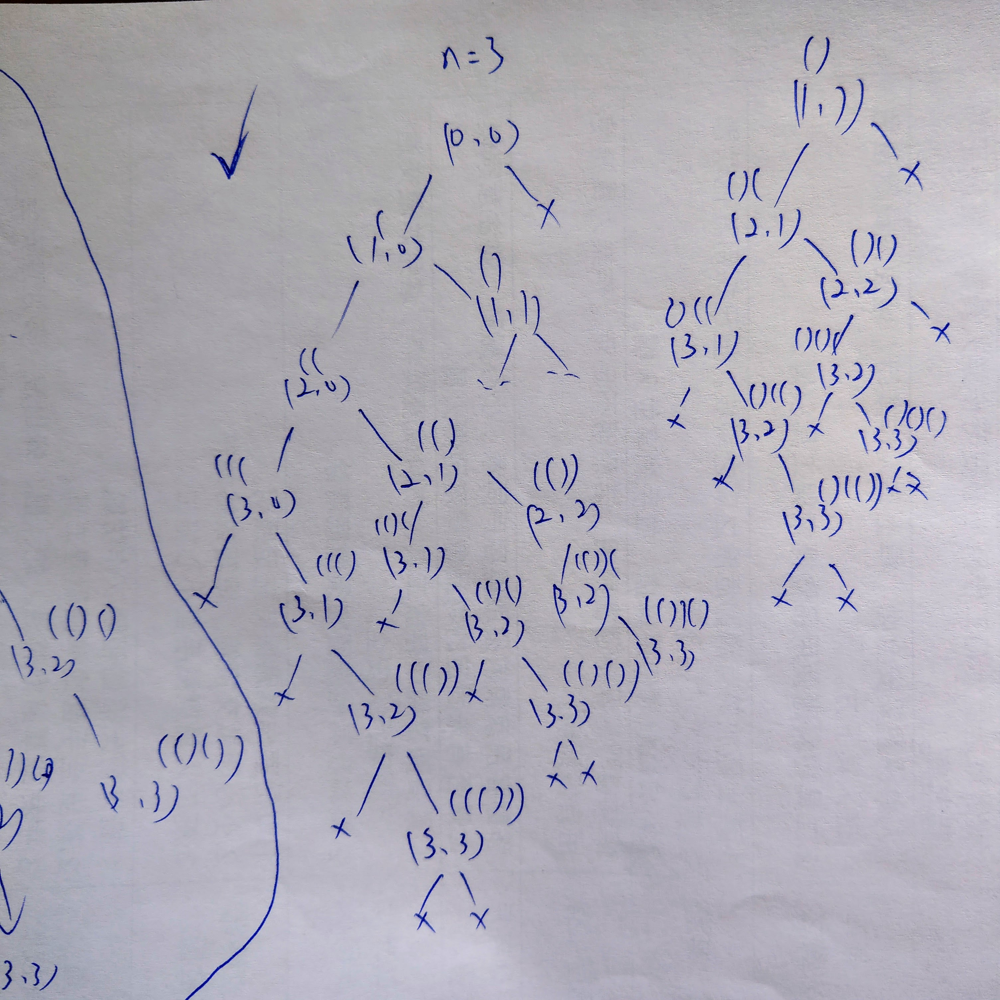

## [22. Generate Parentheses](https://leetcode.com/problems/generate-parentheses/)

A valid parentheses pair meets two requirements:
1. The number of left and right parentheses are equal.
2. The left parenthese number >= right in the prefix of valid parenthese pair, such `((()`, `((())` or `((()))`.

And final result will meets the requirement: left parentheses total number is equal to right one.

### DFS (Backtracking)
We use (`left`, `right`) (the parentheses number) to represent every node, we can either choose left or right parenthese, that will form a full binary tree for every possible combination.

> (3, 2) means 3 `(` and 2 `)` in the string.

But we have to meet the valid rules (tree pruning):
1. If `left` (left parentheses number) < `n`, we can put `(`.
2. If `right` < `left`, we can put `)`.

And we can run either DFS or BFS to traverse every node to form the result string. 
Here we use DFS:
1. We start from `left` = 0 and `right` = 0, `str` is empty.
2. If `left` < `n`, we can put `(` and we increment `left`.
3. If `right` < `left` (not match), then put `)` to match and increment `right`.
4. If `left` = `right` = `n`, return the `str`. (A valid pair)

> You can draw a binary tree for `n = 2`, that would be really helpful!

```kotlin
class Solution {

    private val results = mutableListOf<String>()

    fun generateParenthesis(n: Int): List<String> {
        dfs(n, 0, 0, "")
        return result
    }

    private fun dfs(n: Int, left: Int, right: Int, str: String) {
        // Print the node
        if (left == n && right == n) {
            results.add(str)
        } else {
            // Traverse left subtree
            if (left < n) {
                dfs(n, left + 1, right, str + "(")
            } 
            // Traverse right substree
            if (right < left && right < n) {
                dfs(n, left, right + 1, str + ")")
            }
        }
    }
}
```



Or we can use remaining count:

```kotlin
private val results = mutableListOf<String>()

fun generateParenthesis(n: Int): List<String> {
    dfs(n - 1, n, "(")
    return results        
}

private fun dfs(left: Int, right: Int, str: String) {
    if (left > right) return
    if (left == 0 && right == 0) {
        results.add(str.toString())
        return
    }
    if (left > 0) dfs(left - 1, right, str + "(")
    if (right > 0) dfs(left, right - 1, str + ")")
}
```

### References
> * [DFS](https://leetcode.cn/problems/generate-parentheses/solution/shen-du-you-xian-bian-li-zui-jian-jie-yi-ypti/)
> * [Tree](https://leetcode.cn/problems/generate-parentheses/solution/pei-yang-chou-xiang-si-wei-hui-su-jie-fa-7dwu/)

> We also can use BFS to traverse to generate all combination. 