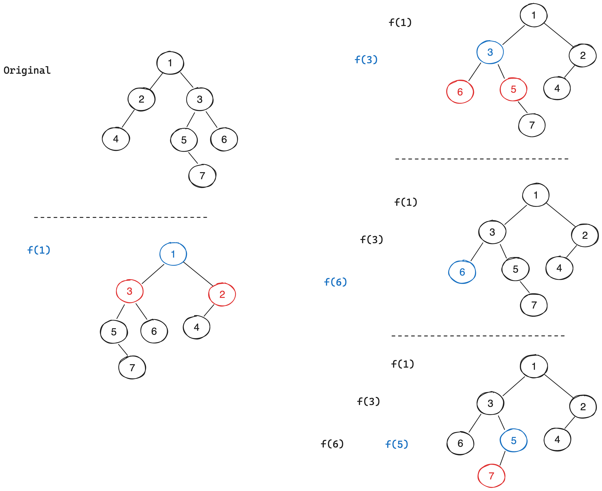

# [226. Invert Binary Tree](https://leetcode.com/problems/invert-binary-tree/)

## Clarification Questions
* No, it's clear from problem description.


> Source: https://leetcode.cn/problems/invert-binary-tree/solutions/73159/dong-hua-yan-shi-liang-chong-shi-xian-226-fan-zhua/
 
## Test Cases
### Normal Cases
```
Input: 
        1
      /   \
     2     3
    / \   / \
   4   5 6   7  
Output: 
        1
      /   \
     3     2
    / \   / \
   7   6 5   4  

Input:
    1
   /
  2
Output:
    1
     \
      2
```
### Edge / Corner Cases
* Empty tree or single node.
```
Input: [], 1
Output: [], 1
```
* Tree with skewed subtree.
```
Input:
        1
     /     \
    2       3
   /       / \ 
  0       4   5
        /  \
       6    7
           /
          8
Output:
        1
     /     \
    3       2
   /  \      \
  5    4      0
     /   \
    7     6
     \
      8 
```

## Recursive
We can invert the left and right subtrees first (postorder), then exchange the left and right child node for current root node.
```kotlin
fun invertTree(root: TreeNode?): TreeNode? {
    if (root == null) return null
    // We have to preserve the original left and right child here, in case of references changes after inverting.
    
    // Wrong results: 
    // root.left = invertTree(root.right)
    // root.right = invertTree(root.left)
    
    val left = root.left
    val right = root.right
    root.left = invertTree(right)
    root.right = invertTree(left)
    
    return root
}
```

Or we can traverse every node and swap the left and right child node. (not swapping the value only)

```kotlin
fun invertTree(root: TreeNode?): TreeNode? {
    if (root == null) return null
    val temp = root.left
    root.left = root.right
    root.right = temp

    invertTree(root.left)
    invertTree(root.right)
    return root
}
```
* **Time Complexity**: `O(n)`, where `n` is the node of tree.
* **Space Complexity**: `O(h)`, where `h` is the height of tree.

## Iterative
We travese the tree and swap the left and right child node.
```kotlin
fun invertTree(root: TreeNode?): TreeNode? {
    if (root == null) return null
    // Use stack or queue
    val stack = Stack<TreeNode>()
    stack.push(root)
    while (!stack.isEmpty()) {
        val node = stack.pop()
        // Swap here, other part is the same as preorder
        swapChildNode(node)
        if (node.right != null) stack.push(node.right)
        if (node.left != null) stack.push(node.left)
    }
    return root
}

private fun swapChildNode(node: TreeNode?) {
    val temp = node?.left
    node?.left = node?.right
    node?.right = temp
}
```
* **Time Complexity**: `O(n)`, where `n` is the node of tree.
* **Space Complexity**: `O(h)`, where `h` is the height of tree.