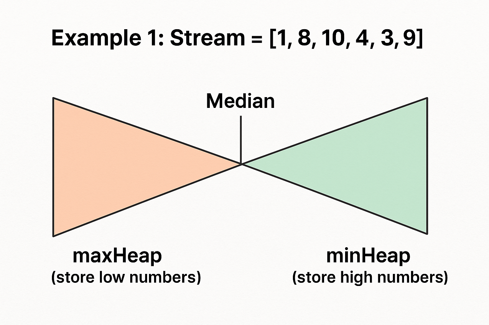

## [295. Find Median from Data Stream](https://leetcode.com/problems/find-median-from-data-stream/)

**Idea!** If our number list is always sorted, then it's quite easy to find the median quickly.
We use two heaps to store the numbers, min heap to store half of numbers that are greater than median and max heap to store half of numbers that are less than median.

* We choose the correct heap to add (comparing with median)
* We have to re-balance the two heaps so that its size difference will be within 1.



```js
Min Heap:
    3
   / \
  4   5

Max Heap:
    2
   / \
  1   0

Median = 3
```

```js
Min Heap:
    3
   / \
  4   5

Max Heap:
    2
   /
  1

Median = (3 + 2) / 2
```


```kotlin
class MedianFinder() {
    
    // We use min heap to store numbers greater than median
    private val minHeap = PriorityQueue<Int>() { n1, n2 -> n1 - n2 }
    // We use max heap to store numbsers less thant median
    private val maxHeap = PriorityQueue<Int>() { n1, n2 -> n2 - n1 }

    fun addNum(num: Int) {
        if (minHeap.isEmpty() || num >= minHeap.peek()) {
            minHeap.add(num)
            
            // Re-balance the two heaps to make sure that the size difference will be <= 1
            if (minHeap.size > maxHeap.size + 1) {
                maxHeap.add(minHeap.poll())
            }
        } else {
            maxHeap.add(num)

            // Re-balance two heaps
            if (maxHeap.size > minHeap.size) {
                minHeap.add(maxHeap.poll())
            }
        }
    }

    fun findMedian(): Double {
        // For odd size
        return if (minHeap.size > maxHeap.size) minHeap.peek().toDouble()
        // For even size
        else (minHeap.peek().toDouble() + maxHeap.peek().toDouble()) / 2.0
    }
}

/**
 * Your MedianFinder object will be instantiated and called as such:
 * var obj = MedianFinder()
 * obj.addNum(num)
 * var param_2 = obj.findMedian()
 */
```

* **Time Complexity**: `O(lg n)` for `addNum()` and `O(1)` for `findMedian()`.
* **Space Complexity**: `O(n)`.

### Test Cases
```js
[1, 2, 3]
[-1, -2, -3] 
```