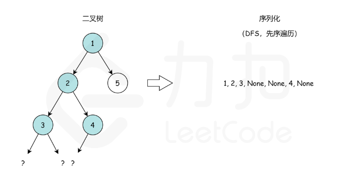

## [297. Serialize and Deserialize Binary Tree](https://leetcode.com/problems/serialize-and-deserialize-binary-tree/)
Key points:

* We have to add special notation for the child node of leaf.
* We can serialize to pre-order traversal and also can deserialize from pre-order traversal.


> Source: https://leetcode.cn/problems/serialize-and-deserialize-binary-tree/solution/er-cha-shu-de-xu-lie-hua-yu-fan-xu-lie-hua-by-le-2/

> Nice illustration:
> * https://leetcode.cn/problems/serialize-and-deserialize-binary-tree/solution/shou-hui-tu-jie-gei-chu-dfshe-bfsliang-chong-jie-f/

```kotlin
/**
 * Definition for a binary tree node.
 * class TreeNode(var `val`: Int) {
 *     var left: TreeNode? = null
 *     var right: TreeNode? = null
 * }
 */
class Codec() {
    
    private val nullString = "n"
    private val itemSeparator = ","
    
    fun serialize(root: TreeNode?): String {
        if (root == null) return ""
        val traversals = mutableListOf<String>()
        preOrderTraversal(root, traversals)
        return traversals.joinToString(itemSeparator)
    }
    
    fun deserialize(data: String): TreeNode? {
        if (data.isEmpty()) return null
        
        val traversals = data.split(itemSeparator).toMutableList()
        return buildTree(traversals)
    }
    
    private fun preOrderTraversal(node: TreeNode?, results: MutableList<String>) {
        results.add(if (node != null) node.`val`.toString() else nullString)
        if (node == null) return
        preOrderTraversal(node?.left, results)
        preOrderTraversal(node?.right, results)
    }
    
    // Key functions
    private fun buildTree(traversals: MutableList<String>): TreeNode? {
        if (traversals.first() == nullString) {
            traversals.removeAt(0)
            return null
        }
        val newNode = TreeNode(traversals.first().toInt())
        traversals.removeAt(0)
        newNode.left = buildTree(traversals)
        newNode.right = buildTree(traversals)
        return newNode
    }
}

/**
 * Your Codec object will be instantiated and called as such:
 * var ser = Codec()
 * var deser = Codec()
 * var data = ser.serialize(longUrl)
 * var ans = deser.deserialize(data)
 */
 ```

## BFS
> My Solution, WA.

```kotlin
/**
 * Definition for a binary tree node.
 * class TreeNode(var `val`: Int) {
 *     var left: TreeNode? = null
 *     var right: TreeNode? = null
 * }
 */
// Failed Cases: [1,2,3,null,null,4,5,6,7]
class Codec() {
    
    private val nullValue = Int.MAX_VALUE
    private val nullNode = TreeNode(nullValue)
    private val nullString = "@"
    private val itemSeparator = ","
    
    fun serialize(root: TreeNode?): String {
        if (root == null) return ""
        
        val bfsList = bfs(root)
        return bfsList.joinToString(itemSeparator)
    }
    
    fun deserialize(data: String): TreeNode? {
        if (data.isEmpty()) return null
        
        // [1, a, 2, a, a, 3, a, a, a, a, a, a, 4, a, a]
        //     1
        //    / \
        //   a   2
        //  / \ / \
        // a  a 3  a
        // ...
        val splits = data.split(itemSeparator)
        val root = TreeNode(splits[0].toInt())
        //   i
        //  / \
        // 2i 2i+1
        buildTree(root, splits, 0)
        return root
    }
    
    private fun buildTree(node: TreeNode, splits: List<String>, index: Int) {
        val leftIndex = index * 2 + 1
        val rightIndex = index * 2 + 2
        if (leftIndex >= splits.size && rightIndex >= splits.size) return
        val leftValue = splits.getOrNull(leftIndex) ?: nullString
        val rightValue = splits.getOrNull(rightIndex) ?: nullString
        
        if (leftValue != nullString) {
            node.left = TreeNode(leftValue.toInt())    
            buildTree(node.left, splits, leftIndex)
        }
        if (rightValue != nullString) {
            node.right = TreeNode(rightValue.toInt())
            buildTree(node.right, splits, rightIndex)
        }
    }
    
    private fun bfs(root: TreeNode): List<String> {
        val results = mutableListOf<String>()
        val queue = ArrayDeque<TreeNode>()
        queue.addLast(root)
        while (!queue.isEmpty()) {
            val node = queue.removeFirst()
            
            val value = node.`val`
            if (value == nullValue) {
                results.add(nullString)
                continue
            } else {
                results.add(value.toString())
            }

            queue.addLast(if (node.left != null) node.left!! else nullNode)
            queue.addLast(if (node.right != null) node.right!! else nullNode)
        }
        return results
    }
}

/**
 * Your Codec object will be instantiated and called as such:
 * var ser = Codec()
 * var deser = Codec()
 * var data = ser.serialize(longUrl)
 * var ans = deser.deserialize(data)
 */