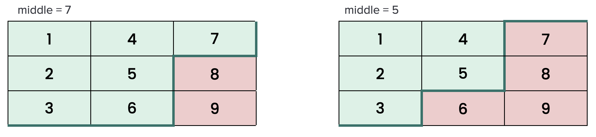

# [378. Kth Smallest Element in a Sorted Matrix](https://leetcode.com/problems/kth-smallest-element-in-a-sorted-matrix/)

## Hints
- The matrix is sorted in both rows and columns. What does this tell you about the minimum and maximum values?
- Can you think of this as finding the first number that has at least `k` elements less than or equal to it?
- What if you could count how many elements are less than or equal to a given value efficiently?

## Breakdowns

> 1. Can we use a heap to find the kth smallest element?

Yes, we can use a max heap to keep track of the k smallest elements, but this approach doesn't leverage the sorted property of the matrix.

> 2. Can we treat each row as a sorted list and merge them?

Yes, we can use a min heap to merge the sorted rows, similar to k-way merge. This is more efficient than the brute force approach.

> 3. Can we use binary search on the value range?

Yes! Since the matrix is sorted, we can binary search on the value range from `matrix[0][0]` to `matrix[n-1][n-1]`. For each value, we can count how many elements are less than or equal to it.

## Key Insights

The key insight is that **this problem can be converted to finding the first number that meets a specific condition** - having at least `k` elements less than or equal to it. This is a classic "binary search on value" pattern.

**Monotonicity**: Given a value `x`, if `count(≤x) < k`, then the kth smallest element must be greater than `x`. If `count(≤x) ≥ k`, then the kth smallest element must be less than or equal to `x`.

**Lower bound**: `matrix[0][0]` (the minimum value in the matrix).

**Upper bound**: `matrix[n-1][n-1]` (the maximum value in the matrix).

**Feasibility**: For any value `x`, we can efficiently count how many elements in the matrix are less than or equal to `x` by traversing the matrix in a specific pattern that leverages the sorted property.

The matrix being sorted in both rows and columns means:
- The smallest element is at `matrix[0][0]`
- The largest element is at `matrix[n-1][n-1]`
- For any value `x`, all elements `≤x` form a "staircase" pattern from the top-left

This problem matches the **binary search on answer space** pattern, where we search for the first value that satisfies a condition.

## Heap Approach

We can use a max heap to keep track of the k smallest elements. This approach doesn't leverage the sorted property but is straightforward.

```kotlin
fun kthSmallest(matrix: Array<IntArray>, k: Int): Int {
    val maxHeap = PriorityQueue<Int>() { n1, n2 -> n2 - n1 }
    for (r in 0 until matrix.size) {
        for (c in 0 until matrix[r].size) {
            maxHeap.add(matrix[r][c])
            if (maxHeap.size > k) maxHeap.poll()
        }
    }
    return maxHeap.peek()!!
}
```

- **Time Complexity**: `O(n² log k)`
- **Space Complexity**: `O(k)`

## K-way Merge Approach

We can treat each row as a sorted list and use a min heap to merge them, similar to the k-way merge pattern.

```kotlin
fun kthSmallest(matrix: Array<IntArray>, k: Int): Int {
    val minHeap = PriorityQueue<Pair<Int, Int>>() { p1, p2 -> 
        matrix[p1.first][p1.second] - matrix[p2.first][p2.second]
    }
    
    // Add first element of each row to heap
    for (row in 0 until matrix.size) {
        minHeap.add(row to 0)
    }

    var kk = k
    // Poll k - 1 times
    while (1 < kk && minHeap.isNotEmpty()) {
        val (row, col) = minHeap.poll()
        if (col + 1 < matrix[0].size) {
            minHeap.add(row to (col + 1))
        }
        kk--
    }
    
    // The kth smallest number
    val (row, col) = minHeap.peek()
    return matrix[row][col]
}
```

- **Time Complexity**: `O(k log n)`, where `k` is the number of elements in the matrix, and `n` is the number of rows or columns in the matrix.
- **Space Complexity**: `O(n)`, where `n` is the number of rows or columns in the matrix.

## Binary Search on Value (Optimal)

The key insight is to binary search on the value range and count how many elements are less than or equal to each value.

```kotlin
fun kthSmallest(matrix: Array<IntArray>, k: Int): Int {
    val n = matrix.size
    var left = matrix[0][0]
    var right = matrix[n - 1][n - 1]
    
    while (left <= right) {
        val middle = left + (right - left) / 2
        val count = countLessOrEqual(matrix, middle)
        
        if (count < k) {
            left = middle + 1
        } else {
            right = middle - 1
        }
    }
    return left
}

private fun countLessOrEqual(matrix: Array<IntArray>, target: Int): Int {
    val n = matrix.size
    var count = 0
    var row = n - 1
    var col = 0
    
    while (row >= 0 && col < n) {
        if (matrix[row][col] <= target) {
            count += row + 1
            col++
        } else {
            row--
        }
    }
    return count
}
```

- **Time Complexity**: `O(n log(max - min))` where `max` and `min` are the maximum and minimum values in the matrix
- **Space Complexity**: `O(1)`

## Edge Cases

- `k = 1` (smallest element) or `k = n²` (largest element)
- Matrix with duplicate values
- Matrix with all same values
- `k` is exactly the count of elements less than or equal to a value that doesn't exist in the matrix

## Pitfalls

- **Returning immediately when count equals k**: The value that gives `count == k` might not exist in the matrix. We need to continue shrinking the search space until `left > right`.
- **Incorrect counting algorithm**: Must leverage the sorted property to count efficiently in `O(n)` time, not `O(n²)`.
- **Off-by-one errors**: Be careful with the binary search loop condition and return value.

## Similar or Follow-up Problems

- @875.koko-eating-bananas.md
- @2594.minimum-time-to-repair-cars.md
- @373.find-k-pairs-with-smallest-sums.md
- @240.search-a-2d-matrix-ii.md

---

## My Original Notes

## Heap
```kotlin
fun kthSmallest(matrix: Array<IntArray>, k: Int): Int {
    val maxHeap = PriorityQueue<Int>() { n1, n2 -> n2 - n1 }
    for (r in 0 until matrix.size) {
        for (c in 0 until matrix[r].size) {
            maxHeap.add(matrix[r][c])
            if (maxHeap.size > k) maxHeap.poll()
        }
    }
    return maxHeap.peek()!!
}
```

* **Time Complexity**: Iterating all item in the matrix takes `O(n^2)`, and `add()` / `poll` takes `O(lg k)`, total takes `O(n^2 lg k)`.
* **Space Complexity**: `O(k)` for heap, but the worst case is `k = n^2`, so it's `O(n^2)` which does not meet the requirement.

## K-way Merge
We can treat the matrix as `n` sorted linked list, and we can use a min heap to store the smallest element of each list. We can add the first element of each row to the heap, and then we can poll the smallest element from the heap and add the next element of the same row to the heap. We repeat this process `k` times.

```js
1  3  6 => 1 -> 3 -> 6
           p1
2  5  8 => 2 -> 5 -> 8
                p2
4  7  9 => 4 -> 7 -> 9
                p3
```

> 矩陣的規則是：如果 `matrix[i][j]` 是目前最小的，那麼 `matrix[i][j+1]` 或者 `matrix[i+1][j]` 才有可能是下一個最小的。如果 `matrix[i][j]` 不是最小，那麼他相鄰的也一定不是最小的。
> 我們使用類似 BFS 的思路，把 `matrix[i][j]` 當作一個點，每次從 heap 中取出最小的點，然後把他的相鄰點加入 heap。

```kotlin
fun kthSmallest(matrix: Array<IntArray>, k: Int): Int {
    val minHeap = PriorityQueue<Pair<Int, Int>>() { p1, p2 -> 
        matrix[p1.first][p1.second] - matrix[p2.first][p2.second]
    }
    for (row in 0 until matrix.size) {
        minHeap.add(row to 0)
    }

    var kk = k
    // Poll k - 1 times
    while (1 < kk && minHeap.isNotEmpty()) {
        val pair = minHeap.poll()
        if (pair.second + 1 < matrix[0].size) {
            minHeap.add(pair.first to (pair.second + 1))
        }
        kk--
    }
    
    // The kth smallest number
    val peek = minHeap.peek()
    return matrix[peek.first][peek.second]
}
```

- **Time Complexity**: `O(k * log n)`, where `k` is the number of elements in the matrix, and `n` is the number of rows or columns in the matrix.
- **Space Complexity**: `O(n)`, where `n` is the number of rows or columns in the matrix.

## Binary Search (Optimal)
The matrix rows and columns are sorted, so the minimum must be `A[0][0]` and the maximum must be at `A[n-1][n-1]`:

**Monotonicity**: The Kth smallest elements exists in the range `A[0][0]..A[n-1][n-1]`, given a number `middle` in the range `left..right`, then the count of all numbers `<= middle` will be the left portion of the matrix. It will be within the range that are covered during search.



We can set `left` and `right` to be the minimum and maximum value in the matrix, and we can apply binary search to find the Kth smallest number in the matrix. It's similiar to [240. Search a 2D Matrix II](../leetcode/240.search-a-2d-matrix-ii.md) but the search space is reduced by the count of numbers that are `<= middle`.

* **Search Space Reduction**: **Actually, the problem can be converted to search the first number that meets the specific condition** (The pattern is similar to [278. First Bad Version](../leetcode/278.first-bad-version.md)), condition is `count(<=X) is k`.

We can count how many numbers `k` in the matrix, we can reduce the search space by this count. If the count `< k`, then we search the right part, otherwise, we search the left part. Here we don't return the value immediately when `count == k`, because the value might not be in the matrix, it just matches the count, so we keep shrinking the search space until breaking the while loop. 

* **Result Guarantee**: The Kth smallest number must be in `left..right`, and we keep reducing the search space by the condition `the count <= k` until `left == right`, then the value is what we're looking for.

Why does the Kth smallest number is the value in the matrix when breaking the loop?

```
To my understanding, the reason why it is assured that answer will be in matrix is :
Suppose n = 8 is not in matrix but has countLessOrEqual(8)>=k then we go to find value less than n now. Suppose answer is 6(and lies in matrix) the when we reach 6 countLessOrEqual(6) >=k still ans as we store min, ans=6. Now we again go left but now countLessOrEqual(<6) will be <k as element 6 will not be counted in countLessOrEqual now.

In the end, lo == hi. lo is the smallest number satisfying that count(lo)>=k. let's assume that lo doesn't exist in matrix. We must have the biggest num in matrix that is less than lo. Because ans didn't exist in matrix, so count(num) >= k also holds which contradicts our previous assumption that lo is the smallest. So lo does exist in matrix.
```

```
If there are less than k elements in the range of [matrix[0][0], mid], we increment mid by 1 and assign it to low. Then if there are more or equal to k elements in the range of [matrix[0][0], mid+1]

mid+1 is our answer because it's mid+1 that causes count to increase from less than k to greater or equal to k, and mid+1 has to be in the matrix otherwise this would never happen.

count < k will always be false to trigger high=mid; namely low should stay still at mid+1, waiting for high to meet it, since there are always more than k elements in the range of [matrix[0][0], t]where high >= t >= mid+1 , and t is the only value we would get from all the following operations of low + (high-low)/2 given now low is mid+1.

Also, since we started low from matrix[0][0] and would not reassign value greater than mid+1 to it. We never miss our answer.
```

```
Most binary search we can check target=mid during the search and return. But this one we cannot because the first mid we find with rank k might not exist in the matrix. Continuing the binary search finds the smallest number with rank k. For example, rank(lo-1)=k-1 and rank(lo)=k. If lo is not in the matrix, then rank(lo-1)=rank(lo)=k-1. So the smallest/first number that ranks k in the matrix must exist in the matrix.
```

```
For those who don't understand why it's guaranteed to have lo as an element in the matrix, here is my two cents.

Basically, the method in the solution is a variation of binary search to "find the first occurrence of an element".

The count is the number of elements less or equal to mid, given the "matrix[i][j] > mid "in the while condition.
There are two scenarios:
Single Kth smallest element in matrix.
[1,2,3,5]
[2,3,5,7]
[3,5,8,9]
[5,8,9,13]
k = 11
Result = 7

This ensures count equals to k at a point, in which it includes the kth smallest element in the matrix. At the moment, binary search shrinks high boundary to mid, instead of returning mid in the regular binary search. You can imagine it as "hi" is waiting at the right spot for "lo" to meet him. (Like dating!)

Multiple Kth smallest element in matrix.
[1,2,3,5]
[2,3,5,7]
[3,7,8,9]
[7,8,9,13]
k = 9
Result = 7

Count won't be equal to k, but "hi" is still guaranteed to stop at right spot. In the above example, the count is 11 when "mid" is 7. After "hi" shrinks to mid, it will not move until "lo" comes to him.

To sum up, "lo" is ensured to reach an authentic element in the matrix, because "hi" will approach and sit at the right spot anyway.
```

```
My attempt to explain some parts of the code and logic. What the author of this discussion explained above in their post is a good place to start.
Our main goal in each iteration of the while loop is to count how many numbers we found that were smaller than our mid. Suppose in any one iteration our count returned was 'x'.
1. if 'x' was smaller than K, that means we counted 'x' numbers but we still counted less than K, so our goal is not yet reached. So we go towards it by incrementing our
lo to be mid+1.
2. else if their'x' was greater than K, that means we counted 'x' numbers and that count went more than K, so we need to go back a little. Hence we decrement our hi to
be mid-1.
Some people might ask: "How are we sure that our mid will always be a number that is present in our matrix and why does it work?"
To answer your question: We don't care if mid is a number actually present in the matrix or not, because the key to solving this problem is NOT whether our mid's value is equal to the Kth smallest element. The key to this solution is the "count." So no matter the value of mid, we come to our conclusion depending on the range of our "count."
```

```
如题解中所说，如果 num >= k，那么说明最终答案 x <= mid；如果 num < k，那么说明最终答案 x > mid。
在最后一次迭代时，check返回的结果为false，即 num < k，说明 x > mid，又因为 x <= right。当 left = mid + 1 后，left > righ，while循环结束。此时有 mid < x <= right < left = mid + 1，即 mid < x <= mid + 1。可得 x = mid + 1 = left。

在[left, right]中符合条件(count(矩阵中小于它的数)==k)的数可能会有多个，这些数中，最小的那个(设为a)一定在矩阵中，对于任意整数i(i<a) ，count(i)<k，直到i等于a时，count将第一次等于k。因此二分查找找到第一个使count==k的位置，也就是c++里lower_bound所求的位置，就一定是所求。

首先，要明确这种二分模式的终止条件，一定是 left == right。（你可以试试把循环终止条件改成：left != right，把返回结果改为right，照样能通过。具体原因就是二分的事情，和本题无直接关系）
无论mid在第K小的数左边或右边，left和right会随之而变动引起right-left变小，但又永远保持left <= 第K小的数 <= right。
那么，当left和right无限逼近第K小的数过程中，最后结果永远都是left == 第K小的数 == right，所以我们把终止条件设置成left != right（或者 left < right），这个时候left或者right就是我们想找的第K小的数。

最后，来看一些细节，举个你可能会产生疑问的例子：某次迭代，小于等于mid的数恰好是K个，但这不代表mid == 第K小的数；因为，mid可能大于第K小的数，但又不存在矩阵中；此次迭代后，right的值大于第K小的数，但又不存在矩阵中。
可以预见，在经历一定次数的迭代后，最终left == 第K小的数，而mid的值域是[left, right)。很显然，由于mid >= left，所以小于等于mid的数依然恰好是K个，那么right == mid，右边继续缩小。
在后续的迭代中，left保持不变，right一直减小，直到right == left == 第K小的数。
```

```
If the mid variable converges to an integer, a_mid, which is not the kth smallest element, a_k, in the array.
Then, a_mid should be bigger than a_k, if not the count will be less than k and a_mid will increase.
Therefore, lo<=a_k<a_mid<=hi will be true, and the loop ends at lo=hi, which means a_mid has to equal to a_k.

Looks like a squeeze theorem.
```

```
if count<k , meaning that you need to make mid become bigger.
else, meaning that you should limit the high.
then you get low == high and k == count.

"find the first occurrence of an element".

How lo will always be an element in the matrix array in the end ? In the end, lo == hi. lo is the smallest number satisfying that count(lo)>=k. **let's assume that lo doesn't exist in matrix.** We must have the biggest num in matrix that is less than lo. Because ans didn't exist in matrix, so count(num) >= k also holds which contradicts our previous assumption that lo is the smallest. So lo does exist in matrix.
```

Based on the above characteristics, we can apply binary search: We set `left` and `right` to the minimum and maximum first, we calculate the `middle` based on left and right, and we count the item numbers that is <= `middle`.
    * If `count < k`, the range is not covered `k`, we search right part.
    * Otherwise `(count >= k)`, we search left part.

> 答案的上限是 `matrix[0][0]`,下限是 `matrix[N-1][N-1]`．对于这个区间的任意一个`ｘ`，我们可以计算出这个矩阵里小于等于 `ｘ`的元素有多少，定义为 `smallerOrEqual(x)`，如果 `smallerOrEqual(x)<k`，说明这个 `ｋ` 太小了不是想要的答案，应该往上调整. 反之 `smallerOrEqual(x)>=k`，说明 `ｋ`可能是答案，但可以再缩小一点试一试。
>
> `count(≤middle) ≥ k` 表示可能是解，但有可能太大，必要但是不充分。二分夾擠最後夾出第一個滿足 `count(<=middle) ≤ k`，再小一點就不會滿足這條件

```kotlin
fun kthSmallest(matrix: Array<IntArray>, k: Int): Int {
    val n = matrix.size
    var left = matrix[0][0]
    var right = matrix[n - 1][n - 1]
    var result = 0
    while (left <= right) {
        val middle = left + (right - left) / 2
        val count = countLessOrEqual(matrix, middle)

        /**
         * We won't return immediately if count == k, because it the middle might not be the value in the matrix, it's just count match.
         * Or see failed case:
         * [
         *  [1, 2]
         *  [1, 3]
         * ]
         * k = 1
         * if (count == k) return middle
         */

        // But we can update the result when (count == k)
        if (count == k) result = middle

        // |------------------| matrix
        //            k
        // |------| count
        // count is too small that the search range doesn't cover the kth smallest number.
        if (count < k) {
            // search right part
            left = middle + 1
        } else {
            // k <= count, that means the current search range covers the kth smallest number,
            // so we have to update the result, and search left part
            right = middle - 1
        }
    }
    return result
}
```

This lead to WA:
```kotlin
if (count < k) {
    left = middle + 1
} else if (count == k) {
    result = middle
    right = middle - 1
} else if (k < count) {
    right = middle - 1
}
```

Failed at the test case:
```
[
 [1,2]
 [3,3]
]
k = 3
```

Or equivalently, we don't update the answer when `count == k`, we try to find the first number that meets the condition `countLessOrEqual() == k`, then we can return the `left` pointer when while loop breaks.

```kotlin
fun kthSmallest(matrix: Array<IntArray>, k: Int): Int {
    val n = matrix.size
    var left = matrix[0][0]
    var right = matrix[n - 1][n - 1]
    var result = left
    while (left <= right) {
        val middle = left + (right - left) / 2
        val count = countLessOrEqual(matrix, middle)
        
        if (k < count) {
            // Search left part
            right = middle - 1
        } else if (count < k){
            // Search right part
            left = middle + 1
        } else if (count == k) { // We are not sure if it's the element element that count == k, so we keep searching the left part.
            right = middle - 1
        }
    }
    return left
}

private fun countLessOrEqual(matrix: Array<IntArray>, middle: Int): Int {
    var count = 0
    var row = matrix.size - 1
    for (col in 0 until matrix.size) {
        while (row >= 0 && matrix[row][col] > middle) {
            row--
        }
        count += row + 1
    }
    return count
}
```

## Dry Run
```js
1  3  6
2  5  8
4  7  9
k = 4

Left    1 1 3 3 4
Right   9 5 5 4 4
Middle  5 3 4 3 4
Count   5 3 4 3 4
```

```js
// Input
 1,  5,  9
10, 11, 13
12, 13, 15
k = 8

//          Count
 L   R   M  C    
 1, 15,  8, 2
 9, 15, 12, 6
13, 15, 14, 8

// It will return 14 immediately when count == 8, it's WA, 14 is not in our matrix
// Correct way:

 L   R   M  C
 1, 15,  8, 2
 9, 15, 12, 6
13, 15, 14, 8
13, 13, 13, 8

// We shrink the search range to be left == right, then the value is what we're looking for.
```

## Edge Cases
* `k` is the smallest number or the largest number in the matrix.
```js
Input: [
    [ 1,  2],
    [ 3,  5],
], 
k = 1 or 4
Output: 1 or 5
```
* There are some duplicates that is `k-th` smallest number or in the same row or column.
```js
Input: [
    [ 1,  2],
    [ 1,  3],
],
k = 2
Output: 1

Input: [
    [ 1,  2],
    [ 3,  3],
],
k = 3
Output: 3

Input: [
    [-5, -4],
    [-5, -4],
],
k = 2
```
