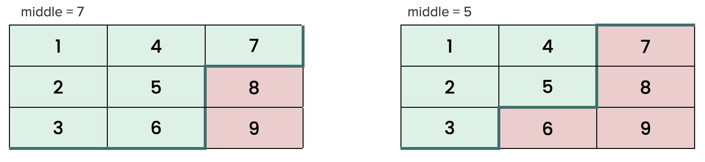

# [378. Kth Smallest Element in a Sorted Matrix](https://leetcode.com/problems/kth-smallest-element-in-a-sorted-matrix/)

## Clarification Questions
* Is `k` always valid?
 
## Test Cases
### Normal Cases
```
Input: [
    [ 1,  2],
    [ 3,  5],
], 
k = 2
Output: 2
```
### Edge / Corner Cases
* `k` is the smallest number or the largest number in the matrix.
```
Input: [
    [ 1,  2],
    [ 3,  5],
], 
k = 1 or 4
Output: 1 or 5
```
* There are some duplicates that is `k`th smallest number or in the same row or column.
```
Input: [
    [ 1,  2],
    [ 1,  3],
],
k = 2
Output: 1

Input: [
    [ 1,  2],
    [ 3,  3],
],
k = 3
Output: 3

Input: [
    [-5, -4],
    [-5, -4],
],
k = 2
```

## Heap
```kotlin
fun kthSmallest(matrix: Array<IntArray>, k: Int): Int {
    val maxHeap = PriorityQueue<Int>() { n1, n2 -> n2 - n1 }
    for (r in 0 until matrix.size) {
        for (c in 0 until matrix[r].size) {
            maxHeap.add(matrix[r][c])
            if (maxHeap.size > k) maxHeap.poll()
        }
    }
    return maxHeap.peek()!!
}
```

* **Time Complexity**: Iterating all item in the matrix takes `O(n^2)`, and `add()` / `poll` takes `O(lg k)`, total takes `O(n^2 lg k)`.
* **Space Complexity**: `O(k)` for heap, but the worst case is `k = n^2`, so it's `O(n^2)` which does not meet the requirement.

> TODO: There is another solution using heap (similar to [23. Merge k Sorted Lists](../leetcode/23.merge-k-sorted-lists.md)), try to understand it.

## Binary Search
The matrix rows and columns are sorted, so the minimum must be `A[0][0]` and the maximum must be at `A[n-1][n-1]`, then we can set `left` and `right` to be the minimum and maximum value in the matrix, and we can apply binary search to find the Kth smallest number in the matrix:

* **Monotonicity**: The Kth smallest elements exists in the range `A[0][0]..A[n-1][n-1]`, given a number `middle` in the range `left..right`, then the count of all numbers `<= middle` will be the left portion of the matrix. It will be within the range that are covered during search.

> Similar idea of [240. Search a 2D Matrix II](../leetcode/240.search-a-2d-matrix-ii.md) but the search space is reduced by the count of numbers that are `<= middle`.



* **Search Space Reduction**: We can count how many numbers `k` in the matrix, we can reduce the search space by this count. If the count `< k`, then we search the right part, otherwise, we search the left part. Here we don't return the value immediately when `count == k`, because the value might not be in the matrix, it just matches the count, so we keep shrinking the search space until `left == right` and return the value at that time. **Actually, the problem can be transformed to search the first number that has count `k <=`** (The pattern is similar to [278. First Bad Version](../leetcode/278.first-bad-version.md)).

```
[X, X, X, O, O, O, O]
          ^ The first number that has count is greater than or equal to `k`
```

* **Result Guarantee**: The Kth smallest number must be in `left..right`, and we keep reducing the search space by the condition `the count <= k` until `left == right`, then the value is what we're looking for.


> TODO: Why does the Kth smallest number is the value in the matrix when breaking the loop?
>
> https://leetcode.com/problems/kth-smallest-element-in-a-sorted-matrix/solutions/1322101/c-java-python-maxheap-minheap-binary-search-picture-explain-clean-concise/comments/1020008
>
> https://leetcode.com/problems/kth-smallest-element-in-a-sorted-matrix/solutions/85173/share-my-thoughts-and-clean-java-code/comments/89885
>
> https://leetcode.com/problems/kth-smallest-element-in-a-sorted-matrix/solutions/85173/share-my-thoughts-and-clean-java-code/comments/122873
> 
> https://leetcode.com/problems/kth-smallest-element-in-a-sorted-matrix/solutions/167784/java-binary-search-with-explanations/comments/925632
>
> https://leetcode.cn/problems/kth-smallest-element-in-a-sorted-matrix/solutions/311472/you-xu-ju-zhen-zhong-di-kxiao-de-yuan-su-by-leetco/comments/471413
>
> https://leetcode.com/problems/kth-smallest-element-in-a-sorted-matrix/solutions/85177/Java-1ms-nlog(max-min)-solution/comments/89959

```
if count<k , meaning that you need to make mid become bigger.
else, meaning that you should limit the high.
then you get low == high and k == count.

"find the first occurrence of an element".

How lo will always be an element in the matrix array in the end ? In the end, lo == hi. lo is the smallest number satisfying that count(lo)>=k. **let's assume that lo doesn't exist in matrix.** We must have the biggest num in matrix that is less than lo. Because ans didn't exist in matrix, so count(num) >= k also holds which contradicts our previous assumption that lo is the smallest. So lo does exist in matrix.
```

Based on the above characteristics, we can apply binary search: We set `left` and `right` to the minimum and maximum first, we calculate the `middle` based on left and right, and we count the item numbers that is <= `middle`.
    * If count < k, the range is not covered k, we search right part.
    * Otherwise (count >= k), we search left part.

```kotlin
fun kthSmallest(matrix: Array<IntArray>, k: Int): Int {
    val n = matrix.size
    var left = matrix[0][0]
    var right = matrix[n - 1][n - 1]
    var result = 0
    while (left <= right) {
        val middle = left + (right - left) / 2
        val count = countLessOrEqual(matrix, middle)

        /**
         * We won't return immediately if count == k, because it the middle might not be the value in 
         * the matrix, it's just count match.
         * Or see failed case:
         * [
         *  [1, 2]
         *  [1, 3]
         * ]
         * k = 1
         * if (count == k) return middle
         */

        // But we can update the result when (count == k)
        // if (count == k) result = middle

        // |------------------| matrix
        //            k
        // |------| count
        // count is too small that the search range doesn't cover the kth smallest number.
        if (count < k) {
            // search right part
            left = middle + 1
        } else {
            // k <= count, that means the current search range covers the kth smallest number,
            // so we have to update the result, and search left part
            result = middle
            right = middle - 1
        }
    }
    return result
}
```

This lead to WA:
```kotlin
if (count < k) {
    left = middle + 1
} else if (count == k) {
    result = middle
    right = middle - 1
} else if (k < count) {
    right = middle - 1
}
```

Failed at the test case:
```
[
 [1,2]
 [3,3]
]
k = 3
```


Or equivalently, we don't update the answer when `count == k`, we try to find the first number that meets the condition `countLessOrEqual() == k`, then we can return the `left` pointer when while loop breaks.

```kotlin
fun kthSmallest(matrix: Array<IntArray>, k: Int): Int {
    val n = matrix.size
    var left = matrix[0][0]
    var right = matrix[n - 1][n - 1]
    var result = left
    while (left <= right) {
        val middle = left + (right - left) / 2
        val count = countLessOrEqual(matrix, middle)
        if (k <= count) {
            // Search left part
            right = middle - 1
        } else {
            // Search right part
            left = middle + 1
        }
    }
    return left
}

// Use the same function `countLessOrEqual()`.
```

* The code to count how many numbers are <= middle.
```kotlin
private fun countLessOrEqual(matrix: Array<IntArray>, middle: Int): Int {
    var row = matrix.size - 1
    var col = 0
    var count = 0
    while (row >= 0 && col < matrix.size) {
        if (matrix[row][col] <= middle) {
            count += row + 1
            col++
        } else {
            row--
        }
    }
    return count
}

// Or equivalently
private fun countLessOrEqual(matrix: Array<IntArray>, num: Int): Int {
    var count = 0
    var row = matrix.size - 1
    var col = 0
    while (row >= 0 && col < matrix.size) {
        while (row >= 0 && matrix[row][col] > num) {
            row--
        }
        count += row + 1
        col++
    }
    return count
}
```

## Dry Run
```js
1  3  6
2  5  8
4  7  9
k = 4

Left    1 1 3 3 4
Right   9 5 5 4 4
Middle  5 3 4 3 4
Count   5 3 4 3 4
```

```js
// Input
 1,  5,  9
10, 11, 13
12, 13, 15
k = 8

//          Count
 L   R   M  C    
 1, 15,  8, 2
 9, 15, 12, 6
13, 15, 14, 8

// It will return 14 immediately when count == 8, it's WA, 14 is not in our matrix
// Correct way:

 L   R   M  C
 1, 15,  8, 2
 9, 15, 12, 6
13, 15, 14, 8
13, 13, 13, 8

// We shrink the search range to be left == right, then the value is what we're looking for.
```
