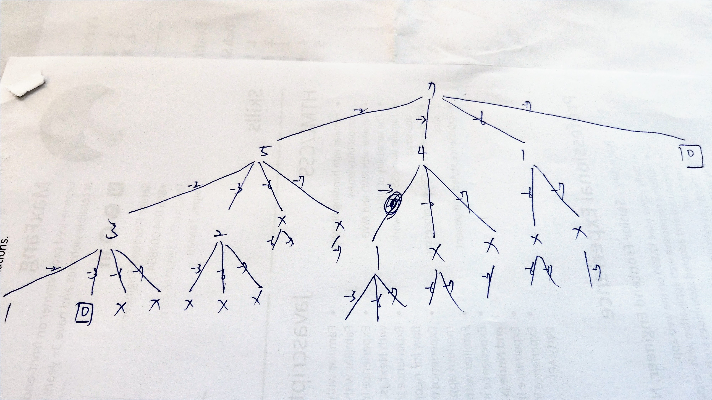

## [39. Combination Sum](https://leetcode.com/problems/combination-sum/)

How to remove the duplicate combinations is the key, we can limit the search candidates to achieve this.

For example, candidates = `[2,3,6,7]`, target = `7`:



We're NOT considering all candidates for different search branch at each level, for searching path `2 -> 3`, we search `[3, 6, 7]` only, we don't search `2` (based on the `i` index search path) because we search this candidate before.

That is:
```js
2, 3, 6, 7 // The first search path
   3, 6, 7 // The 2nd search path
      6, 7 // The 3rd search path
         7 // The 4th search path
```

> Nice explaination: https://leetcode.cn/problems/combination-sum/solution/hui-su-suan-fa-jian-zhi-python-dai-ma-java-dai-m-2/

```kotlin
private val results = mutableListOf<List<Int>>()

fun combinationSum(candidates: IntArray, target: Int): List<List<Int>> {
    dfs(candidates, 0, target, mutableListOf<Int>())
    return results
}

private fun dfs(candidates: IntArray, startIndex: Int, remaining: Int, combination: MutableList<Int>) {
    if (remaining == 0) {
        results.add(ArrayList<Int>(combination))
        return
    }
    
    for (i in startIndex until candidates.size) {
        val num = candidates[i]

        // Prune
        if (remaining - num < 0) continue
        
        combination.add(num)
        dfs(candidates, i, remaining - num, combination)
        combination.removeAt(combination.size - 1)
    }
}
```

* **Time Complexity**: `O(2^n * n)`, `O(2^n)` for 2 choice for every candidate, and every candidate can have `O(n)` sub-candidates.
* **Space Complexity**: `O(target)` for `dfs()` recursive function call stack.