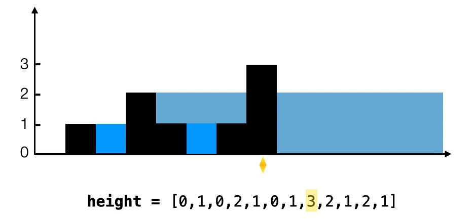

## [42. Trapping Rain Water](https://leetcode.com/problems/trapping-rain-water/)

### Brute Force
Iterate every height, and find the left and right max height from current height. It takes `O(n^2)` time.

```kotlin
fun trap(height: IntArray): Int {
    var trap = 0
    for (i in 0 until height.size) {
        var leftMax = 0
        var rightMax = 0
        for (l in 0 until i) {
            leftMax = maxOf(height[l], leftMax)
        }
        for (r in i + 1 until height.size) {
            rightMax = maxOf(height[r], rightMax)
        }
        val value = (minOf(leftMax, rightMax) - height[i])
        if (value > 0) trap += value
    }
    return trap
}
```

### Dynamic Programming
We can improve the running time from brute force solution, we store every left max and right max for every position (memoization), the time complexity reduces to `O(n)`, but space compexity increase to `O(n)` as well. Then iterate to calculate the result for every position.

```kotlin
/**
height       0,1,0,2,1,0,1,3,2,1,2,1
                                 i
leftHeight = 0 1 1 2 2 2 2 3 3 3 3 3
rightHigh  3 3 3 3 3 3 3 3 2 2 2 1                    
trapping =     X 1 X 1 2 1 X 0 1 X
             0 
               1
                 3
             = min(0,3) - 1 < 0 can't trap
*/
fun trap(height: IntArray): Int {
    val n = height.size
    val leftHeight = IntArray(n)
    val rightHigh = IntArray(n)
    leftHeight[0] = height[0]
    for (i in 1 until n) {
        leftHeight[i] = maxOf(leftHeight[i - 1], height[i])
    }
    rightHigh[n - 1] = height[n - 1]
    for (i in n - 2 downTo 0) {
        rightHigh[i] = maxOf(rightHigh[i + 1], height[i])
    }
    var trapping = 0
    for (i in 1 until n - 1) {
        val h = minOf(leftHeight[i - 1], rightHigh[i + 1]) - height[i]
        if (h > 0) trapping += h
    }
    return trapping
}

// Or another way to calculate the trapping
/**
height        0,1,0,2,1,0,1,3,2,1,2,1
leftMaxArray  0 1 1 2 2 2 2 3 3 3 3 3
rightMaxArray 3 3 3 3 3 3 3 3 2 2 2 1                    
result        0 0 1 0 1 2 1 0 1 0 0 0
 */
fun trap(height: IntArray): Int {
    var result = 0
    var leftMax = 0
    var rightMax = 0
    val leftMaxArray = IntArray(height.size)
    val rightMaxArray = IntArray(height.size)

    // Find the left max height for every position
    for (current in 0 until height.size) {
        leftMax = maxOf(height[current], leftMax)
        leftMaxArray[current] = leftMax
    }
    // Find the right max height for every position
    for (current in height.size - 1 downTo 0) {
        rightMax = maxOf(height[current], rightMax)
        rightMaxArray[current] = rightMax
    }

    // Then calculate the result for every position from above left/right max height.
    for (current in 0 until height.size) {
        result += (minOf(rightMaxArray[current], leftMaxArray[current]) - height[current])
    }
    return result
}
```

* **Time Complexity**: `O(n)` to iterate the whole list.
* **Space Complexity**: `O(n)` to store the left and right max height for every position.

### Monotonic Stack
How can we trap the water? It must be trapped between two high walls. 
```js
leftHigh - low - rightHigh
        \       /
         \     /
          \___/
```

We iterate every height as **right high wall**, then go back to find the ground and left high wall if there exists. How can I find the ground and left high wall? We can use monotonic decreasing stack:
```js
// monotonic decreasing stack
              \               /
               \             /
                \___________/
         10, 3, 2,      1       6
stack = [leftHigh, ground] < righHigh (height[i])

ground = height[stack.pop()] // 1
leftHigh = if (stack.isNotEmpty()) stack.peek() else break // 2
```

The height that can trap is `min(leftHigh, rightHigh) - ground`. And the width is `rightIndex - leftIndex - 1`. So the total trapped water is `trap += height * width`.

```kotlin
fun trap(height: IntArray): Int {
    // We store the index so that we can calculate the width.
    val stack = Stack<Int>()
    var trap = 0
    // Loop as right wall
    for (rightIndex in 0 until height.size) {
        val rightHigh = height[rightIndex]

        // When we find a valid right wall, then go back to find the ground and left height.
        while (!stack.isEmpty() && height[stack.peek()] < rightHigh) {
            val groundIndex = stack.pop()
            
            // If there is not left wall, then can't trap.
            if (stack.isEmpty()) break

            val ground = height[groundIndex]
            val leftIndex = stack.peek()
            val leftHigh = height[leftIndex]

            // For [7 1 4] we can trap max height to 4, not 7.
            val h = minOf(leftHigh, rightHigh) - ground

            // Why to minus 1? 
            // 0, 1, 2, 3, 4, 5, 6
            //       L        R
            //          |--|
            // Width = 5 - 2 - 1 
            val w = rightIndex - leftIndex - 1
            trap += h * w
        }
        stack.push(rightIndex)
    }
    return trap
}
```

```js
height = [2, 1, 0, 0, 3]
trapping = 0 + (min(0,3)-0)*(4-2-1) + (min(1,3)-0)*(4-1-1) + (min(3,2)-1)*(4-0-1)
```

* **Time Complexity**: `O(n)` to iterate the whole list and every element is pushed and popped once.
* **Space Complexity**: `O(n)` for stack.


> Source: https://leetcode.cn/problems/trapping-rain-water/solution/jie-yu-shui-by-leetcode/