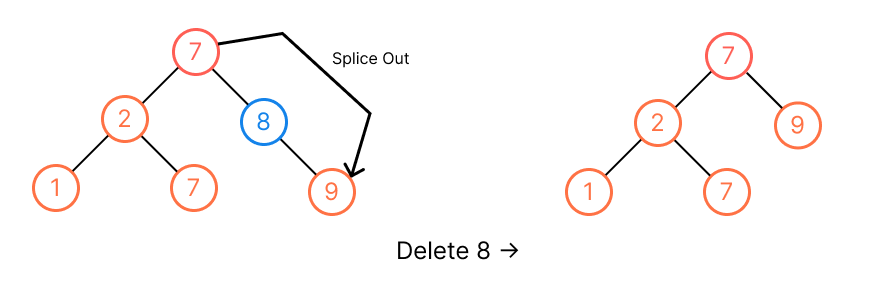
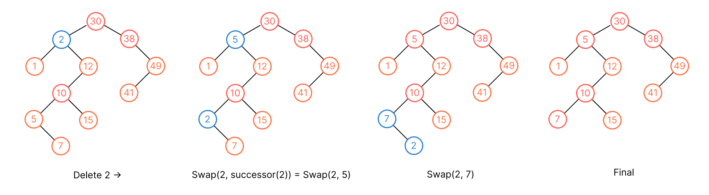

## [450. Delete Node in a BST](https://leetcode.com/problems/delete-node-in-a-bst/)

### Recursive
```kotlin
fun deleteNode(root: TreeNode?, key: Int): TreeNode? {
    if (root == null) return null
    
    // Search for that key
    if (root.`val` < key) {
        root.right = deleteNode(root.right, key)
        return root
    }
    if (key < root.`val`) {
        root.left = deleteNode(root.left, key)
        return root
    }

    // The key is found
    if (key == root.`val`) {
        // Leaf
        if (root.left == null && root.right == null) return null
        // Only have left or right child
        if (root.right == null) return root.left
        if (root.left == null) return root.right
        
        // Have two children
        var successor = root.right
        while (successor?.left != null) {
            successor = successor.left
        }
        // Delete the successor
        root.right = deleteNode(root.right, successor!!.`val`)

        // Swap the successor up to the original position of root
        successor.left = root.left
        successor.right = root.right
        return successor
    }
    return root
}
```

* **Time Complexity**: `O(n)`.
* **Space Complexity**: `O(n)`.

### Iterative
The deletion operations considers the tree cases:
1. Leaves (node has no child): It's easy to delete, just detach. (Like binary tree deletion)
2. Node has one child: We splice out by modifying pointer from parent to its child.

3. Node have two children: We perform the same operation as [binary tree deletion](#deletion), we keep moving down the `X` by swapping with `X` and its successor (its successor will never be the parent of `X`, it never goes up), until `X` reaches the leaf, then detach.


And there are some key points for the implementation, given the root of BST and the `key`, we have to delete the node with that `key` and return the updated root node:

* We don't have `parent` pointer in real implementation or problem, so we have to update parent node as we search or swap with the node.
* The node to delete is root or not will affect the result + how many child does the node to delete have will affect the implementation, all the combinations will be:
    1. The node is root, is leaf. (root updated, it becomes empty tree)
    1. The node is root, has only one child. (The only child will become the new root)
    1. The node is root, has two children. 
    1. The node is NOT root, is leaf.
    1. The node is NOT root, has only one child.
    1. The node is NOT root, has two children.
* The `successor(node)` is a little bit different from orignal binary tree's we don't look for the lowest ancestor (don't look up upward).

```kotlin
private var parent: TreeNode? = null

fun deleteNode(root: TreeNode?, key: Int): TreeNode? {
    val nodeToRemove = searchNodeToRemove(root, key)
    // Not found
    if (nodeToRemove == null) return root
    
    // To remove root
    if (parent == null) {
        // Case 1.
        // [5]
        //  5
        if (nodeToRemove.left == null && nodeToRemove.right == null) return null
        // Case 2.
        // [1,2] or [1,nul,2]
        //  1        
        if (nodeToRemove.left == null || nodeToRemove.right == null) {
            return if (nodeToRemove.left != null) nodeToRemove.left else nodeToRemove.right
        }
    }
    // We leave the case that to delete root that has two children here
    deleteNode(nodeToRemove)
    return root
}

private fun searchNodeToRemove(root: TreeNode?, key: Int): TreeNode? {
    var current: TreeNode? = root
    while (current != null && current.`val` != key) {
        parent = current
        if (current.`val` > key) {
            current = current.left
        } else {
            current = current.right
        }
    }
    return current
}

private fun deleteNode(nodeToDelete: TreeNode?) {
    if (nodeToDelete == null) return

    // We use let {...} scope function to eliminate all null check of parent node
    parent?.let { parent ->
        // Leaf to delete, just detach.
        if (nodeToDelete.left == null && nodeToDelete.right == null) {
            if (nodeToDelete.`val` == parent!!.left?.`val`) {
                parent.left = null
            } else if (nodeToDelete.`val` == parent.right.`val`) {
                parent.right = null
            }
            return
        }
        // Node to delete has one child only
        if (nodeToDelete.left == null || nodeToDelete.right == null) {
            // Determine the left or right child of the node to delete for splicing out
            val child = if (nodeToDelete.left != null) nodeToDelete.left!! else nodeToDelete.right!!
            if (nodeToDelete.`val` == parent.left?.`val`) {
                parent.left = child
            } else if (nodeToDelete.`val` == parent.right.`val`) {
                parent.right = child
            }
            return
        }

    }
    // Node to delete has two children, find the successor and swipe
    parent = nodeToDelete
    var successor = nodeToDelete.right!!
    while (successor?.left != null) {
        parent = successor
        successor = successor.left!!
    }
    
    val temp = nodeToDelete.`val`
    nodeToDelete.`val` = successor.`val`
    successor.`val` = temp

    // Keep moving down the node by swapping with its successor
    deleteNode(successor)
}
```

### Test Cases
```js
[50,30,70,null,40,60,80]
30 

[50,30,70,null,40,60,80]
50

[1,null,2]
1

[5]
5

[5]
3
```

> There are [recursive solution](https://leetcode.cn/problems/delete-node-in-a-bst/solution/shan-chu-er-cha-sou-suo-shu-zhong-de-jie-n6vo/), but I can't get it.