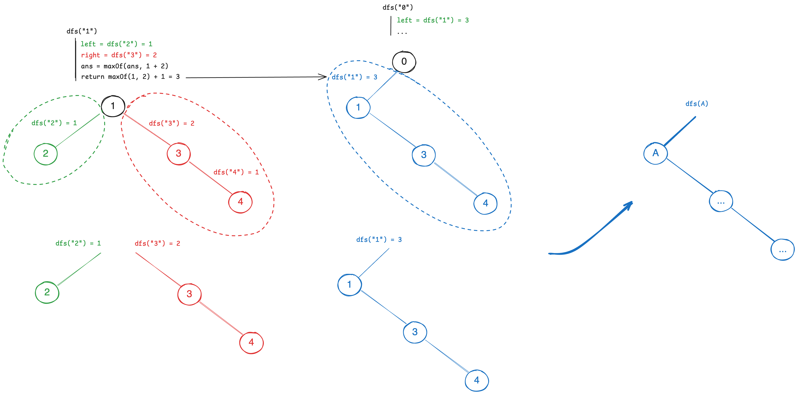

# [543. Diameter of Binary Tree](https://leetcode.com/problems/diameter-of-binary-tree/)

## Hints
- Try to relate the diameter to the depth of subtrees.
- For each node, what is the longest path that passes through it?
- Can you use recursion to compute the answer efficiently in one pass?

## Breakdowns

> 1. What is the diameter of a tree in terms of its subtrees?

The diameter at any node is the sum of the maximum depths of its left and right subtrees.

> 2. How can we efficiently compute the diameter for all nodes?

Use postorder traversal (DFS) to compute the depth of each subtree, updating the maximum diameter as you go.

## Key Insights
- The diameter is the length of the longest path between any two nodes, measured in edges.
- For each node, the longest path passing through it is the sum of the depths of its left and right subtrees.
- The recursive function should return the depth of the subtree, and update a global variable for the diameter. This is a typical "tree DP" pattern: gather info from children, combine for parent, and update a global result.

## Postorder DFS
The key idea is to use postorder DFS to compute the depth of each subtree, and at each node, update the maximum diameter found so far.

```kotlin
private var diameter = 0

fun diameterOfBinaryTree(root: TreeNode?): Int {
    fun dfs(node: TreeNode?): Int {
        if (node == null) return 0
        val left = dfs(node.left)
        val right = dfs(node.right)
        diameter = maxOf(diameter, left + right)
        return maxOf(left, right) + 1
    }
    dfs(root)
    return diameter
}
```
- **Time Complexity**: `O(N)`, where `N` is the number of nodes.
- **Space Complexity**: `O(H)`, where `H` is the height of the tree (recursion stack).

## Preorder (Double Recursion, Not Optimal)

This approach computes the height of subtrees for every node separately, leading to higher time complexity.

```kotlin
private var result = 0
fun diameterOfBinaryTree(root: TreeNode?): Int {
    fun getHeight(node: TreeNode?): Int =
        if (node == null) 0 else 1 + maxOf(getHeight(node.left), getHeight(node.right))

    fun dfs(node: TreeNode?) {
        if (node == null) return
        val left = getHeight(node.left)
        val right = getHeight(node.right)
        result = maxOf(result, left + right)
        dfs(node.left)
        dfs(node.right)
    }
    dfs(root)
    return result
}
```
- **Time Complexity**: `O(N^2)`
- **Space Complexity**: `O(H)`

## Edge Cases
- The tree is empty: should return 0.
- The tree has only one node: diameter is 0 (no edges).
- The longest path does not pass through the root.
- Skewed trees (all nodes on one side).

## Similar or Follow-up Problems

- [104. Maximum Depth of Binary Tree](104.maximum-depth-of-binary-tree.md)

---

## My Original Notes

**NOTE**: This problem is asking for the number of edges, not the number of nodes.

## Test Cases
### Normal Cases
```
Input: 
        1
      /   \
     2     3
   /  \ 
  5    4
      /
     6

Output: 4, (6-4-2-1-3)
```
### Edge / Corner Cases
* The longest diameter does not pass the root node.
```
Input: 
        1
      /   \
     2     3
   /  \ 
  5    4
   \     \
    5     6
     \     \
      7     8   
     
Output: 6 (7-5-2-4-6-8)
```

## Postorder
The diameter of a given tree is the **maximum depth of left subtree + right subtree**. The key idea to solve this problem is to traverse every node, and find the maximum diameter of root itself + left + right subtree for each node. 

```js
        root            dfs(root)
       /    \          / +1      \ +1
     left  right    dfs(left)   dfs(right)
```
We can use postorder traversal to find the diameter of the binary tree. The path may not pass the `root` node, so we have a global variable to store the maximum diameter and create a dedicated function to calculate the diameter of the tree. 

```kotlin
private var result = 0
fun diameterOfBinaryTree(root: TreeNode?): Int {
    dfs(root)
    return result
}

// The function returns the maximum length that passes the root node.
private fun dfs(root: TreeNode?): Int {
    if (root == null) return 0

    // The root might not have left or right child, if not, there is no edge and we can't +1
    val left = if (root.left != null) 1 + dfs(root.left) else 0
    val right = if (root.right != null) 1 + dfs(root.right) else 0

    // We update the global maximum diameter during the traversal
    result = maxOf(result, left + right)
    return maxOf(left, right)
}
```
* **Time Complexity**: `O(n)`, where `n` is the number of nodes in the binary tree.
* **Space Complexity**: `O(h)`.

----
Or equivalently, we can implement in this way (which is more common from discussion):

Define `dfs(root)` to represent the maximum length that includes the current root. If the `root` is empty, then it returns 0, otherwise, it returns the maximum length that includes the current root, even if **it's a leaf node, which contributes to one edge.**

```js
    /    or   \
  leaf       right

dfs(leaf) = 1 // 1 edge from the leaf to its parent
```

In the `dfs(root)`, we calculate the length of the left and right subtree first (postorder), and update the global maximum diameter, then return value is the maximum length that includes the current root.

> 自己的思路：
>
> 1. 上下解法差別在於 `dfs(root)` 是否在內部就 `+1` 包含跟 `root` 向上連結的邊或者沒有包含。大家常用的解法都是在內部就包含 `root` 向上的連結，所以 leaf 在這邊才會回傳 1，而不是 0。它不為空，就代表有一條邊跟上面節點連結。 
> 
> 2. 另一種思路：針對每個 `root` 節點，**我都可以計算「子節點的個數」。**

This diagram demonstrates how it works in the code:



```js
dfs(left)

    /
  left
  /  \
...   ...

dfs(right)

    \
    right
    /  \
  ...   ...

dfs(root) = max(dfs(left), dfs(right)) + 1

          / // +1 for this edge
        root
       /    \
    left   right
    /  \    /  \
 ...  ... ...  ...
```

```kotlin
private var answer = 0

fun diameterOfBinaryTree(root: TreeNode?): Int {
    dfs(root)
    return answer
}

private fun dfs(root: TreeNode?): Int {
    if (root == null) return 0
    val left = dfs(root.left)
    val right = dfs(root.right)

    answer = maxOf(answer, left + right)
    return maxOf(left, right) + 1 // +1 for the edge between root and it parent
}
```

### Dry Run
* Empty tree:
```js
dfs(null) = 0
answer = 0
```

* Single node:
```js
dfs(A) = 1 // Most confusing case, but if you take a look at the next case, you will understand.
    dfs(A.left=null) = 0
    dfs(A.right=null) = 0
    answer = maxOf(0, 0 + 0) = 0
    return max(0, 0) + 1 = 1
answer = 0
```
* Root with one child:
```js   
    A    A
   /      \
  B        B
dfs(A)
    dfs(A.left=B) = 1 // Which is the same as the previous case, it contirbute to one edge between A and B. 
        dfs(B.left=null) = 0
        dfs(B.right=null) = 0
        answer = maxOf(0, 0 + 0) = 0
        return max(0, 0) + 1 = 1

    dfs(A.right=null) = 0
    answer = maxOf(0, 1 + 0) = 1
    return max(1, 0) + 1 = 2
answer = 1
```
* Root with two children:

```js
    A
   / \
  B   C

dfs(A)
    dfs(A.left=B) = 1
        dfs(B.left=null) = 0
        dfs(B.right=null) = 0
        answer = maxOf(0, 0 + 0) = 0
        return max(0, 0) + 1 = 1

    dfs(A.right=C) = 1
        dfs(C.left=null) = 0
        dfs(C.right=null) = 0
        answer = maxOf(0, 0 + 0) = 0
        return max(0, 0) + 1 = 1

    answer = maxOf(0, 1 + 1) = 2
    return max(1, 1) + 1 = 2
```


### Good Explanations
* The diameter of a given tree is **the maximum depth of the left side of the tree, plus the maximum depth of the right side of the tree**. We can write the following pseudocode:
```python
# depth() is a pseudocode function we have to implement later
diameter = depth(root.left) + depth(root.right)
```
* To calculate the height rather than the depth, which the just the representation of edges as required:
```java
class Solution {
    private int answer = 0;
    public int diameterOfBinaryTree(TreeNode root) {
        height(root);
        return answer;
    }
    
    // signature: return the length of longest single path in the tree rooted at 'root'
    public int height(TreeNode root) {
        // base case
        if (root == null) return -1;
        
        int left = height(root.left);
        int right = height(root.right);
        
        answer = Math.max(answer, left + right + 2);
        return Math.max(left + 1, right + 1);
    }   
}
```
* [灵茶山艾府](https://leetcode.cn/problems/diameter-of-binary-tree/solutions/2227017/shi-pin-che-di-zhang-wo-zhi-jing-dpcong-taqma/)
```java
private int ans;

public int diameterOfBinaryTree(TreeNode root) {
    dfs(root);
    return ans;
}

private int dfs(TreeNode node) {
    if (node == null) {
        return -1; // 下面 +1 后，对于叶子节点就刚好是 0
    }
    int lLen = dfs(node.left) + 1; // 左子树最大链长+1
    int rLen = dfs(node.right) + 1; // 右子树最大链长+1
    ans = Math.max(ans, lLen + rLen); // 两条链拼成路径
    return Math.max(lLen, rLen); // 当前子树最大链长
}
```

#### [官神影片講解](https://www.youtube.com/live/UfPMw8zD8EY?si=LW2CMWgVA0QVr4Fd) + ([文字解釋](https://github.com/wisdompeak/LeetCode/tree/master/Tree/543.Diameter-of-Binary-Tree))
我們可以把任一個節點作為出發點可以到達的兩邊最長距離，但是這樣解法時間複雜度是 `O(n^2)` 級別的，我們不應該遍歷所有節點為根的樹，我們應該遍歷每個路徑的「拐點」，一條經過「拐點」的路徑是一邊上升、另一邊下降的路徑。

```js
    拐點
  /     \
 /       \
/
```

例如：以根節點 2 為拐點的最長路徑要怎麼找？就是以 2 往左和右走到葉子的距離。
```js
        1
      /   \
     2     3
   /  \ 
  5*   4*
      /
     6*
    /
   7*
```

如何計算從一個節點要走到葉子的距離，很顯然這可以用遞迴來解決。
`1` 到葉子的最長距離 = `2` 到葉子的最長距離 + 1
`2` 到葉子的最長距離 = ... 到葉子的最長距離 + 1 以此類推。
```js
        1   depth(1)
      /     = 1 +
     2            depth(2)
   /   \          = 1 +   
 ...   ...               depth(...)
```
這樣我們就由下往上遞迴計算出了每個節點到葉子的最長距離。我們在遞迴過程中，我們會計算出每個節點的左右子樹的最長距離，在這過程中我們可以同時計算出以每個節點為拐點的最長路徑，就是它的左右子樹的最長距離之和。

> 常見題目模式：題目問的是最長路徑，但是遞迴計算的是某個節點到葉子的最長距離，遞迴過程中同時計算出了題目所問的最長路徑。

## By Counting Nodes
We apply the same idea from above by counting the number of nodes in the longest path. The number of nodes in the longest path is the maximum depth of the left subtree + right subtree + 1 (the root node).

Also see [104. Maximum Depth of Binary Tree](../leetcode/104.maximum-depth-of-binary-tree.md).

```kotlin
private var answer = 0
fun diameterOfBinaryTree(root: TreeNode?): Int {
    dfs(root)
    // The number of edges = the number of nodes - 1
    return answer - 1
}

// Calculate the number of nodes in the longest path
private fun dfs(root: TreeNode?): Int {
    if (root == null) return 0
    val left = dfs(root.left)
    val right = dfs(root.right)
    answer = maxOf(answer, 1 + left + right)
    return 1 + maxOf(left, right)
}
```

## Preorder (Double Recursion)
> This is not optimal solution.

For each node, we calculate the height of the left and right subtree, and the diameter of the tree is the maximum of the sum of the left and right subtree height. We can use a helper function to calculate the height of the tree and the diameter of the tree. The idea is similar to [110. Balanced Binary Tree](https://leetcode.com/problems/balanced-binary-tree/).

```kotlin
private var result = 0
fun diameterOfBinaryTree(root: TreeNode?): Int {
    dfs(root)
    return result
}

private fun dfs(root: TreeNode?) {
    if (root == null) return 0
    val left = getHeight(root.left)
    val right = getHeight(root.right)
    val diameter = left + right

    result = maxOf(result, diameter)

    dfs(root.left)
    dfs(root.right)
}

private fun getHeight(node: TreeNode?): Int {
    return if (node == null) 0
    else 1 + maxOf(getHeight(node.left), getHeight(node.right))
}
```
* **Time Complexity**: `O(n^2)`, where `n` is the number of nodes in the binary tree.
* **Space Complexity**: `O(H)`.