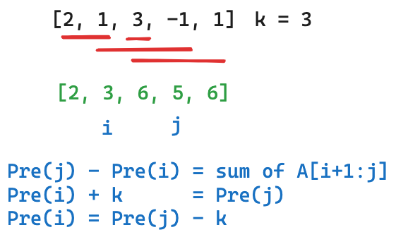

## [560. Subarray Sum Equals K](https://leetcode.com/problems/subarray-sum-equals-k/)

### Brute Force
```kotlin
fun subarraySum(nums: IntArray, k: Int): Int {
    var count = 0
    for (i in 0 until nums.size) {
        for (j in i until nums.size) {
            var sum = 0
            for (k in i..j) {
                sum += nums[k]
            }
            if (sum == k) count++
        }
    }
    return count
}
```

* **Time Complexity**: `O(n^3)`.
* **Space Complexity**: `O(1)`.

### Optimized Brute Force
Suppose `pre[i..j]` represents the sum of subarray ranging from `i` to `j`, then `pre[i..j] = pre[i..j - 1] + nums[j]`, for example, the sum of subarray with length = 3 is from the sum of subarray with length = 2 + the third element. (moving the end only)

```js
[1, 2, 3] Sum
 _          1
 _, _       3 v
 _, _, _    6
    _       2
    _, _    5
       _    3 v
```

```kotlin
fun subarraySum(nums: IntArray, k: Int): Int {
    var count = 0
    for (i in 0 until nums.size) {
        var sum = 0
        for (j in i until nums.size) {
            sum += nums[j]
            if (sum == k) count++
        }
    }
    return count
}
```

* **Time Complexity**: `O(n^2)`, we don't have iterate to sum up the subarray, the next sum will from previous sum and add up the current element.
* **Space Complexity**: `O(1)`.

### Prefix + Hash
We can observe the `pre[i]` (Prefix) array:

```js
k = 3
i    = [0, 1, 2, 3,  4, 5]
nums = [3, 2, 1, 3, -1, 1]
pre =  [3, 5, 6, 9,  8, 9]
           i         j
        |--i
           |----k----|           
```



We have `pre[j] - pre[i]` = `nums[i + 1] + nums[i + 2] + ... + nums[j]`, that is sum of subarrays. So to search the sum of subarray is `k`, we can check `pre[j] - pre[i] == k`, that is `pre[i] + k == pre[j]`.

We iterate `j` and sum up the `prefixSum`, then check if `prefixSum - k` exists in the `prefixSum` map. (Similar approach in problem [1. Two Sum](../leetcode/1.two-sum.md)) If it exists, then we found a subarray with sum `k`. 


```kotlin
fun subarraySum(nums: IntArray, k: Int): Int {
    var count = 0
    var prefixSum = 0
    val countMap = HashMap<Int, Int>()
    // This is for the case that the first element is k
    countMap[0] = 1
    for (i in 0 until nums.size) {
        prefixSum += nums[i]
        if (countMap.containsKey(prefixSum - k)) {
            count += countMap[prefixSum - k]!!
        }
        countMap[prefixSum] = (countMap[prefixSum] ?: 0) + 1
    }
    return count
}
```

```js
k = 3
i    = [0, 1, 2, 3,  4, 5]
nums = [3, 2, 1, 3, -1, 1]
pre =   3                  // look for countMap[0] / count[3] = 1 / count = 1
        3  5               // look for countMap[2] / count[5] = 1 / count = 1
        3  5  6            // look for countMap[3] / count[6] = 1 / count = 2
        3  5  6  9         // look for countMap[9] / count[9] = 1 / count = 2
        3  5  6  9  8      // look for countMap[5] / count[8] = 1 / count = 3
        3  5  6  9  8  9   // look for countMap[6] / count[9] = 2 / count = 4
```

* **Time Complexity**: `O(n)`.
* **Space Complexity**: `O(n)`.

This problem can't be solved by sliding window, because there is no good way to decide when to shrink the window, (`[-1, -1, 1]`)