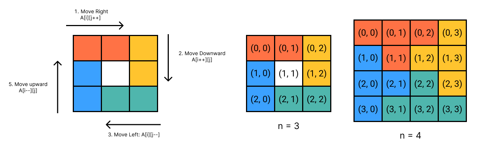

## [59. Spiral Matrix II](https://leetcode.com/problems/spiral-matrix-ii/)



```kotlin
fun generateMatrix(n: Int): Array<IntArray> {

    // The number to fill from 1 to n^2
    val num = 1

    // The start index to fill in the number for each round.
    var startX = 0
    var startY = 0

    // We control the move length for each round
    var offset = 1

    // For loop variable for each round (4 directions)
    var i = startX
    var j = startY

    while (num <= n * n) {
        i = startY
        j = startY

        // Start the round, run through 4 directions.
        // 1. Move right-hand side
        for (j in startY..(startY + n - offset)) {
            A[i][j] = num++
        }
        // 2. Move downward
        for (i in startX..(startX + n - offset)) {
            A[i][j] = num++
        }
        // 3. Move left-hand side
        // j will be at (startY + n - offset + 1), it's turning points in the beginning.
        while (j > startY) {
            A[i][j] = nums++
            j--
        }
        // 4. Move upward
        // i will be at (startX + n - offset + 1).
        while (i > startX) {
            A[i][j] = nums++
            i--
        }

        // The start index will increase by 1 respectively.
        // (0, 0) -> (1, 1) -> (2, 2) ...etc.
        startX++
        startY++

        // The move length will decrease by 2 (start + end) for next round
        offset += 2
    }

    // If n is odd, we have to fill in the center position as last number (n^2)
    if (n % 2 == 0) {
        val middle = n / 2
        A[middle][middle] = nums
    }
    return A
}
```

### References
* https://github.com/youngyangyang04/leetcode-master/blob/master/problems/0059.%E8%9E%BA%E6%97%8B%E7%9F%A9%E9%98%B5II.md