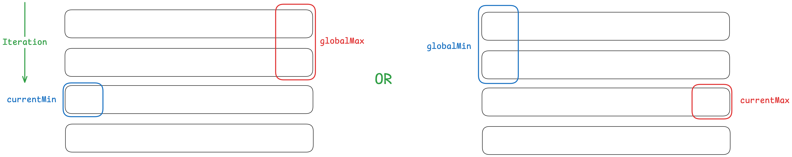
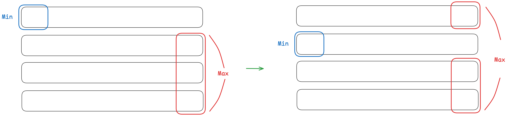

# [624. Maximum Distance in Arrays](https://leetcode.com/problems/maximum-distance-in-arrays/description/)

## Enumeration - 1
We are given a list of **sorted arrays**, and we need to choose one element from each of two **different** array so that the distance of that two elements is maximized. (The distance between `a` and `b` is `|a - b|`.)

The maximum distance is `|a - b|` that is either `max(a) - min(b)` or `- min(a) + max(b)`. If we have two arrays only, the maximum distance can be calculated as:

```js
arrays = [
    [3, 5, 7],
    [0, 2, 4]
]
```

* The maximum from one array, the minimum from another array: `|7 - 0| = 7`
* The minimum from one array, the maximum from another array: `|3 - 4| = 1`

For sorted arrays, we only card about:
* The minimum: `arrays[i].first()`
* The maximum: `arrays[i].last()`

We can keep track of the maximum and minimum we have seen so far (`globalMin` and `globalMax`), and then iterate through the arrays as another minimum and maximum (`currentMin` and `currentMax`) to find the maximum distance, that is:
* `|globalMax - currentMin|`
* `|globalMin - currentMax|`

We keep track of the maximum and minimum seen so far at the same time so that we will never use they from the same array.



```kotlin
fun maxDistance(arrays: List<List<Int>>): Int {
    var maxDistance = Int.MIN_VALUE
    val n = arrays.size

    // The max and min we have seen so far
    var globalMin = arrays.first().first()
    var globalMax = arrays.first().last()

    for (i in 1 until n) {
        // The max and min from another array
        val currentMin = arrays[i].first()
        val currentMax = arrays[i].last()

        maxDistance = maxOf(maxDistance, abs(currentMin - globalMax))
        maxDistance = maxOf(maxDistance, abs(currentMax - globalMin))

        globalMin = minOf(globalMin, currentMin)
        globalMax = maxOf(globalMax, currentMax)
    }
    return maxDistance
}
```

### Dry Run
```js
arrays = [
    [3, 5, 7],
    [0, 2, 4],
    [1, 3, 5]
]

// Initialization
globalMin = 3
globalMax = 7
maxDistance = -oo

// First iteration, i = 1
currentMin = 0
currentMax = 4
maxDistance = max(maxDistance, abs(0 - 7), abs(4 - 3)) = max(-oo, 7, 1) = 7
globalMin = min(3, 0) = 0
globalMax = max(7, 4) = 7

// Second iteration, i = 2
currentMin = 1
currentMax = 5
maxDistance = max(maxDistance, abs(1 - 7), abs(5 - 0)) = max(7, 6, 5) = 7
globalMin = min(0, 1) = 0
globalMax = max(7, 5) = 7
```

## Enumeration - 2 
We precompute the maximum at each row, and then iterate the first element as the current minimum in each array, and find the maximum distance from the rest of the arrays.

- `leftMax[i]` is the maximum of the first `i` arrays.
- `rightMax[i]` is the maximum of the last `i` arrays.

```js
A, B, C, D, E, F, G, H, I
 leftMax        rightMax
|--------|     |--------|
            i 
```

> Similar to [2909. Minimum Sum of Mountain Triplets II](../leetcode/2909.minimum-sum-of-mountain-triplets-ii.md) or [2874. Maximum Value of an Ordered Triplet II](../leetcode/2874.maximum-value-of-an-ordered-triplet-ii.md).



```kotlin
fun maxDistance(arrays: List<List<Int>>): Int {
    val m = arrays.size
    val leftMax = IntArray(m) { Int.MIN_VALUE }
    val rightMax = IntArray(m) { Int.MIN_VALUE }
    leftMax[0] = arrays.first().last()
    rightMax[m - 1] = arrays.last().last()
    for (i in 1 until m) {
        leftMax[i] = maxOf(leftMax[i - 1], arrays[i].last())
    }
    for (i in m - 2 downTo 0) {
        rightMax[i] = maxOf(rightMax[i + 1], arrays[i].last())
    }
    var ans = 0
    for (i in 0 until m) {
        val a = arrays[i].first()
        if (i == 0) {
            val current = maxOf(Int.MIN_VALUE,
                                abs(rightMax[i + 1] - a))
            ans = maxOf(ans, current)
        } else if (i == m - 1) {
            val current = maxOf(abs(leftMax[i - 1] - a),
                                Int.MIN_VALUE)
            ans = maxOf(ans, current)
        } else {
            val current = maxOf(abs(leftMax[i - 1] - a),
                                abs(rightMax[i + 1] - a))
            ans = maxOf(ans, current)
        }
    }
    return ans
}
```