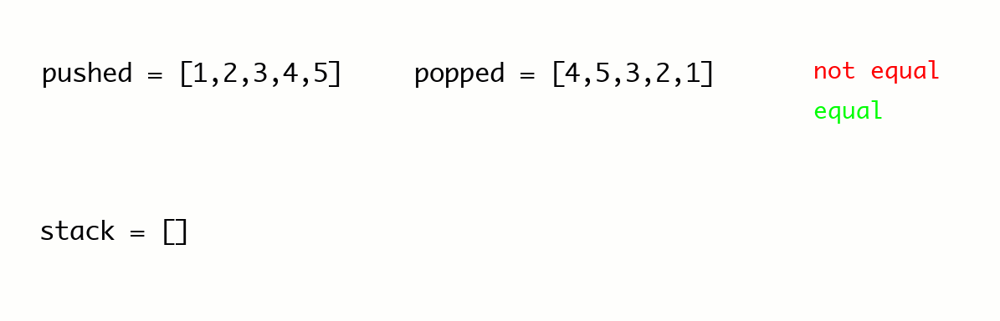

## [946. Validate Stack Sequences](https://leetcode.com/problems/validate-stack-sequences)

## Clarification Questions
* No, it's clear from problem description.
 
## Test Cases
### Normal Cases
```
Input: 
Output: 
```
### Edge / Corner Cases
* 
```
Input: 
Output: 
```

### Greedy
When we push a item, when should and is able to pop it? It should and is able to pop it when the peek of stack matches the popped array. That is the only chance, so when we have a chance to pop it, we should pop it right away. Otherwise, we will never pop it. 


> [Source](https://leetcode.com/problems/validate-stack-sequences/description/comments/1861868)

```kotlin
fun validateStackSequences(pushed: IntArray, popped: IntArray): Boolean {
    val n = pushed.size
    val stack = Stack<Int>()
    var popIndex = 0

    for (item in pushed) {
        stack.push(item)
        // Pop items greedily when we are able to pop it.
        while (stack.isNotEmpty() && stack.peek() == popped[popIndex]) {
            stack.pop()
            popIndex++
        }
    }
    return stack.isEmpty()
}
```

* **Time Complexity**: `O(n)`.
* **Space Complexity**: `O(n)`.