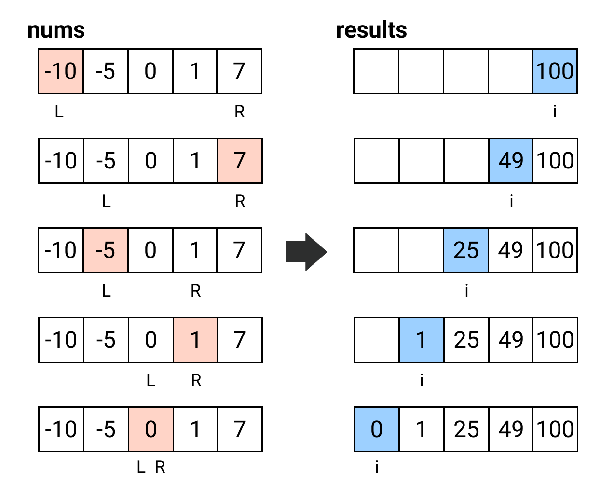

## [977. Squares of a Sorted Array](https://leetcode.com/problems/squares-of-a-sorted-array/)

### Straightfoward

```kotlin
fun sortedSquares(nums: IntArray): IntArray {
    return nums.map { it * it }.sorted().toIntArray()
}
```

* **Time Complexity**: `O(n + n log n)` for this solution, there is `O(n)` solution for follow up.

### Two Pointers
Let's take an example containing both negative and positive numbers `[-10, -5, 0, 1, 7]`. Since we put squares in the result array, so we can consider that all numbers are positive, i.e. `[10, 5, 0, 1, 7]`, the largest two numbers reside in the most left- and right-hand side respectively, not in the middle. So we can use two pointer approach that pointed to `start` and `end` and compare, insert larger one to the right-hand side (like *merge sort*.



```kotlin
fun sortedSquares(nums: IntArray): IntArray {
    val results = IntArray(nums.size)
    var left = 0
    var right = nums.size - 1
    for (i in nums.size - 1 downTo 0) {
        if (abs(nums[left]) > abs(nums[right])) {
            results[i] = nums[left] * nums[left]
            left++
        } else {
            results[i] = nums[right] * nums[right]
            right--
        }
    }
    return results
}

```

* **Time Complexity**: `O(n)` for only one for-loop.
* **Space Complexity**: `O(n)` for one extra result array.