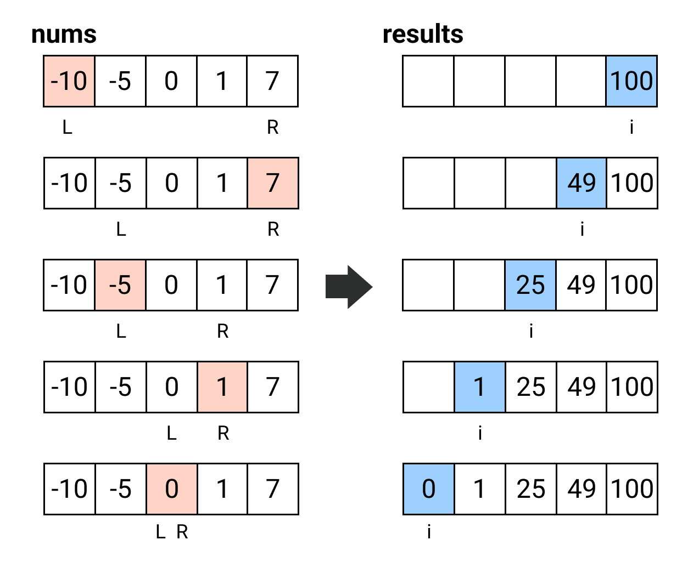

## [977. Squares of a Sorted Array](https://leetcode.com/problems/squares-of-a-sorted-array/)

### Two Pointers
Let's take an example containing both negative and positive numbers `[-10, -5, 0, 1, 7]`. Since we put squares in the result array, so we can consider that all numbers are positive, i.e. `[10, 5, 0, 1, 7]`, the largest two numbers reside in the most left- and right-hand side respectively, not in the middle. So we can use two pointer approach that pointed to `left` and `right` and compare, insert larger one to the right-hand side (like *merge sort*.



```kotlin
fun sortedSquares(nums: IntArray): IntArray {
    val results = IntArray(nums.size)
    var left = 0
    var right = nums.size - 1
    for (i in nums.size - 1 downTo 0) {
        if (abs(nums[left]) > abs(nums[right])) {
            results[i] = nums[left] * nums[left]
            left++
        } else {
            results[i] = nums[right] * nums[right]
            right--
        }
    }
    return results
}

```

* **Time Complexity**: `O(n)` for only one for-loop.
* **Space Complexity**: `O(n)` for one extra result array.

----
## [283. Move Zeroes](https://leetcode.com/problems/move-zeroes/)

### Two Pointers
Write non-zero items, and append zero at the last.

```kotlin
fun moveZeros(nums: IntArray) {
    var readIndex = 0
    var writeIndex = 0
    while (readIndex < nums.size) {
        if (nums[readIndex] != 0) {
            nums[writeIndex] = nums[readIndex]
            writeIndex++
        }
        readIndex++
    }
    while (writeIndex < nums.size) {
        nums[writeIndex] = 0
        writeIndex++
    }
}
```

* **Time Complexity**: `O(n)` for two while loops but iterating the most n element.
* **Space Complexity**: `O(1)`, no extra space required.

----
## [15. 3Sum](https://leetcode.com/problems/3sum/)

### Two Pointers
> The reason why to sort first, the way to avoid duplicate and why two pointers approach helps, you can take a [nice explanation](https://leetcode.cn/problems/3sum/solution/san-shu-zhi-he-by-leetcode-solution/)!!

The array `[-1, 0, 1, 2, -1, -4]` can be sorted at first, it will become `[-4, -1, -1, 0, 1, 2]`, then we can fix the `1st` number one by one, and use two points to find the `2nd` + `3rd` number that make the three sum = 0:

```
[-4, -1, -1, 0, 1, 2]
  i   L->        <-R
```
The first number sets to `-4`, the target number will be `4`, then we apply two points approach to the subarray `[-1, -1, 0, 1, 2]` to find the `2nd` + `3rd` numbers, when left + right < target, we move forward left pointer, otherwise, move backward right pointer.

And we have to avoid the duplicate triplets, so we will skip and move forward/backward pointers or the `1st` numbers if the number is the same.

```kotlin
fun threeSum(nums: IntArray): List<List<Int>> {
    nums.sort()
    val results = mutableListOf<List<Int>>()
    for (i in 0 until nums.size) {
        val current = nums[i]

        // For sorted array, when we encounter the first positive, that means the number after will be positive as well. We can't find sum == 0 for two numbers are positive anymore.
        if (current > 0) break

        // Skip duplicate
        if (i > 0 && nums[i] == nums[i - 1]) continue

        var left = i + 1
        var right = nums.size - 1
        val target = 0 - current
        while (left < right) {
            if (nums[left] + nums[right] == target) {
                results.add(listOf(current, nums[left], nums[right]))

                // Prune the duplicate numbers
                while (left < right && nums[left] == nums[left + 1]) left++
                while (left < right && nums[right] == nums[right - 1]) right--

                left++
                right--
            } 
            
            // Two sum is less than target, means negative number is too negative, move forward left pointer to "smaller" negative number
            if (nums[left] + nums[right] < target) {
                left++
            } else {
                right--
            }
        }
    }
    return results
}
```

* **Time Complexity**: `O(n^2)`.
* **Space Complexity**: `O(n^2)`.

----
## [1. Two Sum](https://leetcode.com/problems/two-sum/)

### Hash Table
```kotlin
fun twoSum(nums: IntArray, target: Int): IntArray {
    val hashMap = hashMapOf<Int, Int>()
    val results = IntArray(2)
    for (i in 0 until nums.size) {
        val remaining = target - nums[i]
        val remainingIndex = hashMap[remaining]
        if (remainingIndex != null && remainingIndex != i) {
            results[0] = i
            results[1] = remainingIndex
            return results
        }
        hashMap[nums[i]] = i
    }
    return results
}
```

* **Time Complexity**: `O(n)` for only one for-loop.
* **Space Complexity**: `O(n)` for hash table.

----
## [217. Contains Duplicate](https://leetcode.com/problems/contains-duplicate/)

There are lots of different ways to implement, such as double for-loop (`O(n^2)`), sorting first and check if two adjacent numbers are duplicate (`O(n lg n)`), or using hash table (`O(n)`) with space-time tradeoff.

### Hash Table
```kotlin
fun containsDuplicate(nums: IntArray): Boolean {
    val seenSet = hashSetOf<Int>()
    for (i in 0 until nums.size) {
        if (seenSet.contains(nums[i])) {
            return true
        }
        seenSet.add(nums[i])
    }
    return false
}
```

* **Time Complexity**: `O(n)`.
* **Space Complexity**: `O(n)` for hash set.

----
## [350. Intersection of Two Arrays II](https://leetcode.com/problems/intersection-of-two-arrays-ii/)

### Hash Table
```kotlin
fun intersect(nums1: IntArray, nums2: IntArray): IntArray {
    // We will build hash table on the array with shorter length
    if (nums1.size > nums2.size) return intersect(nums2, nums1)
    
    val hashTable = hashMapOf<Int, Int>()
    for (i in 0 until nums1.size) {
        hashTable[nums1[i]] = (hashTable[nums1[i]] ?: 0) + 1
    }
    val results = mutableListOf<Int>()
    for (j in 0 until nums2.size) {
        if (hashTable.containsKey(nums2[j])) {
            results.add(nums2[j])

            val count = hashTable[nums2[j]]!!
            if (count - 1 > 0) {
                hashTable[nums2[j]] = count - 1
            } else {
                hashTable.remove(nums2[j])
            }
        }
    }
    return results.toIntArray()
}
```

* **Time Complexity**: `O(m + n)`.
* **Space Complexity**: `O(min(m, n))` for hash set.

### Two Pointers
```kotlin
fun intersect(nums1: IntArray, nums2: IntArray): IntArray {
    nums1.sort()
    nums2.sort()

    val results = mutableListOf<Int>()
    var index1 = 0
    var index2 = 0
    while (index1 < nums1.size && index2 < nums2.size) {
        if (nums1[index1] < nums2[index2]) index1++
        else if (nums1[index1] > nums2[index2]) index2++
        else {
            // Common part
            // [2, 2] / [2, 2, 2, 2] or reverse
            results.add(nums1[index1])
            index1++
            index2++
        }
    }

    return results.toIntArray()
}
```

* **Time Complexity**: `O(m lg m + n lg n)`.
* **Space Complexity**: `O(min(m, n))` for result.

----
## [48. Rotate Image](https://leetcode.com/problems/rotate-image/)

## Matrix Transformation
We can reverse upside down, and swap the symmetry. (There are some equivalent ways but different sequences of operations)

```kotlin
fun rotate(matrix: Array<IntArray>): Unit {
    for (i in 0 until matrix.size / 2) {
        for (j in 0 until matrix[i].size) {
            val reverseIndex = matrix.size - 1 - i
            val temp = matrix[i][j]
            matrix[i][j] = matrix[reverseIndex][j]
            matrix[reverseIndex][j] = temp
        }
    }
    for (i in 0 until matrix.size) {
        for (j in i + 1 until matrix.size) {
            val temp = matrix[i][j]
            matrix[i][j] = matrix[j][i]
            matrix[j][i] = temp
        }
    }
}
```

----
## [189. Rotate Array](https://leetcode.com/problems/rotate-array/)

### Reserve Without Extra Space
```js
k = 3
        [1 2 3 4 5 6 7]
// Move (k % size) to the start
  5 6 7 [1 2 3 4      ]
  
// We can reverse the array
1 2 3 4 5 6 7
7 6 5 4 3 2 1

// Then reverve the (0 ~ k-1) and (k ~ size) parts
7 6 5 | 4 3 2 1
5 6 7 | 1 2 3 4
```

```kotlin
fun rotate(nums: IntArray, k: Int): Unit {
    val kk = k % nums.size
    if (kk == 0) return
    reverse(nums, 0, nums.size - 1)
    reverse(nums, 0, (kk - 1))
    reverse(nums, kk, nums.size - 1)
}

private fun reverse(A: IntArray, start: Int, end: Int) {
    var left = start
    var right = end 
    while (left < right) {
        val temp = A[left]
        A[left] = A[right]
        A[right] = temp
        
        left++
        right--
    }
}
```

### Failed Cases
```kotlin
[1, 2], k = 3

[-1], k = 2
```