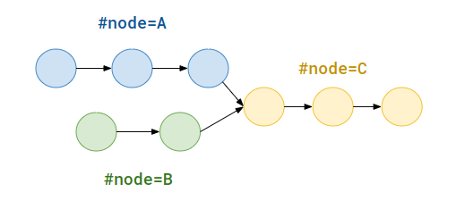

## [707. Design Linked List](https://leetcode.com/problems/design-linked-list/)

```kotlin
data class Node(
    val value: Int,
    var next: Node? = null
)

class MyLinkedList() {

    private var head: Node? = null

    fun get(index: Int): Int {
        if (index == 0 && head == null) return -1

        var i = 0
        var node: Node? = head
        while (i < index) {
            i++
            node = node?.next
        }
        return node?.value ?: -1
    }

    fun addAtHead(value: Int) {
        val newNode = Node(value, next = head)
        head = newNode
    }

    fun addAtTail(value: Int) {
        if (head == null) {
            addAtHead(value)
            return
        }
        var last: Node? = head
        while (last?.next != null) {
            last = last.next
        }
        val newNode = Node(value)
        last?.next = newNode
    }

    fun addAtIndex(index: Int, value: Int) {
        if (index == 0) {
            addAtHead(value)
            return
        }
        var i = 0
        var previous: Node? = null
        var current: Node? = head        
        while (i < index) {
            i++
            previous = current
            current = current?.next
        }
        val newNode = Node(value, next = current)
        previous?.next = newNode
    }

    fun deleteAtIndex(index: Int) {
        if (index == 0) {
            head = head?.next
            return 
        }
        var previous: Node? = null
        var current: Node? = head
        var i = 0
        while (i < index) {
            i++
            previous = current
            current = current?.next
        }
        previous?.next = current?.next
    }
}
```

----
## [203. Remove Linked List Elements](https://leetcode.com/problems/remove-linked-list-elements/)

```js
// Delete the head, and move the head
[6, 6, 6, 1], value = 6 --> [1]

// Delete non-head node
[1, 2, 3, 3], value = 3 --> [1, 2]
```

When deleting a node, we can implement in the following way:

```kotlin
var previous: ListNode? = null
var current: ListNode? = head
while (current != null) {
    if (current == nodeToDelete) {
        previous?.next = current.next
    } else {
        previous = current
        current = current.next
    }
}
```

However, the implementation will not work when delete the head, since `previous` is null and `previous?.next` will not be executed at all, we have find other way to handle the case to delete head.

We introduce *sentinel node* to help us when deleting the head node so that we can implement node deletion in the above way even for deleting head.

```kotlin
fun removeElements(head: ListNode?, `val`: Int): ListNode? {
    val sentinel = ListNode(-1)
    sentinel.next = head
    // Here is different part.
    var previous: ListNode? = sentinel
    var current: ListNode? = head
    while (current != null) {
        if (current.`val` == `val`) {
            previous?.next = current.next
        } else {
            previous = current
        }
        current = current.next
    }
    return sentinel?.next
}
```

----
## [83. Remove Duplicates from Sorted List](https://leetcode.com/problems/remove-duplicates-from-sorted-list/)

```kotlin
fun deleteDuplicates(head: ListNode?): ListNode? {
    var node: ListNode? = head
    while (node != null) {
        val nextUniqueNode = findNextUniqueNode(node.next, node.value)
        // Relink to unique node (delete duplicate nodes)
        node.next = nextUniqueNode

        // Move onto to next pointer
        node = nextUniqueNode
    }
    return head
}

private fun findNextUniqueNode(nextNode: ListNode?, value: Int): ListNode? {
    var node: ListNode? = nextNode
    while (node != null && node.value == value) {
        node = node.next
    }
    return node
}
```

----
## [82. Remove Duplicates from Sorted List II](https://leetcode.com/problems/remove-duplicates-from-sorted-list-ii/)

```kotlin
fun deleteDuplicates(head: ListNode?): ListNode? {
    val sentinel = ListNode(-1000)
    sentinel.next = head

    // The predecessor node before the start of duplicate
    var predecessor: ListNode? = sentinel

    var current: ListNode? = head
    var next: ListNode? = head?.next
    while (next != null) {
        if (current?.`val` == next?.`val`) {
            // loop until item becomes distinct
            while (current?.`val` == next?.`val`) {
                current = next
                next = next?.next
            }

            // pointer to the distinct item
            predecessor?.next = next
        } else {
            predecessor = current
        }
        current = next
        next = next?.next
    }
    return sentinel.next
}
```

### Test Cases
```
1 -> 1
1 -> 1 -> 2 -> 2
1 -> 2 -> 2 -> 2 -> 3 -> 3
```

----
## [206. Reverse Linked List](https://leetcode.com/problems/reverse-linked-list/)

```kotlin
fun reverseList(head: ListNode?): ListNode? {
    var previous: ListNode? = null
    var current: ListNode? = head

    while (current != null) {
        // We have to store the next pointer first before overriding.
        val next = current.next
        current.next = previous

        previous = current
        current = next
    }
    return previous
}
```

----
## [92. Reverse Linked List II](https://leetcode.com/problems/reverse-linked-list-ii/)

**Idea!** We find the part to reverse and the before / after node of reverse list, reuse modified `reverseLinkedList(node)` with length to reverse, and relink the before / after node pointer to correct.

```js
1 -> 2 -> 3 -> 4 -> 5
left = 2, right = 4

// Traverse list to find the before / after pointer
before = 1
after = 5

// Reverse from left to right
reversedHead = reverseLinkedList(2 -> 3 -> 4), return 4

// Relink before and after pointer to reverse list
before -> reversedHead -> ... -> after
```

For the example: `1 -> 2 -> 3 -> 4 -> 5`, left = 2, right = 4, we have to find `1 -> 2` and `4 -> 5`, and reverse between `2 -> 3 -> 4` and relink `1` to the new head of reversed list and relink the last node of reversed list to `5`.

```kotlin
fun reverseBetween(head: ListNode?, left: Int, right: Int): ListNode? {
    // We introduce sentinel for help
    val sentinel = ListNode(-1)
    sentinel.next = head
    
    // Looking for 1 -> 2
    var nodeBeforeLeft: ListNode? = sentinel
    var leftNode: ListNode? = head
    var i = 1
    while (i < left) {
        nodeBeforeLeft = leftNode
        leftNode = leftNode?.next
        i++
    }
    // Lookin for 4 -> 5
    var rightNode: ListNode? = nodeBeforeLeft
    var nodeAfterRight: ListNode? = rightNode?.next
    while (i <= right) {
        rightNode = rightNode?.next
        nodeAfterRight = rightNode?.next
        i++
    }
    
    val reverseHead = reverse(leftNode, right - left + 1)
    // Relink 1 -> reversed list
    nodeBeforeLeft?.next = reverseHead
    // Relink reversed list -> 5
    leftNode?.next = nodeAfterRight
    return sentinel.next
}

private fun reverse(start: ListNode?, count: Int): ListNode? {
    var previous: ListNode? = null
    var current: ListNode? = start
    var i = 0
    while (current != null && i < count) {
        val next = current?.next
        current?.next = previous
        previous = current
        current = next
        i++
    }
    return previous
}
```

----
## [876. Middle of the Linked List](https://leetcode.com/problems/middle-of-the-linked-list/)

```kotlin
data class ListNode(
    val value: Int,
    var next: ListNode? = null
)

fun middleNode(head: ListNode?): ListNode? {
    val size = getSize(head)
    val middle = size / 2
    var i = 0
    var node = head
    while (i < middle) {
        node = node?.next
        i++
    }
    return node
}

private fun getSize(head: ListNode?): Int {
    var node = head
    var size = 0
    while (node != null) {
        size++
        node = node.next
    }
    return size
}
```

We also can achieve by two pointers approach, slow pointer goes 1 step, fast pointer goes 2 step:

```kotlin
fun middleNode(head: ListNode?): ListNode? {
    var slow: ListNode? = head
    var fast: ListNode? = head?.next
    while (fast != null) {
        slow = slow?.next
        fast = fast?.next?.next
    }
    return slow
}
```

----
## [141. Linked List Cycle](https://leetcode.com/problems/linked-list-cycle/)

```kotlin
fun hasCycle(head: ListNode?): Boolean {
    val seenNode = hashSetOf<ListNode>()
    var node = head
    while (node != null) {
        if (seenNode.contains(node)) {
            return true
        }
        seenNode.add(node)
        node = node.next
    }
    return false
}
```

We can use two pointers approach to solve this with `O(1)` space:
1. Slow pointer goes 1 step, fast pointer goes 2 step.
2. Traverse the linked list.
3. The two pointer will meet at the same node if there is cycle.

```kotlin
fun hasCycle(head: ListNode?): Boolean {
    var slow: ListNode? = head
    var fast: ListNode? = head?.next
    while (slow != null) {
        if (fast == slow) return true
        show = show?.next
        fast = fast?.next?.next
    }
    return false
}
```

----
## [142. Linked List Cycle II](https://leetcode.com/problems/linked-list-cycle-ii/)

```kotlin
fun detectCycle(head: ListNode?): ListNode? {
    val seenNodeSet = hashSetOf<ListNode>()
    var node: ListNode? = head
    while (node != null) {
        if (seenNodeSet.contains(node)) {
            return node
        }
        seenNodeSet.add(node)
        node = node.next
    }
    return null
}
```

We can use two pointers approach to solve this with `O(1)` space. (like [the solution](../leetcode/141.linked-list-cycle.md) with some extra steps)

> Explanation: https://leetcode.cn/problems/linked-list-cycle-ii/solution/142-huan-xing-lian-biao-ii-jian-hua-gong-shi-jia-2/
>
> There are some equivalent two pointers implementation, but we have make sure that `slow` and `fast` pointers **start from the same node**!!.

```kotlin
fun detectCycle(head: ListNode?): ListNode? {
    var slow: ListNode? = head
    var fast: ListNode? = head

    boolean containsCycle = false
    while (slow != null) {
        slow = show.next
        fast = fast?.next?.next

        if (slow == fast) {
            containsCycle = true
            break
        }
    }

    if (!containsCycle) return null
    slow = head
    while (slow != fast) {
        slow = slow?.next
        fast = fast?.next
    }
    return slow
}
```

---
## [21. Merge Two Sorted Lists](https://leetcode.com/problems/merge-two-sorted-lists/)

* Sentinel node
* Better way to concanate the remaining list.

```kotlin
fun mergeTwoLists(list1: ListNode?, list2: ListNode?): ListNode? {
    val sentinel = ListNode(0)
    var result: ListNode? = sentinel
    var node1: ListNode? = list1
    var node2: ListNode? = list2
    while (node1 != null && node2 != null) {
        if (node1.`val` < node2.`val`) {
            result?.next = node1
            node1 = node1.next
        } else {
            result?.next = node2
            node2 = node2.next
        }
        result = result?.next
    }
    // Chain the rest linked list
    result?.next = if (node1 == null) node2 else node1
    return sentinel.next
}
```

### Recursion
We can do this recursively:
* Base case: if `list1` is null, then return another `list2`, vise verse.
* Recursive case: `list1[i] + f(list1.next, list2)` if `list1[i] < list2[i]` and vice verse.

```kotlin
fun mergeTwoLists(list1: ListNode?, list2: ListNode?): ListNode? {
    if (list1 == null) return list2
    if (list2 == null) return list1

    if (list1.`val` < list2.`val`) {
        list1?.next = mergeTwoLists(list1?.next, list2)
        return list1
    } else {
        list2?.next = mergeTwoLists(list1, list2?.next)
        return list2
    }
}
```

----
## [234. Palindrome Linked List](https://leetcode.com/problems/palindrome-linked-list/)

```kotlin
fun isPalindrome(head: ListNode?): Boolean {
        val size = getSize(head)
        val middle = (size + 1) / 2
        var i = 0
        var middleNode: ListNode? = head
        while (i < middle) {
            middleNode = middleNode?.next
            i++
        }
        val end = reverse(middleNode)
        
        var n1: ListNode? = head
        var n2: ListNode? = end
        // Here we check n2 only
        // for size = 5, 1 -> 2 -> 3 -> 2 -> 1
        //  n1 = 1 -> 2 -> 3 
        //  n2 = 1 -> 2 (reversed)
        while (n2 != null) {
            if (n1?.`val` != n2?.`val`) return false
            n1 = n1?.next
            n2 = n2?.next
        }
        return true
    }
    
    private fun getSize(head: ListNode?): Int {
        var size = 0
        var node: ListNode? = head
        while (node != null) {
            size++
            node = node.next
        }
        return size
    }
    
    private fun reverse(head: ListNode?): ListNode? {
        var previous: ListNode? = null
        var current: ListNode? = head
        while (current != null) {
            val next = current.next
            current.next = previous
            previous = current
            current = next
        }
        return previous
    }
```

Another way is using two pointers to locate the middle node, then reverse the node after the node, then check if the two parts are palindrome, and reverse back.

```kotlin
    fun isPalindrome(head: ListNode?): Boolean {
    val middle = middleOfLinkedList(head)
    val reverseHead = reverseLinkedList(middle?.next)

    var start: ListNode? = head
    var end: ListNode? = reverseHead
    while (start != null && end != null) {
        if (start?.`val` != end.`val`) {
            result = false
        }
        start = start?.next
        end = end.next
    }
    middle?.next = reverseLinkedList(reverseHead)
    return result
}

private fun middleOfLinkedList(head: ListNode?): ListNode? {
    var slow: ListNode? = head
    var fast: ListNode? = head
    // Slight different from the problem: 876. Middle of the Linked List, because we are looking for the node to break the list into two part to test if palindrome, (not the true middle node)
    // For [1 -> 2 -> 3 -> 3 -> 2 -> 1] we would find the first [3], not the second [3], but in problem 876. it should be the second [3].
    while (fast?.next != null && fast.next.next != null) {
        slow = slow?.next
        fast = fast.next?.next
    }
    return slow
}

private fun reverseLinkedList(node: ListNode?): ListNode? {
    var previous: ListNode? = null
    var current: ListNode? = node
    while (current != null) {
        val next = current.next
        current.next = previous

        previous = current
        current = next
    }
    return previous
}
```

----
## [19. Remove Nth Node From End of List](https://leetcode.com/problems/remove-nth-node-from-end-of-list/)

Solution with one pass but `O(n)` space complexity:

```kotlin
fun removeNthFromEnd(head: ListNode?, n: Int): ListNode? {
    if (head == null) return null
    
    val size = getSize(head)
    val position = size - n
    
    val sentinel = ListNode(-1)
    sentinel.next = head
    
    var previous: ListNode? = sentinel
    var current: ListNode? = head
    var i = 0
    while (i < position) {
        previous = current
        current = current?.next
        i++
    }
    previous?.next = current?.next
    
    return sentinel.next
}

private fun getSize(head: ListNode?): Int {
    var size = 0
    var node: ListNode? = head
    while (node != null) {
        size++
        node = node.next
    }
    return size
}
```

Two pointers solution: Let `fast` goes ahead `slow` pointer `n` steps, once `fast` reaches the last pointer, the `slow` pointer will be the node to delete, and we relink the `previous` node.

```js
1 -> 2 -> 3 -> 4 -> 5 -> 6 - 7 -> null, n = 3
               p    s             f
```

And to simplify the boundary conditions, we add sentinel node at first.

```kotlin
fun removeNthFromEnd(head: ListNode?, n: Int): ListNode? {
    val sentinel = ListNode(-1)
    sentinel.next = head
    
    var slow: ListNode? = sentinel
    var fast: ListNode? = sentinel
    
    // Forward fast pointer by n steps
    for (i in 0 until n) {
        fast = fast?.next
    }

    // Once fast pointer reaches the end of list, the slow pointer
    // will be located at the previous node of n-th node to delete.
    while (fast?.next != null) {
        slow = slow?.next
        fast = fast?.next
    }
    slow?.next = slow?.next?.next
    
    return sentinel.next
}
```
----
## [2. Add Two Numbers](https://leetcode.com/problems/add-two-numbers/)

```kotlin
fun addTwoNumbers(l1: ListNode?, l2: ListNode?): ListNode? {
    if (l1 == null || l2 == null) return null
    
    val sentinel = ListNode(-1)
    var result: ListNode = sentinel
    var n1: ListNode? = l1
    var n2: ListNode? = l2
    var carry = 0
    while (n1 != null || n2 != null) {
        val sum = (n1?.`val` ?: 0) + (n2?.`val` ?: 0) + carry
        val sumNode = ListNode(sum % 10)
        carry = sum / 10
        
        result.next = sumNode
        result = result.next!!
        n1 = n1?.next
        n2 = n2?.next
    }
    if (carry > 0) {
        result.next = ListNode(carry)
    }
    return sentinel.next
}
```

----
## [143. Reorder List](https://leetcode.com/problems/reorder-list/)

```kotlin
fun reorderList(head: ListNode?): Unit {
    if (head == null || head?.next == null) return
    val middle = middle(head)
    val reverseMiddleHead = reverse(middle)
    merge(head, reverseMiddleHead)
}

private fun middle(head: ListNode?): ListNode? {
    var previous: ListNode? = null
    var slow: ListNode? = head
    var fast: ListNode? = head
    while (fast != null && fast?.next != null) {
        previous = slow
        slow = slow?.next
        fast = fast?.next?.next
    }
    // Disconnect with middle node (see below)
    // 1 -> 2
    // 4 -> 3
    // or
    // 1 -> 2
    // 5 -> 4 -> 3
    previous?.next = null
    return slow
}

private fun reverse(head: ListNode?): ListNode? {
    var previous: ListNode? = null
    var current: ListNode? = head
    while (current != null) {
        val next = current.next
        current.next = previous
        previous = current
        current = next
    }
    return previous
}

private fun merge(l1: ListNode?, l2: ListNode?) {
    var i = 2
    var result: ListNode? = l1
    var n1: ListNode? = l1?.next
    var n2: ListNode? = l2
    while (n1 != null && n2 != null) {
        if (i % 2 == 0) {
            result?.next = n2
            n2 = n2?.next
        } else {
            result?.next = n1
            n1 = n1?.next
        }
        result = result?.next
        i++
    }
    if (n1 != null) result?.next = n1 else result?.next = n2
}
```

We will have duplicate node when reversing the list from the middle, so make sure to disconnect that node.

```js
// 3 is duplicate
1 -> 2 -> 3 -> X
4 -> 3 -> X

// 3 is duplicate
1 -> 2 -> 3 -> X 
5 -> 4 -> 3 -> X
```
----
## [160. Intersection of Two Linked Lists](https://leetcode.com/problems/intersection-of-two-linked-lists/)

```kotlin
fun getIntersectionNode(headA:ListNode?, headB:ListNode?):ListNode? {
    var seenNodeA = hashSetOf<ListNode>()
    var nodeA: ListNode? = headA
    while (nodeA != null) {
        seenNodeA.add(nodeA)
        nodeA = nodeA.next
    }

    var nodeB: ListNode? = headB
    while (nodeB != null) {
        if (seenNodeA.contains(nodeB)) {
            return nodeB
        }
        nodeB = nodeB.next
    }
    return null
}
```

* Since we CAN'T modify the list, so reversing and check is not doable. 
* We can get the length of two lists, and move the A/B pointers to the same starting node, then compare to find the same node.

```js
0 -> 1 -> 2 -> 3 -> 7 -> 8 -> 9, size = 7
          i
          5 -> 0 -> 7 -> 8 -> 9, size = 5
          j
```

```kotlin
fun getIntersectionNode(headA:ListNode?, headB:ListNode?):ListNode? {
    val sizeA = getSize(headA)
    val sizeB = getSize(headB)

    var nodeA: ListNode? = headA
    var nodeB: ListNode? = headB

    if (sizeA > sizeB) {
        val step = sizeA - sizeB
        for (i in 0 until step) {
            nodeA = nodeA?.next
        }
    } else {
        val step = sizeB - sizeA
        for (i in 0 until step) {
            nodeB = nodeB?.next
        }
    }

    // The size of two list might be different, so we can't use `nodeA != null && nodeB != null` as condition
    while (nodeA != nodeB) {
        nodeA = nodeA?.next
        nodeB = nodeB?.next
    }
    return nodeA
}

private fun getSize(head: ListNode?): Int {
    var size = 0
    var node: ListNode? = head
    while (node != null) {
        size++
        node = node.next
    }
    return size
}
```

### Two Pointers
Assume the number of nodes to travese shown below.



And we assume there is an interaction node:
* `nodeA` traverses from `headA` then traverses from `headB`, the total traversal nodes when reaching the interaction node 
are `A + C + B`.
* `nodeB` traveses the same way, the total traversal nodes is `B + C + A`.

At this point, `nodeA` and `nodeA` meet at the interaction node, so `A + C + B` = `B + C + A`.

1. If there is interaction which means `C > 0`, then two pointers will meet at the interaction node (`A + B` = `B + A`)
2. If no interaction (`C = 0`), then they meet at `null`.

```kotlin
fun getIntersectionNode(headA:ListNode?, headB:ListNode?):ListNode? {
    if (headA == null || headB == null) return null
    var nodeA: ListNode? = headA
    var nodeB: ListNode? = headB

    while (nodeA != nodeB) {
        nodeA = if (nodeA == null) headB else nodeA.next
        nodeB = if (nodeB == null) headA else nodeB.next
    }
    return nodeA
}
```

This problem **CAN'T** be solved by the following code:
```kotlin
fun getIntersectionNode(headA:ListNode?, headB:ListNode?):ListNode? {
    var a: ListNode? = headA
    var b: ListNode? = headB
    while (a != b) {
        a = a?.next ?: headB
        b = b?.next ?: headA
    }
    return a
}
```
Since the two nodes will meet at `null` (the end of the list) when there is no intersection, the above code will pass `null` at all.

```js
headA = 1 -> 5 -> 2
headB = 4 -> 6

// Traversal with null
1 -> 5 -> 2 -> null -> 4 -> 6 -> null
4 -> 6 -> null -> 1 -> 5 -> 2 -> null

// Traversal without null, it will never meet.
1 -> 5 -> 2 -> 4 -> 6
4 -> 6 -> 1 -> 5 -> 2
```

----
## [23. Merge k Sorted Lists](https://leetcode.com/problems/merge-k-sorted-lists/)

### Intuition
```kotlin
fun mergeKLists(lists: Array<ListNode?>): ListNode? {
    // Chain all linked list as one array list
    val itemList = mutableListOf<Int>()
    lists.forEach { list -> 
        var node: ListNode? = list
        while (node != null) {
            itemList.add(node!!.`val`)
            node = node!!.next
        }
    }
    // Sort that array list
    itemList.sort()

    // Create the result linked list from the sorted array list
    val sentinel = ListNode(0)
    var node: ListNode? = sentinel
    for (i in 0 until itemList.size) {
        node?.next = ListNode(itemList[i])
        node = node?.next
    }
    return sentinel.next
}
```

* **Time Complexity**: `O(N lg N)`, for `N` is total number of nodes.
* **Space Complexity**: `O(N)` for saving all nodes.

### Merge One By One
```kotlin
fun mergeKLists(lists: Array<ListNode?>): ListNode? {
    var result: ListNode? = null
    lists.forEach { head ->
        if (result == null) {
            result = head
        } else {
            result = mergeTwoLinkedList(result, head)
        }
    }
    return result
}

private fun mergeTwoLinkedList(list1: ListNode?, list2: ListNode?): ListNode? {
    val sentinel = ListNode(0)
    var result: ListNode? = sentinel
    var node1: ListNode? = list1
    var node2: ListNode? = list2

    while (node1 != null && node2 != null) {
        if (node1.`val` < node2.`val`) {
            result?.next = node1
            node1 = node1.next
        } else {
            result?.next = node2
            node2 = node2.next
        }
        result = result?.next
    }
    result?.next = if (node1 == null) node2 else node1
    return sentinel.next
}
```
* **Time Complexity**: `O(k * N)` for `N` is total number of nodes in the `result`.
* **Space Complexity**: `O(N)` for result / `O(1)` if we can modify the function argument.

### Divide & Conquer
We will merge each two lists into one, so `k` lists will be `k/2` lists, repeat until it becomes one sorted list.

* **Time Complexity**: `O(N * lg k)`
* **Space Complexity**: `O(N)` for result / `O(1)` if we can modify the function argument.

### Priority Queue
We add all head into priority queue, and poll the minimum value and put its next pointer into the queue.

```kotlin
fun mergeKLists(lists: Array<ListNode?>): ListNode? {
    val comparator = Comparator<ListNode> { n1, n2 ->
        when {
            n1.`val` < n2.`val` -> -1
            n1.`val` > n2.`val` -> 1
            else -> 0
        }
    }
    val priorityQueue = PriorityQueue(comparator)

    val sentinel = ListNode(0)
    var result: ListNode? = sentinel

    lists.forEach { head ->
        if (head != null) {
            priorityQueue.add(head)
        }
    }
    while (priorityQueue.isNotEmpty()) {
        val minValueNode = priorityQueue.poll()
        result?.next = minValueNode
        result = result?.next

        if (minValueNode?.next != null) {
            priorityQueue.add(minValueNode.next)
        }
    }
    return sentinel.next
}
```
* **Time Complexity**: `O(lg k)` for insert and poll operations of priority queue, and there are `N` total nodes, so it takes `O(N lg k)` time.
* **Space Complexity**: `O(k)` for priority queue.

----
## [328. Odd Even Linked List](https://leetcode.com/problems/odd-even-linked-list/)

We traverse the list once to check by two nodes (odd/even) together, and chain odd/even lists separately, then chain odd and even list together.

```js
1 -> 2 -> 3
------

1 -> 2 -> 3 -> 4
------    ------
```

```kotlin
fun oddEvenList(head: ListNode?): ListNode? {
    if (head == null) return null
    var odd: ListNode? = head
    var even: ListNode? = head?.next
    val evenStart: ListNode? = head?.next

    while (odd != null || even != null) {
        odd?.next = even?.next
        if (odd?.next == null) break
        odd = odd?.next
        even?.next = odd?.next
        even = even?.next
    }
    odd?.next = evenStart
    return head
}
```