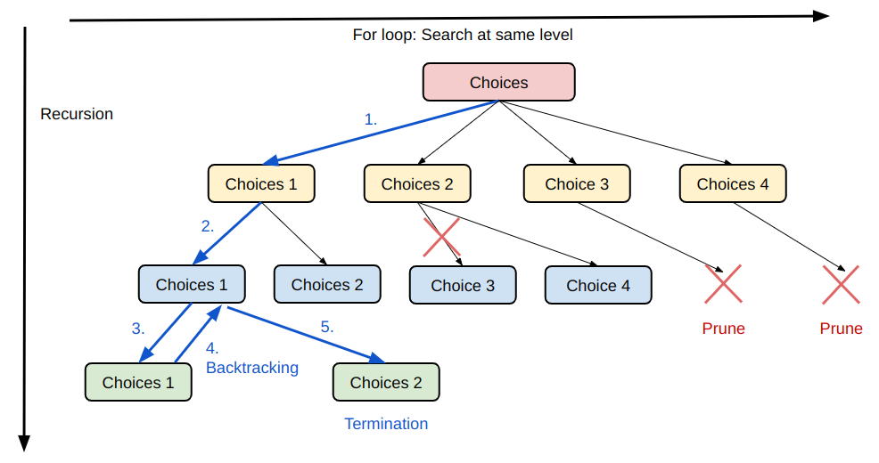
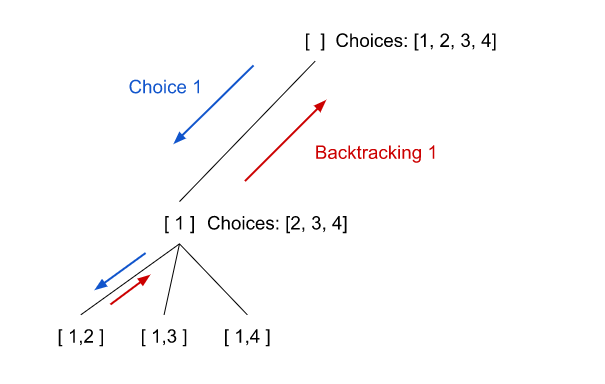

# Backtracking

> TODO: Translate to English.

## Definition

* 回溯本質上是「窮舉」，依照一些條件限制來搜尋、找到要的答案，算是暴力解法的一種，搭配一些剪枝來優化搜尋效能。
* 回溯解決的問題可以化成樹狀結構 (N-ary Tree)，可以透過遞迴在樹當中去做深度優先搜尋符合條件的找答案。



## Template
```kotlin
private val results = List<...>

fun problemSolution(集合): List<...> {
    選擇 = 轉化成選擇(集合)
    dfs(選擇, 參數, 空答案)
    return results
}

private fun dfs(選擇, 參數, 路徑) {
    if (終止條件) {
        // ArrayList 主要是在於 deep copy
        results.add(ArrayList<...>(路徑))
        return
    }

    for (下一步 in 選擇) {
        // Prune
        看看是否剪枝、跳過某些選擇

        做選擇加到路徑
        dfs(選擇, 參數, 路徑)
        // Backtracking
        路徑撤銷選擇
    }
}
```

### Elements

依照上述樣板，我們在解題時需要釐清幾個步驟的內容：
1. **遞迴參數**: 遞迴 `dfs` 的「參數」為何，選擇的集合為何？是否有限定開始搜尋的位置？條件為何？如何把目前組出來的答案傳到下一層？

```kotlin
fun dfs(candidates: IntArray, startIndex: Int, target: Int, combination: MutableList<Int>) {
    ...
}
```

2. **遞迴終止條件**: 遞迴該如何停止？通常抵達的時候會要把目前搜尋的結果更新到答案去。
3. **單層搜尋的邏輯**: 這邊就是看如何做迭代，其中迭代裡面又包含 1. 剪枝 2. 回溯 3. 去重
4. **剪枝**: 是否可以剪枝來增加搜尋效率？
> 小心有時候只是 continue 略過目前路徑，有時候可以 break 整個剪掉後面所有選擇。

5. **回溯**: 當我們加入一個選擇然後進入下一層搜尋結束返回後，應該把結果和對應的一些選擇回溯到之前的樣子，好讓我們可以在同一樹層進行另一選擇的搜尋。



6. **去重**: 答案是否可以出現重複的組合？像是 `[2, 3]` 和 `[3, 2]` 是否是一樣的？去除重複的條件判斷要小心，看是「同一層」不能重複 (橫向的迭代)、還是同一個搜尋路徑 (垂直的遞迴) 要判斷去除重複。

### Time Complexity
一般取決於上圖的橫軸 (橫向的迭代、樹的寬度、選擇的數量) 和縱軸 (垂直的遞迴、樹的高度) 相乘決定。

## Tips for [Problem Solving](../problems/problems-solutions.md#backtracking)
不論是排列 (Combination)、組合 (Permutation)、子集合 (Subset) 問題，大多是給定一個整數陣列 `nums` 然後取若干的元素組成路徑，主要有幾種變形：

1. `nums` 元素都唯一，每個元素只能被使用一次。
2. `nums` 元素有重複，不可複選。
3. `nums` 元素唯一，但是可以複選。

以上面幾種變形再加上一些其他限制，例如只能取 `k` 個元素當作題目。

## Resources
* [代码随想录](https://github.com/youngyangyang04/leetcode-master#%E5%9B%9E%E6%BA%AF%E7%AE%97%E6%B3%95)
* [回溯算法秒杀所有排列/组合/子集问题](https://labuladong.github.io/algo/1/9/)