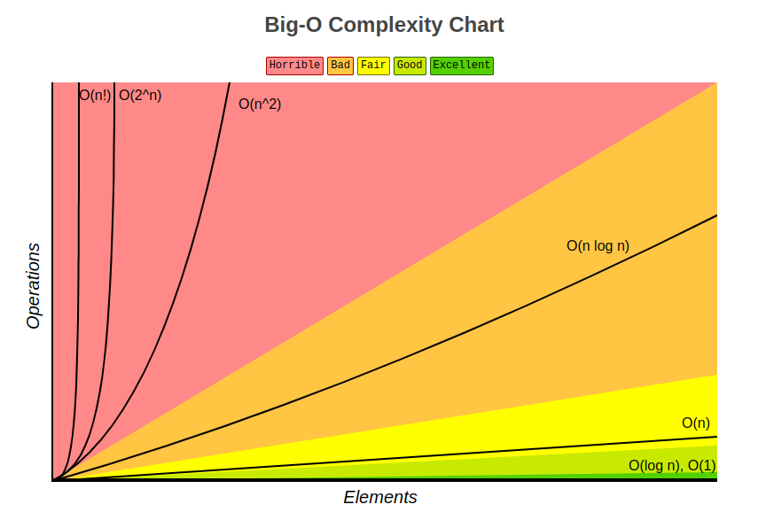

# Complexity

## Efficiency
How could we measure how fast an algorithm runs? The *efficiency* means not only 1) how fast the algorithm does run, but also 2)  how fast does it compare to others. It depends on the algorithm itself (implementation) and the machine, but we want to measure without knowing how fast the machine is, that is, want measure the performance to be **machine independent**. 

We don't want to count how long it runs on a real machine, we don't measure the time, instead, we want to abstract the time, count fundamental operations, expect performance to depend on **the size of our input**.

### Asymptotic Notation
We use *asymptotic notation* to ignore constants and low order terms that do not change with the input size.

- O Notation: Upper bound
- Ω Notation: Lower bound
- Θ Notation: Both, tight bound

| constant | logarithmic | linear | log-linear | quadratic | polynomial | exponential |
|----------|-------------|--------|------------|-----------|------------|-------------|
| Θ(1)     | Θ(log n)    | Θ(n)   | Θ(n log n) | Θ(n2)     | Θ(n^c)     | 2^Θ(n^c)    |

> Source: https://www.bigocheatsheet.com/

## Resources
- [X] [MIT 6.006 Introduction to Algorithm - Lecture 1: Algorithms and Computation](https://ocw.mit.edu/courses/electrical-engineering-and-computer-science/6-006-introduction-to-algorithms-spring-2020/lecture-videos/lecture-1-algorithms-and-computation/) (2)
- [X] CLRS - Ch 3. Growth of Functions // Definition, very detailed. (2)
- [ ] Fundamental of Data Structure (1)
- [ ] CTCI

- [ ] [Google Tech Dev Guide - Runtime Analysis](https://techdevguide.withgoogle.com/paths/data-structures-and-algorithms/#sequence-7) // Curated resources & links (1)
- [ ] [Khan Academy - Asymptotic Notation](https://www.khanacademy.org/computing/computer-science/algorithms/asymptotic-notation/a/asymptotic-notation) (1)
- [ ] [Coursera: Algorithm, Princeton](https://www.coursera.org/learn/algorithms-part1/lecture/xaxyP/analysis-of-algorithms-introduction)
- [ ] [Complexity：Asymptotic Notation(漸進符號)](http://alrightchiu.github.io/SecondRound/complexityasymptotic-notationjian-jin-fu-hao.html) // Nice introductory post
- [ ] [Coding Interview University - Complexity](https://github.com/jwasham/coding-interview-university#algorithmic-complexity--big-o--asymptotic-analysis) // Curated resources & links, however, they might be skipped after all since it's out-of-date.
- [ ] [Software Engineering Interview Preparation - Complexity](https://github.com/orrsella/soft-eng-interview-prep/blob/master/topics/complexity.md) // Like cheat sheet
- [ ] [Tech Interview Cheat Sheet - Asymptotic Analysis](https://github.com/TSiege/Tech-Interview-Cheat-Sheet#asymptotic-notation) // Cheat sheet
- [ ] [Stadford Foundations of Computer Science - The Running Time of Programs](http://infolab.stanford.edu/~ullman/focs/ch03.pdf) // Definition, very detailed, too long, might skip.
