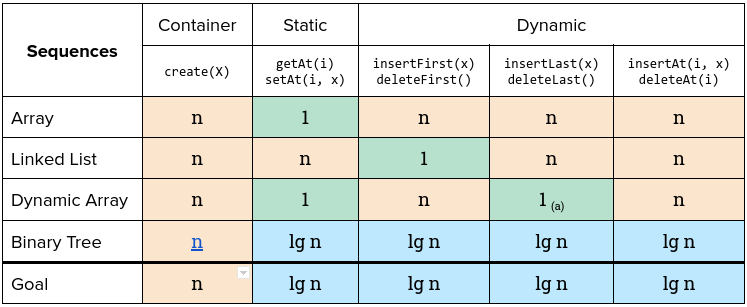
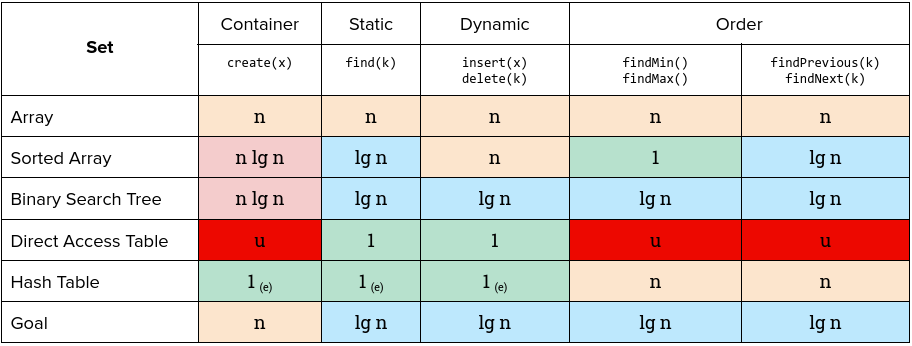
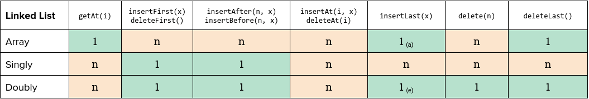
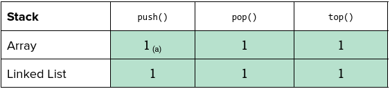
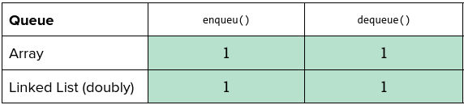
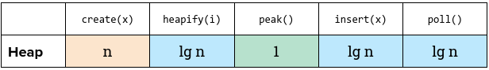
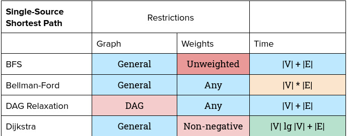
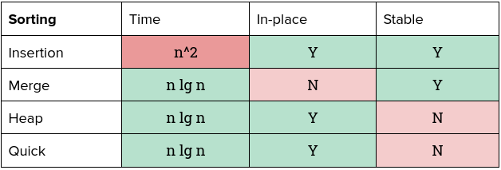

# Complexity

## Efficiency
How could we measure how fast an algorithm runs? The *efficiency* means not only 

1) how fast the algorithm does run, but also 
2) how fast does it compare to others. 

It depends on the algorithm itself (implementation) and the machine, but we want to measure without knowing how fast the machine is, that is, want to measure the performance to be **machine independent**. 

We don't want to count how long it runs on a real machine, we don't measure the time, instead, we want to abstract the time, count the fundamental operations, expect performance to depend on **the size of our input**.

The *running time* of an algorithm on a particular inputs is **the number of statements/operations/steps executed** which is to define the notation of step so that it's machine-independent.

## Runtime Analysis
For *insertion sort*, the code is below: 
```kotlin
fun insertSort(A) {
    for (j = 2 to A.size()) {           // For loop of unsorted array
        var key = A[j]                  // Current element to sort
        var i = j - 1                   // Previous element to compare
        while (i > 0 && A[i] > key) {   // Compare key with sorted array
            A[i + 1] = A[i]             // Shift elements if greater than key
            i = i - 1                   
        }
        A[i + 1] = key                  // Insert the key to right place where the previous is less than the key
    }
}
```

We start the running time analysis by presenting the time of seach tatements:
```kotlin
fun insertSort(A) {                     // ---- Times ----
    for (j = 2 to A.size()) {           // n, without -1 means the iteration that tests to break for-loop
        var key = A[j]                  // n - 1
        var i = j - 1                   // n - 1
        while (i > 0 && A[i] > key) {   // SUM(j = 2 to n) {j}, without -1 means the iteration that tests to break while-loop
            A[i + 1] = A[i]             // SUM(j = 2 to n) {j - 1}
            i = i - 1                   // SUM(j = 2 to n) {j - 1}
        }
        A[i + 1] = key                  // n - 1
    }
}
```

In insertion sort, the best case occurs if the array is already sorted, and its running time will be:

```kotlin
fun insertSort(A) {                     // ---- Times ----
    for (j = 2 to A.size()) {           // n
        var key = A[j]                  // n - 1
        var i = j - 1                   // n - 1
        while (i > 0 && A[i] > key) {   // n - 1, 
            A[i + 1] = A[i]             // 0, not running
            i = i - 1                   // 0, not running
        }
        A[i + 1] = key                  // n - 1
    }
}
```

It is **linear function** of `n` for the best case. What about the case that the array is in reverse sorted order - the worst case results, means that we must compare each keys `A[j]` with each element in the entire sorted sbuarray `A[1..j-1]`, so the running time will be:

```kotlin
fun insertSort(A) {                     // ---- Times ----
    for (j = 2 to A.size()) {           // n
        var key = A[j]                  // n - 1
        var i = j - 1                   // n - 1
        while (i > 0 && A[i] > key) {   // SUM(j = 2 to n) {j} = n(n + 1) / 2 - 1, 
            A[i + 1] = A[i]             // SUM(j = 2 to n) {j - 1} = n(n - 1) / 2
            i = i - 1                   // SUM(j = 2 to n) {j - 1} = n(n - 1) / 2
        }
        A[i + 1] = key                  // n - 1
    }
}
```

This worst running time can expressed as `a*n^2 + b*n + c`, it's a **quadratic function** of `n`.

We shall usually conccentrate on the worst-case running time, because of the three reasons:
1. It's the upper bound of running time for any input, it gives us a guarantee that the algorithm will never tak any longer.
2. For some algorithm, the worst case occurs fairly often.
3. The "average case" is often roughly as bad as the worst case.

We expect that the same algorithm running on a fast machine will run faster than the same algorithm on a slow one, however, we'd like to be able to compare without worrying about how fast the machine is, so we compare the running time based on *asymptotic performance* (the abstraction way) relative to the input size.

## Asymptotic Notation
When look at input sizes large engough to make only the order of growth of the running time relevant, we use *asymptotic notation* to express the **rate of growth** of an algorithm's running time in terms of the input size `n`.

For the worst-case running time of *insert sort* is `a*n^2 + b*n + c`, what we care about is the **order of growth**, we therefore consider:

1. Keep only the leading terms (`a*n^2`) and drop *lower-order terms* (`b*n + c`), since the lower-order terms are relatively insignificant for large `n`.
> `O(n^2 + n)` becomes `O(n^2)`. `O(n + log n)` becomes `O(n)`. `O(5 * 2 ^ n + 1000 * n ^ 100)` becomes `O(2^n)`.

2. Ignore the *constant coefficient* in the leading term, i.e. `a`.

Thus, we write that *insertion sort* has a worst-case running time of `Θ(n^2)`.

| O Notation                                                                   | Ω Notation                                                                    | Θ Notation                                           |
|------------------------------------------------------------------------------|-------------------------------------------------------------------------------|------------------------------------------------------|
| **Upper**  bound, an algorithm takes  **at most**  a certain amount of time. | **Lower**  bound, an algorithm takes  **at least**  a certain amount of time. | Both, tight bound                                    |
|                              |                           |  |
> Source: [Khan Academy - Algorithms](https://www.khanacademy.org/computing/computer-science/algorithms#asymptotic-notation)

The following table lists the common runtime from the fastest to slowest ones.

| constant | logarithmic | linear | log-linear | quadratic | polynomial | exponential | factorial |
|----------|-------------|--------|------------|-----------|------------|-------------|-----------|
| Θ(1)     | Θ(log n)    | Θ(n)   | Θ(n log n) | Θ(n^2)     | Θ(n^c)     | 2^Θ(n^c)    | Θ(n!)     |


> Source: https://www.bigocheatsheet.com/

## Runtime Analysis Techniques

### Summation Rules
Support an algorithm consists of two parts, one part takes `O(n^2)`, another take `O(n^3)`, we can simply "add" these two parts and drop the lower-order terms to be the running time of the entire algorithm.

Or more simple way for this rule: `O(f(n)) + O(g(n))` = `O(max(f(n), g(n)))`, for example, `6n^3 + 4n^2 + 10n + 1` is `O(n^3)` by summation rule.

What about `O(f(n)) * O(g(n))`? That would be `O(f(n) * g(n))`.

For example, an function that make `A` an n x n identity matrix (All the values are 1 in the diagonal position):

```kotlin
fun generateIdentityMatrix(n: Int) {    // Times
    for (i = 0; i < n; i++) {           // n + 1 
        for (j = 0; j < n, j++) {       // n
            A[i][j] = 0                 // n * n
        }
    }
    for (i = 0; i < n; i++) {           // n + 1
        A[i][i] = 1                     // n
    }
}
```
The running time of `generateIdentityMatrix()` is `O(n^2)` + `O(n)` = `O(n^2)` by summation rule.

How about the case `O(n + n/2)`, `O(2 * n)` or `O(n + log n)`? We can drop the constants (1.5, 2, (1 + log n) respectively) and keep the dominant term, so they are still `O(n)`. However, for `O(n + m)` we can not drop the term `m` since it is not relative to `n`.

### For Simple Statement
There are several kinds of statements can run in `O(1)` time, that is independent of the input size.
* Arithmetic: `+` or `%`.
* Logical: `&&` or `||`.
* Comparison: `<=`.
* Structure accessing: `A[i]`
* Assigment: `A[j + 1] = A[i]`
* Function calls not evaluating arguments: `print(...)` or `logger.debug(...)`
* Jump: `break` or `return`.

### For If-Else Conditional Statement
```kotlin
fun doSomething() {
    if (...) {
        here()      // Takes O(f(n))
    } else {
        there()     // Takes O(g(n))
    }
}
```

The running time of `doSomething()` is very straightforward, that is `O(max(f(n), g(n)))`.

### For For-Loops Statement
For example, the for-loop `for (i = 0; i < n; i++)`, it iterates `n` times (including the last time that tests to break the for-loop).

To bound the running time of for-loop, we must obtain an upper bound on **the number of loop iteration** times **the time to perform per iteration**, we can multiple the Big-O for the body by the Big-O of the loop, that is,

```kotlin
for (i = 0; i < n; i++) {           // n + 1
    A[i][i] = 1                     // n
}
```

The running time will be `O(n)`.

For some loops don't have an explicit count of number around the loop, we still can apply this rule:

```kotlin
fun linearSearch(A, value): Int {
    // ...
    var i = 0
    while (value != A[i]) { // Run n times at most = O(n)
        i++                 // n
        // ...
    }
    // ...
}
```
The running time of function `linearSearch()` is `O(n)` .

For the nested loop:
```kotlin
fun printPairs(array: Int[][]) {
    for (i = 0; i < array.length; i++) {
        for (j = i + 1; j < array.length; j++) {
            print(array[i][j])
        }
    }
}
```
We can **count the number of iteration** as we mention above, when i = 0, we have to run `n - 1` steps in j-loop and so on:
| Loop `i`             | 0     | 1     | 2    | ... | n - 1 |
|----------------------|-------|-------|------|-----|-------|
| Times of running `j` | n - 1 | n - 2 | n -3 | ... | 1     |

Therefore, the total steps is: `(n - 1) + (n - 2) + ... + 2 + 1` = `n * (n - 1) / 2`, that is `O(n^2)`.

How about we iterate an array with *only half of items*, that is `for (int i = 0; i < array.length / 2; i++)`? It does **NOT** impack the big O time, it's still `O(n)`.

⭐⭐ We just need to know **how many iterations** the for loop goes through in *the worst case*.

### Multi-Part Algorithms: Add vs. Multiple
```kotlin
// A block
arrayA.forEach { item ->
    print(item)
}

// B block
arrayB.forEach { item ->
    print(item)
}
```
We do A block then B block later, the total amount of work is `O(A + B)`.

```kotlin
// A block
arrayA.forEach { a ->
    // B block
    arrayB.forEach { b ->
        print("$a, $b")
    }
}
```
We do B block for each element in A, then the total amount of work is `O(A * B)`.

In other words:
* `"Do this, and when you're done, then do that"` ➡️ **add** the runtime.
* `"Do this for each time you do that"` ➡️ **multiple** the runtime.

## Running Time: log n
Let's use *binary search* as an example, we start searching from middle of `n`, then search left- (0 ~ n/2) or right-hand side (n/2 + 1 ~ n), and so on. We keep dividing by 2 until `n` reaches to 1.

```
For n = 16
n = 16
n = 8   // divide by 2
...
n = 1   // divide by 2   
```
How many times does `n` divide by 2 to be 1? Let's look in reverse, *how may time we can multiple 1 by 2 until we get `n`?

```
2 ^ 4 = 16, log 16 = 4
2 ^ k = n, log n = k
```

That we can conclude the runtime of binary search is `O(log n)`.

> What the base of the `log`? The short answer is that it doesn't matter for Big O at all.

### Common Combinatorics
| Combinations                                                                  | Running Times                      |
|-------------------------------------------------------------------------------|------------------------------------|
| All pairs                                                                     | O(n^2)                             |
| All triples                                                                   | O(n^3)                             |
| Divide by x                                                                   | O(log n)                           |
| Number of all permutations                                                    | n!                                 |
| `n` over `k`, number of combinations for choosing `k` items from a set of `n` | C(n over k) = n! / (k! * (n - k)!) |
| Number of subsets from a set of `n`                                           | 2^n                                |

> Usually, not always!!

## Space Complexity
1. Space complexity is a parallel concept to time complexity. For an array of size `n`, it requires `O(n)` space, and for two-dimensional array of `n x m`, it will requires `O(n * m)`.

Stack space in recursive calls counts, the following code would take `O(n)` space and time:

```kotlin
fun sum(n: Int): Int {
    if (n <= 0) return 0
    else return n + sum(n - 1)
}
```

Each function call adds a level to the stack (and exists for each call):
```
sum(4)
    -> sum(3)
        -> sum(2)
            -> sum(1)
                -> sum(0)
```

However, if the calls do not exist simultaneously on the call stack, you don't need `O(n)` space. For example,
```kotlin
fun sumPairSequence(n: Int): Int {
    var sum = 0;
    for (i in 0..n) {
        sum += sumPair(i, i + 1)
    }
    return sum
}

fun sumPair(a: Int, b: Int) = a + b
```
The function `sumPairSequence()` has runtime `O(n)` but only need `O(1)` space.

## Complexity Cheat Sheet









## Resources
- [MIT 6.006 Introduction to Algorithm - Lecture 1: Algorithms and Computation](https://ocw.mit.edu/courses/electrical-engineering-and-computer-science/6-006-introduction-to-algorithms-spring-2020/lecture-videos/lecture-1-algorithms-and-computation/)
- CLRS
    - Ch 2. Getting Started
    - Ch 3. Growth of Functions
- [Stadford Foundations of Computer Science - The Running Time of Programs](http://infolab.stanford.edu/~ullman/focs/ch03.pdf) // Comprehensive analysis of running time.
- CTCI // For interview keypoints, concepts and practices.
- Fundamental of Data Structure
- [Google Tech Dev Guide - Runtime Analysis](https://techdevguide.withgoogle.com/paths/data-structures-and-algorithms/#sequence-7) // Curated resources & links
- [Khan Academy - Asymptotic Notation](https://www.khanacademy.org/computing/computer-science/algorithms/asymptotic-notation/a/asymptotic-notation) 
- [Complexity：Asymptotic Notation(漸進符號)](http://alrightchiu.github.io/SecondRound/complexityasymptotic-notationjian-jin-fu-hao.html) // Nice introductory post
- [Coding Interview University - Complexity](https://github.com/jwasham/coding-interview-university#algorithmic-complexity--big-o--asymptotic-analysis) // Curated resources & links, but lots of resourse are old videos.
- [Software Engineering Interview Preparation - Complexity](https://github.com/orrsella/soft-eng-interview-prep/blob/master/topics/complexity.md) // Like cheat sheet
- [Tech Interview Cheat Sheet - Asymptotic Analysis](https://github.com/TSiege/Tech-Interview-Cheat-Sheet#asymptotic-notation) // Very short note

