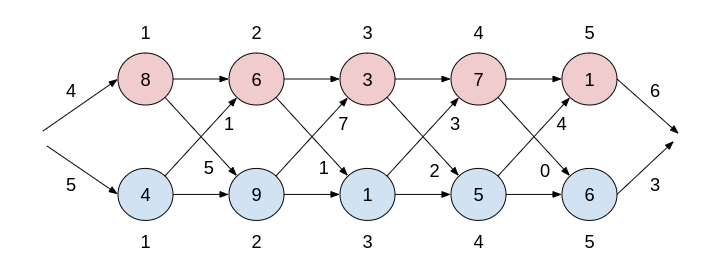
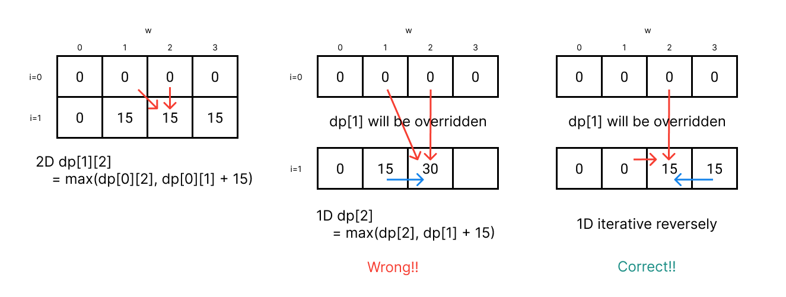
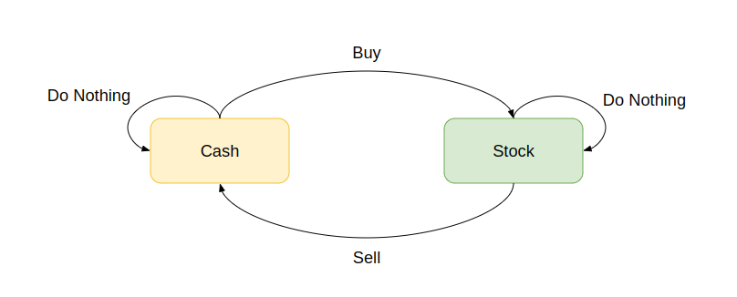
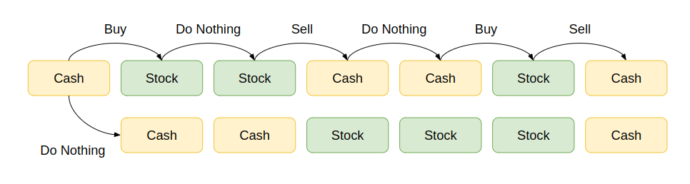

# Dynamic Programming
The *dynamic programming* (DP) generalizes *divide and conquer* method, solves problems by combining the solutions to subproblems.

## DP = Subproblem + Re-use!
The basic idea of dynamic programming is to split the problem into subproblems, solve those subproblems and reuse the solutions to the subproblems.

We are going to break down a problem into a series of overlapping subproblems (top-down), and build up solutions from bottom subproblems to larger subproblems, and finally to the original problem (bottom-up). 

> The result of the previous answers helps us in choosing the future answers.

The DP algorithm is applicable when the subproblems are **dependent**, the subproblems share subsubproblems. It solves every subsubproblem once and saves its answer in a table (*programming*), thereby avoiding recompute every time the subsubproblem. DP is a powerful technique that solves problems in polynomial time for which naive or brute-force approach would take exponential time. 

DP is typically applied to *optimization problems*, there will be many possible solutions with a *value* and we wish to find a solution with optimal value which is minimum or maximum.

We might need to maintain auxiliary information (such as parent pointer to the subproblem) in addition to reconstruct the answer we are optimizing.

### DP = Recursion + Memoization
* If we solved before, just reuse the solution from memoization.
* Otherwise, we compute and store it, return that solution.

```kotlin
fun solveProblem(subproblem) {
    // We check the memo first, return once if record exists
    if (subproblem in memo) {
        return memo[subproblem]
    } else {
        // We calculate solution to a subproblem
        val solution = if (subproblem is base case) 
            base case
        else {
            recursion via relation
        }
        // And record into a memo
        memo[subproblem] = solution
    }
}
```

## Solve Problems [Recursively](../topics/recursion.md)
To solve a problem using DP, we follow the *recursive algorithm design paradigm*: `SRT BOT`
* **S**ubprobem definition: 
    * Describe **in words** in terms of parameters.
    * It's often the subset of input, such as prefix/suffix/substrings of a sequence.
* **R**elate subproblem solutions recursively
* **T**opological order on subproblems
* **B**ase case
* **O**riginal problem solution via subproblem
* **T**ime analysis: The total **non-recursive** work * number of the work.

Let's take a look at how to solve *Fibonacci Numbers* using `SRT BOT` framework:
* **S**ubproblem: `F(i)`, the i-th Fibonacci number where `0 <= i <= n`.
* **R**elation: `F(i) = F(i - 1) + F(i - 2)`
* **T**opological order: Increasing `i`.
* **B**ase case: `F(i) = i` for `i` = 0 or 1.
* **O**riginal problem: `F(n)`
* **T**ime: `T(n) = T(n - 1) + T(n - 2)` by recurrence, that would be `Θ(2 ^ n)`.

The time complexity is exponential and there are some duplicate calculations, we can use *memoization* to avoid the re-calculation.

### Memoization
**Idea!** Remember and re-use the solution to subproblems, we maintain hash table mapping to subproblem, and the recursive function calls return the stored value or compute + store if not exist. For Fibonacci Numbers, we only have to calculate `F(1)`, `F(2)`...`F(n - 1)`, store and re-use for `F(n)`, that will be `O(n)` calculation. The intuition behind DP is that we **trade space for time**. 

```kotlin
// Recursive
fun fibonacci(n: Int): Int {
    return if (n == 0 || n == 1) n
    else fibonacci(n - 1) + fabonacci(n - 2)
}

// With memoization
fun fibonacci(n: Int): Int {
    if (n <= 1) return n
    val dp = IntArray(n + 1)
    dp[0] = 0
    dp[1] = 1
    for (i in 2..n) {
        dp[i] = dp[i - 1] + dp[i - 2]
    }
    return dp[n]
}
```

## Steps of Dynamic Programming
1. Try to break down the problem into optimal subproblems.
2. Define the solution to the original problem recursively in terms of the solution to subproblems.
3. Compute the value of optimal solution to the subproblems in a bottom-up fashion.
4. Constuct the optimal solution to the original problem from the solutions to subproblems of step 3. (memoization) and *backtracking*.

> Update note from this ref: https://leetcode.com/problems/min-cost-climbing-stairs/discuss/476388/4-ways-or-Step-by-step-from-Recursion-greater-top-down-DP-greater-bottom-up-DP-greater-fine-tuning
> 
> Merge the [Problem Solving Steps](#problem-solving-steps)

For the assembly line scheduling problem (CLRS P.324):


1. The fastest way is either through the previous station in the same line or a transfer from another line.
2. `f1(n) = min{f1(n - 1) + a(n), f2(n - 1) + t(n -1) + a(n)}`
3. Calculate `f1(n)` and `f2(n)` for each station, and store the *backtrack* solution.
4. Construct the fast path from the stored *backtrack* of step 3.

## Elements of Dynamic Programming
* **Optimal substructure**: The optimal solution to the original problem contains within its optimal solutions to subproblems. That is, we can build the solution to the original problem from the solutions to subproblem.
* **Overlapping subproblems**: We can break down the problem into *overlapping subproblems". Then we can develop the recursive algorithm that solves the same subproblems over and over (memoization).
* **Memoization**: We maintain a table with subproblem solutions so that we can re-use to build the solution from bottom-up.

動態規劃問題一般來說就是求極值，要求極值就要窮舉所有可行的答案，然後從中找最佳解，這時候就需要正確的 **「狀態轉移方程式」** 才能窮舉所有可行答案，另外問題也要具有 **「最佳的子結構」(Optimal Substructure)** ，要可以透過子問題的答案推導出原問題的答案，還有 **「重疊的子問題」(Overlapping Subproblems)**，透過表格紀錄子問題答案來優化窮舉的過程，減少不必要的計算。

一般思考的框架會是：
```python
# Top-Down Dynamic Programming
def findOptimal(狀態1, 狀態2, ...): 
    for 選擇/動作 in 所有可能的選擇/動作:
        # 可能會是前幾個狀態去求最佳解
        result = 求最佳解(result, findOptimal(狀態1, 狀態2, ...))
    return result

# Or
# Bottom-Up Dynamic Programming
def findOptimal(狀態1, 狀態2, ...):
    ## Define base cases
    dp[0][0][...] = xxx

    ## Build up the solution to subproblems in bottom-up fasion
    for 狀態1 in 狀態 1 所有可能的值:
        for 狀態2 in 狀態 2 所有可能的值:
            for ...:
                dp[狀態1][狀態2][...] = 求最佳解(選擇/動作1, 選擇/動作2, ...)
    
    ## Return what the problem is asked
    return dp[x][y][...]
```
所以 **動態規劃基本上來說就是窮舉「狀態」然後在「選擇」中找出最佳解**。

> Source: https://labuladong.github.io/algo/


> This might be optional!

Solution representation classification based on shape of graph:

| Methods             | Graph   |
|---------------------|---------|
| Brute Force         | Star    |
| Divide & Conquer    | Tree    |
| Decrease & Conquer  | Chain   |
| Dynamic Programming | Graph   |
| Greedy              | Subgraph|

Recursive function call represents a vertex in a graph, and a directed edge from `A` to `B` if `B` calls `A`. And the graph of recursive calls must be acyclic. (otherwise it never terminates) That is, function call sequence is the topological order on the graph, and the subproblem dependencies **overlap** in the graph.

> TODO: For Knapsack problem (0/1 or unbounded), double check if the implementations are correct.
> * DP[`item + 1`][weight + 1] v.s. DP[`item`][weight + 1], **I saw lots of resources using `dp[item + 1][weight + 1]`**, try to figure out the meaning of `dp[i][j]`!!
> * The base cases
> * For loop order
> * For loop initialization
> * The return dp[item.size][weight] v.s. dp[item.size - 1][weight]
## 0-1 Knapsack Problem

```
Items: (value / weight)
X1: $1 / 2kg
X2: $10 / 5kg
X3: $7 / 3kg
X4: $13 / 8kg

Knapsack = 10kg max capacity
```

### Modeling the Problem
We have weight `w(i)`, value `v(i)` for each item, capacity = `k` for knapsack, to find the subset of items which value is max and sum of weights <= `k`. We also define `x(i)` to represent if an item is selected `1` or not `0`.

* Constraint: `SUM(i = 1 to N) {w(i) * x(i)} <= k`
* Objective: `SUM(i = 1 to N) {v(i) * x(i)}` is maximum and subject to the above problem constraint.

Optimal structure is `knapsack(i, w)` is capacity `w` of selected items `{1...i}`, which maximize `SUM(i = 1 to N) {v(i) * x(i)}` and is subject to `SUM(i = 1 to N) {w(i) * x(i)} <= k`

For our example will be:
```js
knapsack(i, w) = max{1 * x1 + 10 * x2 + 7 * x3 + 13 * x4} for some j and is subject to 2 * x1 + 5 * x2 + 3 * x3 + 8 * x4 <= k
```

We can determine if we're going to take the item or skip, or just skip it if it's overweighted.

```js
knapsack(i, w) =
    // w[i] <= w 
    knapsack(i - 1, w - w(i))   // We take item i
    knapsack(i - 1, w)          // We don't take item i

    // Or w[i] > w
    knapsack(i - 1, w)          // We can't take item i
```

### Top-Down Recursion
We calculate the maximum value from all `n` items and the whole `capacity`:
* We take the `n` item: the maximum value of `n` is the maximum value of `n - 1` item + value of `n`.
* Or we don't take the `n` item.

```kotlin
val values = intArrayOf(60, 100, 120)
val weights = intArrayOf(10, 20, 30)
val capacity = 50

// We're going to determine to take `i-th` item under current remaining capacity `w`
// NOTE: Here we use 1-based index!! Or some call it the item count.
private fun knapsack(i: Int, w: Int): Int {
    // Base cases: no item or no capacity
    if (i == 0 || w == 0) return 0
    // Overweight when taking current item, then not take it
    return if (weights[i - 1] > w) knapsack(i - 1, w)
    else max(
        // Take it
        knapsack(i - 1, w - weights[i - 1]) + values[i - 1],
        // Not take it
        knapsack(i - 1, w)
    )
}

// We have n items with capacity, and start taking the last item until no item.
knapsack(values.size, capacity)
```

* **Time Complexity**: `O(2^n)`, we either can take or skip for each items, it's 2 choices and we have `n` items.
* **Space Complexity**: `O(n)` for recursive function call stack.

### Top-Down DP
Let `dp[i][j]` represent the maximum value of capacity `j` from considering the items of size `i` (from `0` to `i - 1` items, i.e. `values[0:i-1]`)

> **Note**: We have to keep in mind what the `dp[i][w]` stands for.

> We might skip this approach, we just start from bottom-up DP solution for knapsack problem.

```kotlin
private val dp = Array(values.size + 1) { _ -> IntArray(capacity + 1) { _ -> -1 } }

fun knapsack(i: Int, w: Int): Int {
    if (i == 0 || w == 0) return 0
    if (dp[i][w] != -1) return dp[i][w]
    if (weights[i - 1] > w) {
        dp[i][w] = knapsack(i - 1, w)
    } else {
        dp[i][w] = max(
            knapsack(i - 1, w - weights[i - 1]) + values[i - 1],
            knapsack(i - 1, w)
        )
    }
    return dp[i][w]
}

knapsack(values.size, capacity)
```

* **Time Complexity**: `O(W * N)`, where `N` is the number of items, and `W` for storing every possible weights range from 0 ~ `W` of the capacity.
* **Space Complexity**: `O(W * N)` for 2D array for memoization.

### Bottom-Up DP
```kotlin
fun knapsack(): Int {
    val dp = Array(values.size + 1) { _ -> IntArray(capacity + 1) }

    // Build up the solution in bottom-up fashion
    for (i in 0..values.size) {
        for (w in 0..capacity) {
            dp[i][w] = 
                // Base cases: either item size or capacity is 0
                if (i == 0 || w == 0) 0
                // Overweight, skip it
                else if (weights[i - 1] > w) dp[i - 1][w]
                else max(
                    // Take it
                    dp[i - 1][w - weights[i - 1]] + values[i - 1],
                    // Skip it
                    dp[i - 1][w]
                )
        }
    }
    return dp[values.size][capacity]
}
```

* **Time Complexity**: `O(W * N)`, where `N` is the number of items, and `W` for storing every possible weights range from 0 ~ `W` of the capacity.
* **Space Complexity**: `O(W * N)` for 2D array for memoization.

> **Note**: Mind the iteration variable, for `values` and `weights`, make sure to minus one, but does have to for `dp[i][w]`!!

### Bottom-Up DP (Space Optimization, 1D DP) 
For `dp[i][w] = max(dp[i - 1][w], dp[i - 1][w - weights[i]] + values[i])`, what we use is the previous row only, the idea to reduce the space is to copy `dp[i - 1]` to `dp[i]`. (2D to 1D)

So `dp[w]` is equivalient to `dp[i - 1][w]`, so the new state transition will be:

```js
dp[w] = max(dp[w], dp[w - weights[i]] + values[i])
```

```kotlin
val values = intArrayOf(15, 20)
val weights = intArrayOf(1, 2)
val capacity = 3

fun knapsack(): Int {
    val dp = IntArray(capacity + 1)
    dp[0] = 0
    for (i in 1..values.size) {
        // We iterate from capacity to w[i - 1] (decreasingly) and avoid overweight.
        // For overweight case, dp[w] = dp[w], it's trivial, we don't iterate.
        for (w in capacity downTo w[i - 1]) {
            dp[w] = max(
                // Take it
                dp[w - weights[i - 1]] + values[i - 1]
                // Skip it
                dp[w]
            )
        }
    }
    return dp[capacity]
}
```

```js
// Iterate from capacity downTo 0
w    0    1    2    3	
i=0  0    0    0    0	
i=1  0   15   15   15
i=2  0   15   20   35	
maxValue = 35

// Iterate from 0 to capacity
w    0    1    2    3	
i=0  0    0    0    0	
i=1  0   15   30   45	
i=2  0   15   30   45
maxValue = 45
```

When we count `dp[2]` for `i=1`:
* 2D: `dp[1][2] = max(dp[0][2], dp[0][1] + 15)`, where `dp[0][1]` and `dp[0][2]` are zero.
* 1D `dp[2] = max(dp[2], dp[1] + 15)`:
    * Iterate from 0 to `capacity`, `dp[1]` will be updated when calculate `i=1`, whereas it should be zero (`i=0`). It was overridden!!.
    * Iterate from `capacity` to `w[i - 1]`, we won't override `dp[1]` and it keeps the value for `i=0` when calcluate `dp[2]` of `i=1`.
    * Here we don't iterate to 0, because from `w[i - 1]` down to 0 are all cases that is overweight, it will skip taking item, and that will be `dp[w] = dp[w]`, which is trivial.



More important perspective, *double-counting*:

Suppose we update `dp[8]` from `dp[3]` for item `i` (which weight is 5), and we've calculated `dp[3]` for item `i` before (iterative capacity incremently), it means that you had already put item `i` on state `dp[3]`, so in essence, you're taking item `i` again when calculating `dp[8]` (double-counting) which is not allowed (there is one item item, not unlimited!!)

> Nice explanation: 
> * https://leetcode.com/discuss/study-guide/1200320/Thief-with-a-knapsack-a-series-of-crimes.
> * https://github.com/youngyangyang04/leetcode-master/blob/master/problems/%E8%83%8C%E5%8C%85%E7%90%86%E8%AE%BA%E5%9F%BA%E7%A1%8001%E8%83%8C%E5%8C%85-2.md
> * https://leetcode.com/problems/coin-change-2/discuss/176706/Beginner-Mistake%3A-Why-an-inner-loop-for-coins-doensn't-work-Java-Soln
> * https://leetcode.com/problems/coin-change-2/discuss/141076/Unbounded-Knapsack/180294

> **Note**: For bottom-up DP of 0/1 knapsack problem, we **CAN** exchange the order of two for-loop, however, space optimization and unbounded knapsack solution, **the for-loop order matters!!**

## Unbounded Knapsack Problems
The difference between [0/1 Knapsack Problem](#0-1-knapsack-problem) is that we can put the unlimited amount of items into knapsack (with capacity limit).

### Top-Down Recursion
```kotlin
// Top-Down Recursion
private fun knapsack(i: Int, w: Int): Int {
    if (i == 0 || w == 0) return 0
    if (weights[i - 1] > w) return knapsack(i - 1, w)
    else return max(
        // Here we pass `i`, not i - 1, because we have unlimit items, we keep taking i-th item if available.
        knapsack(i, w - weights[i - 1]) + values[i - 1], // Take it
        knapsack(i, w) // Skip it
    )
}
```

### Bottom-Up DP (Space Optimization)
Since we can take the same item in unlimited time, so we will iterate capacity from the lowest weight we can take to maximum capacity. (The only difference to 0/1 knapsack). 

> More detailed explanation see above or the double-counting from [link](https://leetcode.com/discuss/study-guide/1200320/Thief-with-a-knapsack-a-series-of-crimes).

```kotlin
fun knapsack(): Int {
    val dp = IntArray(capacity + 1)
    dp[0] = 0
    for (i in 1..values.size) {
        // Mind the iterate order (different from 0/1 knapsack 1D DP
        for (w in weights[i - 1]..capacity) {
            dp[w] = max(dp[w], dp[w - weights[i - 1]] + values[i - 1])
        }
    }
    return dp[capacity]
}
```

## Best Time to Buy and Sell Stock Problems
The following problems are categorized as *state machine* problems. 

| Problem          | Difficulty |
|------------------|------------|
|[121. Best Time to Buy and Sell Stock](../leetcode/121.best-time-to-buy-and-sell-stock.md)|Easy|
|[122. Best Time to Buy and Sell Stock II](../leetcode/122.best-time-to-buy-and-sell-stock-ii.md)|Medium|
|[123. Best Time to Buy and Sell Stock III](../leetcode/123.best-time-to-buy-and-sell-stock-iii.md)|Hard|

> * https://leetcode.com/problems/best-time-to-buy-and-sell-stock-iv/
> * https://leetcode.com/problems/best-time-to-buy-and-sell-stock-with-cooldown/
> * https://leetcode.com/problems/best-time-to-buy-and-sell-stock-with-transaction-fee/

### State Transitions
For this series of stock problems, we can apply the framework we mentioned above:
```py
## Iterate all states
for state1 in all possible values of state1:
    for state2 in all possible values of state2:
        for ...:
            dp[state1][state2][...] = selectOptimal(selection1, selection2, ...)
```

In order to solve by this framework, we have to define the states and selections. 

#### States
* For `state1`, it's the state of the `i-th` day, it's very straightforward.
* For `state2`, we might own the cash or the stock on specific day, so there are two states: `Cash` (you don't buy stock or sell back to cash out) or `Stock` (you bought it or cash in).
* For `state3`, there might be `k` times transactions limit.

#### Selections
And you have three selections (actions): `Do Nothing`, `Buy` and `Sell`.  Therefore, there are two actions for cash/stock state on `i-th` day state: you either can do nothing or buy/sell the stock (depend on whether you bought before or not), so the state machine for stock transaction on `i-th` day is


> For simplify, we use `state1` and `state2` only as example.

* If you stay in `Cash` state on `i - 1` day, then you can do nothing (`Cash`) or buy stock on `i` day (`Stock`).
* So on for `Stock` state.

The max profit is the `Cash` state on `n-th` day, and we have calculate the two states with different available selections (actions) from the first day to `n-th` day. 

In the framework, it would be:
```py
maxK = K
# State1: On i-th day
for i in prices:
    # State2: Cash (0) or Stock (1)
    for j in 0 or 1:
        ## (Optional): k times transactions limit
        for k in 1 to maxK:
            dp[i][j][k] = max(Do Nothing, Buy, Sell)
```

The `dp[i][j][k]` can interpreted as "the profit on `i-th` day, with (`j` = 1)/without stock (`j` = 0), with `k` times transactions limit.



So we can use DP to transit the state machine to find the max profit:
* We define our `dp[i][0]` and `dp[i][1]` as the max profit for `Cash` and `Stock` states on `i-th` day.
* For `Cash` state, we either can do nothing or sell.
```kotlin
dp[i][0] = max(dp[i - 1][0], dp[i - 1][1] + prices[i])
         = max( Do Nothing , Sell Stock )
```
* For `Stock` state, we either can do nothing or buy stock (we have to pay the cash for the price)
```kotlin
dp[i][1] = max(dp[i - 1][1], dp[i - 1][0] - prices[i])
         = max( Do Nothing , Buy Stock )
```
* The base cases for the two states would be `0` (We don't own stock, the profit is 0) and `-prices[0]` (We own the stock, but the profit is `-prices[0]`, we can't cash out)

```kotlin
fun maxProfit(prices: IntArray): Int {
    val n = prices.size
    val dp = Array(prices.size) { _ -> IntArray(2) }
    // The max profit for Cash state is 0
    dp[0][0] = 0
    // The max profit for Stock state is the amount we pay for the stock
    dp[0][1] = -prices[0]
    for (i in 1 until prices.size) {
        // Update the optimal solution of subproblems from selections
        dp[i][0] = max(dp[i - 1][0], dp[i - 1][1] + prices[i])
        dp[i][1] = max(dp[i - 1][1], dp[i - 1][0] - prices[i])
    }
    return dp[n - 1][0]
}
```

For problem 121, the `k` is one, and problem 122, the `k` is unlimited, the problem 123, the `k` is two.

> * Nice explanation and general template: https://leetcode.com/problems/best-time-to-buy-and-sell-stock-with-transaction-fee/discuss/108870/Most-consistent-ways-of-dealing-with-the-series-of-stock-problems
> * In chinese: [一个方法团灭 LEETCODE 股票买卖问题](https://labuladong.github.io/algo/1/13/)
> * Nice illustration: https://leetcode.com/discuss/study-guide/1490172/Dynamic-programming-is-simple

## Longest Common Subsequence Problem
Given two strings `A` and `B`, find the longest common subsequences (not necessarily continuous) of `A` and `B`.

### Characterization
For two strings `A` and `B`, we can start comparing either the first or the last character, and we assume the length of `A` and `B` is `m` and `n` respectively. And we're going to calculate `LCS(A[1 ~ m], B[1 ~ n])`, now we compare the last character:

* `A` = `A[1 ~ m - 1]` + `A[m]`
* `B` = `B[1 ~ n - 1]` + `B[n]`

> We're also able to compare the first character as well.

There are two cases of the last charater, either equal or different:
* If `A[m] == B[n]`, then the result will be `1 + LCS(A[1 ~ m - 1], B[1 ~ n - 1])`
* If they are different, then we compare the results of

```js
// The LCS of 
A[1 ~ m - 1] + A[m]
B[1 ~ n - 1]

// Or the LCS of
A[1 ~ m - 1]
B[1 ~ n - 1] + B[n]
```

That is, `max(LCS(A[1 ~ m - 1], B[1 ~ n]), LCS(A[1 ~ m], B[1 - n - 1]))`.

Then we can define the `SRT BOT` paradiam:
* **S**ubproblem: `L(i, j)` is the LCS of `A(1 ~ i)` and `B(1 ~ j)` for `i` in 1 to `m` and `j` in 1 to `n`.
* **R**elation: We compare the last character, so either they match or not.

```js
L(i, j) = LCS(i - 1, j - 1) + 1 if A[i] == B[j]
        = max(LCS(i - 1, j), LCS(i, j - 1)) if A[i] != B[j]
```
* **T**opological order: Subproblem `L(i, j)` depends on smaller `i` and/or `j` , we increase `i` and `j` to build the solution.
* **B**ase case: `A` or `B` is empty string, then `L(i, j)` will be 0.
* **O**riginal problem: `L(m, n)` and we have to store the parent pointer to construct the LCS.
* **T**ime: `O(m * n)`

### Top-Down Recursion
```kotlin
fun longestCommonSubsequence(A: String, B: String, lengthA: Int, lengthB: Int): Int {
    if (lengthA == 0 || lengthB == 0) return 0
    if (A[lengthA - 1] == B[lengthB - 1]) return 1 + longestCommonSubsequence(A, B, lengthA - 1, lengthB - 1)
    else return max(
        longestCommonSubsequence(A, B, lengthA - 1, lengthB),
        longestCommonSubsequence(A, B, lengthA, lengthB - 1)
    )
}

longestCommonSubsequence(A, B, A.length, B.length)
```

### Top-Down DP
```kotlin
// m, n represent the length of substring.
fun longestCommonSubsequence(A: String, B: String, m: Int, n: Int, dp: Array<IntArray>): Int {
    if (m == 0 || n == 0) return 0
    if (dp[m][n] != -1) return dp[m][n]
    dp[m][n] = if (A[m - 1] == B[n - 1]) 1 + longestCommonSubsequence(A, B, m - 1, n - 1, dp)
    else max(
        longestCommonSubsequence(A, B, m - 1, n, dp),
        longestCommonSubsequence(A, B, m, n - 1, dp)
    )
    return dp[m][n]
}

// +1 for the case of length == 0
val dp = Array(A.length + 1) { _ -> IntArray(B.length + 1) { _ -> -1 } }
longestCommonSubsequence(A, B, A.length, B.length, dp)
```

### Bottom-Up DP
```kotlin
fun longestCommonSubsequence(A: String, B: String): Int {
    val m = A.length
    val n = B.length
    // +1 for the case of length == 0
    val dp = Array(m + 1) { _ -> IntArray(n + 1) }
    // We maintain the parent table for constructing the LCS.
    val parent = Array(m + 1) { _ -> IntArray(n + 1) }

    // Base cases:
    for (i in 0..m) {
        dp[i][0] = 0
    }
    for (j in 0..n) {
        dp[0][j] = 0
    }

    // Build up the solutions
    for (i in 1..m) {
        for (j in 1..n) {
            if (A[i - 1] == B[j - 1]) {
                dp[i][j] = 1 + dp[i - 1][j - 1]
                // Go up and left
                parent[i][j] = 0 
            } else {
                if (dp[i - 1][j] > dp[i][j - 1]) {
                    dp[i][j] = dp[i - 1][j]
                    // Go up
                    parent[i][j] = 1
                } else {
                    dp[i][j] = dp[i][j - 1]
                    // Go left
                    parent[i][j] = 2
                }
            }
        }
    }
    return dp[m][n]
}
```

### Construct LCS
```kotlin
fun printLCS(parent: Array<IntArray>, x: Int, y: Int) {
    if (x == 0 || y == 0) return
    when (parent[x][y]) {
        // Go up and left
        0 -> {
            printLCS(parent, x - 1, y - 1)
            // The subsequences are in reversed order!! We have to print after the recursive calls.
            println(A[x - 1])
        }
        // Go up
        1 -> {
            printLCS(parent, x - 1, y)
        }
        // Go left
        2 -> {
            printLCS(parent, x, y - 1)
        }
        else -> return
    }
}
```

> We can print iteratively or contruct without parent table, just use [dp table](https://www.programiz.com/dsa/longest-common-subsequence).

* **Time Complexity**: `O(m * n)`, for `m`, `n` is the length of `A` and `B`.
* **Space Complexity**: `O(m * n)` for dp 2D table.

## Tips for [Problem Solving](../problems/problems-solutions.md#dynamic-programming)
* Most dynamic programming questions can be boiled down to a few categories. It's important to recognize the category because it allows us to FRAME a new question into something we already know. ([Source](https://leetcode.com/problems/target-sum/discuss/455024/DP-IS-EASY!-5-Steps-to-Think-Through-DP-Questions))
* For some problems, we have to return the max amoung DP table, not just `dp[0]` or `dp[n]` .

### When to use DP? 
The problem meets the both two characteristics:
1. Solve the optimal problem (often, but not always), for example:
    * The minimum cost
    * The maximum profit
    * How many ways are there to do...
    * What's the longest/shortest possible...
2. The solution of original problem comes from eariler calculated solution (from the overlapping subproblems), that is, the later step will be affected by the eariler step.

Sometimes, only meets the first but not the second might be the greedy algorithm, not DP.

### Problem Solving Steps
Assume we solve 1-dimension DP problem, and we use 1D array `dp[i]` to store the solution of subproblems:
1. Define the `dp[i]` and the definition of index.
2. Define the recursive steps a.k.a state transformation formular, such as `dp[i] = dp[i - 1] + dp[i - 2]`
3. Define the base case (initialization of `dp[i]`): `d[0] = 0`, `dp[1] = 1`.
4. Define how to iterate to get the original problem from building up the solution to subproblems.

> * TODO: Must practice!! [Top-Down + Bottom-up Optimization](https://leetcode.com/problems/min-cost-climbing-stairs/discuss/476388/4-ways-or-Step-by-step-from-Recursion-greater-top-down-DP-greater-bottom-up-DP-greater-fine-tuning)
> * https://leetcode.com/problems/target-sum/discuss/455024/DP-IS-EASY!-5-Steps-to-Think-Through-DP-Questions.
> * https://leetcode.com/problems/house-robber/discuss/156523/From-good-to-great.-How-to-approach-most-of-DP-problems

### How to Relate Subproblem Solutions
1. Try to identify the question about a subproblem.
2. Then locally brute-force the question, try all possible answers, and take the best one. The key for efficiency is that for the questions having a small number of possible answer, we can brute-force it very quickly.

### Memoization Recipe
Overall, try to think about your recursive functions call in terms of a **tree**, try to brute force all solutions, then you can recognize **where** can I optimize the brute force solution.

1. Make it work.
    * Visualize the problem as a *tree*.
    * Implement the tree using *recursion*.
    * Verify your solution works.

2. Make it efficient.
    * Design the *memo* data structure.
    * Check the memo first and return it.
    * Otherwise, calculate the solution and store into memo if it doesn't exist.

## Resources
- CLRS
- [MIT](https://ocw.mit.edu/courses/6-006-introduction-to-algorithms-spring-2020/resources/lecture-15-dynamic-programming-part-1-srtbot-fib-dags-bowling/) // There are four videos
- CTCI
- [Google Tech Dev Guide](https://techdevguide.withgoogle.com/paths/data-structures-and-algorithms/#sequence-9)
    * There a nice articles: [Introduction to Dynamic Programming](https://www.hackerearth.com/practice/algorithms/dynamic-programming/introduction-to-dynamic-programming-1/tutorial/)
- [Google Recuriter Recommended Problems List](https://turingplanet.org/2020/09/18/leetcode_planning_list/)
- [力扣加加](https://leetcode-solution-leetcode-pp.gitbook.io/leetcode-solution/thinkings/dynamic-programming)
- [代碼隨想錄](https://github.com/youngyangyang04/leetcode-master#%E5%8A%A8%E6%80%81%E8%A7%84%E5%88%92)
- [LC Learn](https://leetcode.com/explore/learn/card/dynamic-programming/) // Some topics are locked
- ~~[ ] [Coding Interview University](https://github.com/jwasham/coding-interview-university#dynamic-programming)~~
- [Tech Interview Handbook](https://www.techinterviewhandbook.org/algorithms/dynamic-programming/) // Not too much notes, some references posts only
- [动态规划详解](https://mp.weixin.qq.com/s/1V3aHVonWBEXlNUvK3S28w)
- [LeetCode Curated Posts](https://leetcode.com/discuss/general-discussion/665604/Important-and-Useful-links-from-all-over-the-LeetCode)