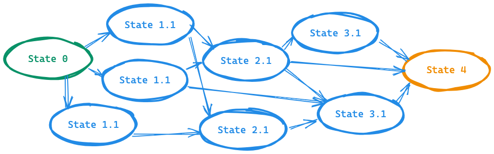
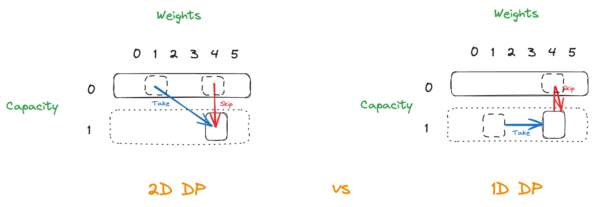
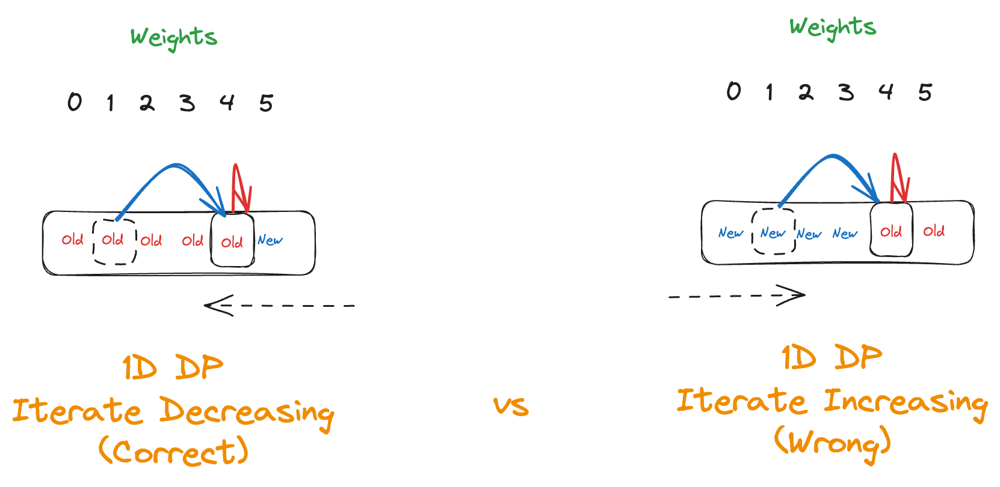

# Dynamic Programming
The *dynamic programming* (DP) generalizes *divide and conquer* method, solves problems by combining the solutions to subproblems.

## Overview
The basic idea of dynamic programming is to break down the problem into subproblems, solve those subproblems and reuse the solutions to the subproblems.

We are going to break down a problem into a series of overlapping subproblems (top-down), and build up solutions from bottom subproblems to larger subproblems, and finally to the original problem (bottom-up). 



> **Key Idea**: The result of the previous answers helps us in choosing the future answers.

The DP algorithm is applicable when the subproblems are **dependent**, the subproblems share subsubproblems. It solves every subsubproblem once and saves its answer in a table (*programming*), thereby avoiding recompute every time the subsubproblem. DP is a powerful technique that solves problems in polynomial time for which naive or brute-force approach would take exponential time. 

DP is typically applied to *optimization problems*, there will be many possible solutions with a *value* and we wish to find a solution with optimal value which is minimum or maximum.

### DP = Subproblem + Memoization = Recursion + Reuse
* If we solved before, just reuse the solution from memoization.
* Otherwise, we compute and store it, return that solution.

```kotlin
fun solveProblem(subproblem) {
    // We check the memo first, return once if record exists
    if (subproblem in memo) {
        return memo[subproblem]
    } else {
        // We calculate solution to a subproblem
        val solution = if (subproblem is base case) 
            base case
        else {
            recursion via relation
        }
        // And record into a memo
        memo[subproblem] = solution
    }
}
```

## Solve Problems [Recursively](../topics/recursion.md)
To solve a problem using DP, we follow the *recursive algorithm design paradigm*: `SRT BOT`
* **S**ubprobem definition: 
    * Describe **in words** in terms of parameters.
    * It's often the subset of input, such as prefix/suffix/substrings of a sequence.
* **R**elate subproblem solutions recursively
* **T**opological order on subproblems
* **B**ase case
* **O**riginal problem solution via subproblem
* **T**ime analysis: The total **non-recursive** work * number of the work.

Let's take a look at how to solve *Fibonacci Numbers* using `SRT BOT` framework:
* **S**ubproblem: `F(i)`, the i-th Fibonacci number where `0 <= i <= n`.
* **R**elation: `F(i) = F(i - 1) + F(i - 2)`
* **T**opological order: Increasing `i`.
* **B**ase case: `F(i) = i` for `i` = 0 or 1.
* **O**riginal problem: `F(n)`
* **T**ime: `T(n) = T(n - 1) + T(n - 2)` by recurrence, that would be `Θ(2 ^ n)`.

The time complexity is exponential and there are some duplicate calculations, we can use *memoization* to avoid the re-calculation.

### Memoization
**Idea!** Remember and re-use the solution to subproblems, we maintain hash table mapping to subproblem, and the recursive function calls return the stored value or compute + store if not exist. For Fibonacci Numbers, we only have to calculate `F(1)`, `F(2)`...`F(n - 1)`, store and re-use for `F(n)`, that will be `O(n)` calculation. The intuition behind DP is that we **trade space for time**. 

```kotlin
// Recursive
fun fibonacci(n: Int): Int {
    return if (n == 0 || n == 1) n
    else fibonacci(n - 1) + fabonacci(n - 2)
}

// With memoization
fun fibonacci(n: Int): Int {
    if (n <= 1) return n
    val dp = IntArray(n + 1)
    dp[0] = 0
    dp[1] = 1
    for (i in 2..n) {
        dp[i] = dp[i - 1] + dp[i - 2]
    }
    return dp[n]
}
```

## Elements of Dynamic Programming
* **Optimal substructure**: The optimal solution to the original problem contains within its optimal solutions to subproblems. That is, we can build the solution to the original problem from the solutions to subproblem.
* **Overlapping subproblems**: We can break down the problem into *overlapping subproblems". Then we can develop the recursive algorithm that solves the same subproblems over and over (memoization).
* **Memoization**: We maintain a table with subproblem solutions so that we can re-use to build the solution from bottom-up.

## Problem Solving Techniuqes
### When to use DP? 
The problem meets the following characteristics:
1. Solve the optimal problem (often, but not always), for example:
    * The minimum cost
    * The maximum profit
    * How many ways are there to do...
    * What's the longest/shortest possible...
2. The solution of original problem comes from eariler calculated solution (from the overlapping subproblems), that is, the later step will be affected by the eariler step.

> Sometimes, only meets the first but not the second might be the greedy algorithm, not DP. 

3. Recursion + duplicate calculation (the subproblems are overlapping), it might be solved by DP.

For some problems, we have to return the optimal value among DP table, not just `dp[0]` or `dp[n]` itself.

### Steps of Dynamic Programming
1. **Identify Category**: Most dynamic programming questions can be boiled down to a few categories. It's important to recognize the category because it allows us to FRAME a new question into something we already know. ([Source](https://leetcode.com/problems/target-sum/discuss/455024/DP-IS-EASY!-5-Steps-to-Think-Through-DP-Questions))

| Category                                     | Example Problem                                                                                                                                                      |
|----------------------------------------------|----------------------------------------------------------------------------------------------------------------------------------------------------------------------|
| 0/1 Knapsack                                 | [Equal Subset Sum Partition](../leetcode/416.partition-equal-subset-sum.md) / [Target Sum](../leetcode/494.target-sum.md)                                            |
| Unbounded Knapsack                           | [Coin Change](../leetcode/322.coin-change.md)                                                                                                                        |
| Fibonacci Sequence                           | [House Thief](../leetcode/198.house-robber.md), [Jump Game](../leetcode/55.jump-game.md)                                                                             |
| Counting / Distinct Ways                     | [Climbing Stairs](../leetcode/70.climbing-stairs.md), [Unique Paths I/II](../leetcode/62.unique-paths.md)                                                            |
| String / Substring / Subsequece / Palindrome | [Longest Palindromic Substring](../leetcode/5.longest-palindromic-substring.md), [Longest Increasing Subsequence](../leetcode/300.longest-increasing-subsequence.md) |
| Matrix / Grid 2D DP                          | [Unique Paths I/II](../leetcode/63.unique-paths.ii.md), [Minimum Path Sum](../leetcode/64.minimum-path-sum.md)                                                       |
| Shortest Path                                | Unique Paths I/II                                                                                                                                                    |
| Tree DP                                      | [House Robber III](../leetcode/337.house-robber-iii.md)                                                                                                              |
| Other                                        |                                                                                                                                                                      |

2. **Define States**: A set of necessary variables that are required to calculate the optimal result in the subproblems. 

```md
> Examples:
1. Knapsack: item index, capacity
2. Substring: `dp[i]` represents `s[0:i]`.
3. Subsequence: `dp[i][j]` represents `s1[0:i]` and `s2[0:j]`.
```

3. **Make Decision**: For each state, we can make the decision to calculate the optimal result. For Knapsack, it's whether to pick the number or not. For other problems, it might be which direction to go, which character to pick, etc.
4. Write **Recursion** + **State Transition**: The relationship between the current state and the next state. For Knapsack, it's the maximum value between picking and not picking the number. For other problems, it might be the minimum of the among all sub-problems, etc.

> **Tips**: We can try to do more problems and summarize all the possible state transition by examples. 套路性比較強烈，可多做題目總結可能的套路。([Source](https://leetcode-solution-leetcode-pp.gitbook.io/leetcode-solution/thinkings/dynamic-programming#xiao-jie-1))

5. Define **Base Case**: The base case usually represents the minimum or maximum value of the state. For Knapsack, it's when the index is out of bound or the capacity is negative. For other problems, it might be when the index is out of bound or the string is empty.
6. **Optimize**: We can apply memoization to recursion to avoid repeated calculation. We can also apply bottom-up DP (tabulation) to eliminate the overhead and stack overflow in recursion approach. It's important that the time complexity of the recursion approach and the bottom-up DP approach are the same. However, the bottom-up DP approach usually requires less memory space (eliminating the stack used in recursive function calls).
7. **Complexity**: We can analyze the time and space complexity based on **State** and **Memoization** / **Tabulation**.:
    * **Time Complexity**: `O(#State)`.
    * **Space Complexity**: `O(Size of memo / table)`.

動態規劃問題一般來說就是求極值，動態規劃的核心在於 **窮舉** 所有可行的答案，然後從中找最佳解。動態規劃遵循一個固定的流程：「遞迴的暴力解」->「帶有 Memo 的遞迴解」->「迭代的建立表格解」，這三個步驟都是為了窮舉所有可行解，然後找出最佳解。

需要正確的 **「狀態轉移方程式」** 才能窮舉所有可行答案，問題要具有 **「最佳的子結構」(Optimal Substructure)** ，可以透過子問題的答案推導出原問題的答案，還有 **「重疊的子問題」(Overlapping Subproblems)**，透過表格紀錄子問題答案來優化窮舉的過程，減少不必要的計算。

> 狀態轉移方程式:
> f(n) = 1                   if n is 1 or 2
>      = f(n - 1) + f(n - 2) if n > 1

「帶有 Memo 的遞回解」是問題結果的回推，把問題拆解變小直到變成 base case，而「迭代的建立表格解」則是從 base cases 逐步建立子問題的答案，直到建立出原本問題的答案。

一般思考的框架會是：
* 定義「Base Cases」 
    * -> 定義「狀態」
        * -> 定義「選擇」
            * -> 定義 DP 變數 / 函數的「定義」

按照上面的框架走的話，程式架構大概會長這樣：
```python
# Top-Down Dynamic Programming
def findOptimal(狀態1, 狀態2, ...): 
    for 選擇/動作 in 所有可能的選擇/動作:
        # 可能會是前幾個狀態去求最佳解
        result = 求最佳解(result, findOptimal(狀態1, 狀態2, ...))
    return result

# Or
# Bottom-Up Dynamic Programming
def findOptimal(狀態1, 狀態2, ...):
    ## Define base cases
    dp[0][0][...] = xxx

    ## Build up the solution to subproblems in bottom-up fasion
    for 狀態1 in 狀態 1 所有可能的值:
        for 狀態2 in 狀態 2 所有可能的值:
            for ...:
                dp[狀態1][狀態2][...] = 求最佳解(選擇/動作1, 選擇/動作2, ...)
    
    ## Return what the problem is asked
    return dp[x][y][...]
```
所以 **動態規劃基本上來說就是窮舉「狀態」然後在「選擇」中找出最佳解**。

### Steps by Steps
1. Find recusive relation.
2. Recursive (top-down)
3. Recursive + memo (top-down)
4. Iterative + memo (bottom-up)
5. Iterative + N variables (bottom-up)

Assume we solve 1-dimension DP problem, and we use 1D array `dp[i]` to store the solution of subproblems:

1. **Find recusive relation**: Define the `dp[i]` and the definition of index. Define the recursive steps a.k.a *state transition*, such as `dp[i] = dp[i - 1] + dp[i - 2]`, and the base case (initialization of `dp[i]`): `d[0] = 0`, `dp[1] = 1`.

> How to determine the size of `dp[i][j]`? Is `dp[m][n]` or `dp[m + 1][n + 1]`? It depends on **how we define the base case**.

```js
// Recursive relation
dp[i] = dp[i - 1] + dp[i - 2]

// Base case
dp[0] = 0
dp[1] = 1
```

2. **Recursive (top-down)**: Convert recurrence into recursive calls.
```kotlin
fun fib(n: Int): Int {
    if (n == 0) return 0
    if (n == 1) return 1
    return fib(n - 1) + fib(n - 2)
}
```

3. **Recursive + memo (top-down)**: Write recurrence, and add memoization to recursion - Time complexity from exponential to linear time.

```kotlin
fun fib(n: Int, memo: Map): Int {
    if (n == 0) return 0
    if (n == 1) return 1
    if (memo[n] != null) return memo[n]
    else {
        memo = fib(n - 1, memo) + fib(n - 2, memo)
        return memo
    }
}
```

> **Tips**: Try to write the recurrence relation in math formular to clearly define the relation. For example:
```latex
f(i, j) = f(i - 1, j - 1) if s[i] == t[j]
        = false           if s[i] != t[j]
```

4. **Iterative + tabulation (bottom-up)**: Convert resursive to iterative - Get rid of recursive call stack.

The biggest challenge here is how to iterate all possible states without any missing or duplication:
* For 1D dp, iterate either from left to right or right to left?
* For 2D dp, iterate either from top to bottom + left to right or bottom to top + right to left?
* For multiple states, which state to iterate first? Is it OK to alternate the order of iteration?

Without space optimization, the order of iterate dependes on *state transition*. **We have to ensure that previous states are already calculated before calculating the current state.** For example, if we want to calculate `dp[i]`, we have to calculate `dp[i - 1]` first, so we have to iterate from left to right. If we want to calculate `dp[i][j]`, we have to calculate `dp[i - 1][j]` and `dp[i][j - 1]` first, so we have to iterate from top to bottom and left to right.


```kotlin
fun fib(n: Int): Int {
    val dp = Array(n + 1)
    dp[0] = 0
    dp[1] = 1
    for (i in 2..n) {
        dp[i] = dp[i - 1] + dp[i - 2]
    }
    return dp[n]
}
```

5. **Iterative + N variables (bottom-up)**: Optimize the space complexity - Use only two variables instead of array, or use 1D array for 2D dp.

With space optimization, the order of iteration depends on *the relation before and after space optimization*. We have to know how we optimize the space.
```kotlin
fun fib(n: Int): Int { 
    var n0 = 0
    var n1 = 1
    for (i in 2..n) {
        val result = n1 + n0
        n0 = n1
        n1 = result
    }
    return result
}
```

> [Source1](https://leetcode.com/problems/min-cost-climbing-stairs/discuss/476388/4-ways-or-Step-by-step-from-Recursion-greater-top-down-DP-greater-bottom-up-DP-greater-fine-tuning) / [Source2](https://leetcode.com/problems/house-robber/discuss/156523/From-good-to-great.-How-to-approach-most-of-DP-problems)

### How to Relate Subproblem Solutions
1. Try to identify the question about a subproblem.
2. Then locally brute-force the question, try all possible answers, and take the best one. The key for efficiency is that for the questions having a small number of possible answer, we can brute-force it very quickly.

### Memoization Recipe
Overall, try to think about your recursive functions call in terms of a **tree**, try to brute force all solutions, then you can recognize **where** can optimize the brute force solution.

1. Make it work.
    * Visualize the problem as a *tree*.
    * Implement the tree using *recursion*.
2. Make it efficient.
    * Identify any duplicate computations.
    * Design the *memo* data structure.
    * Check the memo first and return it.
    * Otherwise, calculate the solution and store into memo if it doesn't exist.

> **Tips**: 凡是遇到需要遞迴的問題，都先畫出遞迴樹，這可以幫助你分析時間複雜度，並且找到可能重複計算的地方。

## 0-1 Knapsack Problem

> TODO: For Knapsack problem (0/1 or unbounded), double check if the implementations are correct.
> * DP[`item + 1`][weight + 1] v.s. DP[`item`][weight + 1], **I saw lots of resources using `dp[item + 1][weight + 1]`**, try to figure out the meaning of `dp[i][j]`!!
> * The base cases
> * For loop order
> * For loop initialization
> * The return dp[item.size][weight] v.s. dp[item.size - 1][weight]

```
Items: (value / weight)
X1: $1 / 2kg
X2: $10 / 5kg
X3: $7 / 3kg
X4: $13 / 8kg

Knapsack = 10kg max capacity
```

### Modeling the Problem
We have weight `w(i)`, value `v(i)` for each item, capacity = `k` for knapsack, to find the subset of items which value is max and sum of weights <= `k`. We also define `x(i)` to represent if an item is selected `1` or not `0`.

* Constraint: `SUM(i = 1 to N) {w(i) * x(i)} <= k`
* Objective: `SUM(i = 1 to N) {v(i) * x(i)}` is maximum and subject to the above problem constraint.

Optimal structure is `knapsack(i, w)` is capacity `w` of selected items `{1...i}`, which maximize `SUM(i = 1 to N) {v(i) * x(i)}` and is subject to `SUM(i = 1 to N) {w(i) * x(i)} <= k`

For our example will be:
```js
knapsack(i, w) = max{1 * x1 + 10 * x2 + 7 * x3 + 13 * x4} for some j and is subject to 2 * x1 + 5 * x2 + 3 * x3 + 8 * x4 <= k
```

We can determine if we're going to take the item or skip, or just skip it if it's overweighted.

```js
knapsack(i, w) =
    // w[i] <= w 
    knapsack(i - 1, w - w(i))   // We take item i
    knapsack(i - 1, w)          // We don't take item i

    // Or w[i] > w
    knapsack(i - 1, w)          // We can't take item i
```

### Top-Down Recursion
We calculate the maximum value from all `n` items and the whole `capacity`:
* We take the `n` item: the maximum value of `n` is the maximum value of `n - 1` item + value of `n`.
* Or we don't take the `n` item.

```kotlin
val values = intArrayOf(60, 100, 120)
val weights = intArrayOf(10, 20, 30)
val capacity = 50

/**
 * We're going to determine to take item from size of `i` under current remaining capacity `w`.

 * @param i the size of items
 * @param w the remaining capacity
 */
private fun knapsack(i: Int, w: Int): Int {
    // Base cases: no item or no capacity
    if (i == 0 || w == 0) return 0
    // Overweight when taking current item, then not take it
    return if (weights[i - 1] > w) knapsack(i - 1, w)
    else max(
        // Take it
        knapsack(i - 1, w - weights[i - 1]) + values[i - 1],
        // Not take it
        knapsack(i - 1, w)
    )
}

// We have n items with capacity, and start taking the last item until no item.
knapsack(values.size, capacity)
```

* **Time Complexity**: `O(2^n)`, we either can take or skip for each items, it's 2 choices and we have `n` items.
* **Space Complexity**: `O(n)` for recursive function call stack.

### Top-Down DP
Let `dp[i][j]` represent the maximum value of capacity `j` from considering the items of size `i` (from `0` to `i - 1` items, i.e. `values[0:i-1]`)

> **NOTE**: We have to keep in mind what the `dp[i][w]` stands for.

> We might skip this approach, we just start from bottom-up DP solution for knapsack problem.

```kotlin
private val dp = Array(values.size + 1) { IntArray(capacity + 1) { -1 } }

fun knapsack(i: Int, w: Int): Int {
    if (i == 0 || w == 0) return 0
    if (dp[i][w] != -1) return dp[i][w]
    if (weights[i - 1] > w) {
        dp[i][w] = knapsack(i - 1, w)
    } else {
        dp[i][w] = max(
            knapsack(i - 1, w - weights[i - 1]) + values[i - 1],
            knapsack(i - 1, w)
        )
    }
    return dp[i][w]
}

knapsack(values.size, capacity)
```

* **Time Complexity**: `O(W * N)`, where `N` is the number of items, and `W` for storing every possible weights range from 0 ~ `W` of the capacity.
* **Space Complexity**: `O(W * N)` for 2D array for memoization.

### Bottom-Up DP
```kotlin
fun knapsack(): Int {
    val dp = Array(values.size + 1) { IntArray(capacity + 1) }

    // Build up the solution in bottom-up fashion
    for (i in 0..values.size) {
        for (w in 0..capacity) {
            dp[i][w] = 
                // Base cases: either item size or capacity is 0
                if (i == 0 || w == 0) 0
                // Overweight, skip it
                else if (weights[i - 1] > w) dp[i - 1][w]
                else max(
                    // Take it
                    dp[i - 1][w - weights[i - 1]] + values[i - 1],
                    // Skip it
                    dp[i - 1][w]
                )
        }
    }
    return dp[values.size][capacity]
}
```

* **Time Complexity**: `O(W * N)`, where `N` is the number of items, and `W` for storing every possible weights range from 0 ~ `W` of the capacity.
* **Space Complexity**: `O(W * N)` for 2D array for memoization.

> **NOTE**: Mind the iteration variable, for `values` and `weights`, make sure to minus one, but does have to for `dp[i][w]`!!

### Bottom-Up DP (Space Optimization, 1D DP) 
For `dp[i][w] = max(dp[i - 1][w], dp[i - 1][w - weights[i]] + values[i])`, what we use is the previous row only, the idea to reduce the space is to copy `dp[i - 1]` to `dp[i]`. (2D to 1D)

So `dp[w]` is equivalient to `dp[i - 1][w]`, so the new state transition will be:

```js
dp[w] = max(dp[w], dp[w - weights[i]] + values[i])
```

```kotlin
val values = intArrayOf(15, 20)
val weights = intArrayOf(1, 2)
val capacity = 3

fun knapsack(): Int {
    val dp = IntArray(capacity + 1)
    dp[0] = 0
    for (i in 1..values.size) {
        // We iterate from capacity to w[i - 1] (no need to 0) decreasingly to avoid duplicate counting (see below) and avoid overweight.
        // For overweight case, dp[w] = dp[w], it's trivial, we don't iterate.
        for (w in capacity downTo w[i - 1]) {
            dp[w] = max(
                // Take it
                dp[w - weights[i - 1]] + values[i - 1]
                // Skip it
                dp[w]
            )
        }
    }
    return dp[capacity]
}
```

### Iteration Order for Space Optimization
For space optimization, we have to iterate decreasingly from `capacity` to `0` to avoid double-counting. 


For 2D DP `dp[i][w] = max(dp[i - 1][w], dp[i - 1][w - weights[i]] + values[i])`, `dp[i - 1][w - weightsp[i]]` is coming from the previous row (previous iteration), but if we iterate increasingly, we might overwrite the value of `dp[i - 1][w - weights[i]]` before we calculate `dp[i][w]` for the current item `i`.

We risk overwriting the values in the DP array that we still need for future calculations within the same iteration. This can lead to incorrect results as the DP array no longer correctly represents the state before the current item was considered. 



1. Decreasing: Ensures that each update to the DP array is based on the state before the current item is considered, thus maintaining correctness.
2. Increasing: Leads to potential reuse of the same item within the same iteration, which violates the constraints of the 01 Knapsack problem.

Let's take a look at the following example:
```js
// Iterate decreasingly from `capacity` to 0 (correct iteration order)
w    0    1    2    3	
-----------------------
i=0  0    0    0    0	
i=1  0   15   15   15
i=2  0   15   20   35	
maxValue = 35 // Correct answer

// Iterate increasingly from 0 to `capacity`
w    0    1    2    3	
-----------------------
i=0  0    0    0    0	
i=1  0   15   30   45	
i=2  0   15   30   45
maxValue = 45 // Wrong answer
```

Explanation: when we count `dp[2]` for `i=1`:
* 2D: `dp[1][2] = max(dp[0][2], dp[0][1] + 15)`, where `dp[0][1]` and `dp[0][2]` are zero.
* 1D `dp[2] = max(dp[2], dp[1] + 15)`:
    * Iterate **increasingly**: `dp[1]` will be updated when calculate `i=1`, whereas it should be zero (`i=0`). It was overridden!!.
    * Iterate **decreasingly**: we won't override `dp[1]` and it keeps the value for `i=0` when calcluate `dp[2]` of `i=1`.


More important perspective, *double-counting*:

Suppose we update `dp[8]` from `dp[3]` for item `i` (which weight is 5), and we've calculated `dp[3]` for item `i` before (iterative capacity incremently), it means that you had already put item `i` on state `dp[3]`, so in essence, you're taking item `i` again when calculating `dp[8]` (double-counting) which is not allowed (there is one item item, not unlimited!!)

> Nice explanation: 
> * https://leetcode.com/discuss/study-guide/1200320/Thief-with-a-knapsack-a-series-of-crimes.
> * https://github.com/youngyangyang04/leetcode-master/blob/master/problems/%E8%83%8C%E5%8C%85%E7%90%86%E8%AE%BA%E5%9F%BA%E7%A1%8001%E8%83%8C%E5%8C%85-2.md
> * https://leetcode.com/problems/coin-change-2/discuss/176706/Beginner-Mistake%3A-Why-an-inner-loop-for-coins-doensn't-work-Java-Soln
> * https://leetcode.com/problems/coin-change-2/discuss/141076/Unbounded-Knapsack/180294

> **NOTE**: For bottom-up 2D DP of 0/1 knapsack problem, we **CAN** exchange the order of two for-loop, however, space optimization and unbounded knapsack solution, **the for-loop order matters!!**

## Unbounded Knapsack Problems
The difference between [0/1 Knapsack Problem](#0-1-knapsack-problem) is that we can put the unlimited amount of items into knapsack (with capacity limit).

### Top-Down Recursion
```kotlin
// Top-Down Recursion
private fun knapsack(i: Int, w: Int): Int {
    if (i == 0 || w == 0) return 0
    if (weights[i - 1] > w) return knapsack(i - 1, w)
    else return max(
        // Here we pass `i`, not i - 1, because we have unlimit items, we keep taking i-th item if available.
        knapsack(i, w - weights[i - 1]) + values[i - 1], // Take it
        knapsack(i, w) // Skip it
    )
}
```

### Bottom-Up DP (Space Optimization)
Since we can take the same item in unlimited time, so we will iterate capacity from the lowest weight we can take to maximum capacity. (The only difference to 0/1 knapsack). 

> More detailed explanation see above or the double-counting from [link](https://leetcode.com/discuss/study-guide/1200320/Thief-with-a-knapsack-a-series-of-crimes).

```kotlin
fun knapsack(): Int {
    val dp = IntArray(capacity + 1)
    dp[0] = 0
    for (i in 1..values.size) {
        // It's OK to iterate weight increasingly (different from 0/1 knapsack 1D DP
        // We allow to take the same item multiple times. (allow double-counting)
        for (w in weights[i - 1]..capacity) {
            dp[w] = max(dp[w], dp[w - weights[i - 1]] + values[i - 1])
        }
    }
    return dp[capacity]
}
```

## Longest Common Subsequence Problem
Given two strings `A` and `B`, find the longest common subsequences (not necessarily continuous) of `A` and `B`.

> Sample problem: https://leetcode.com/problems/longest-common-subsequence

### Characterization
For two strings `A` and `B`, we can start comparing either the first or the last character, and we assume the length of `A` and `B` is `m` and `n` respectively. And we're going to calculate `LCS(A[1 ~ m], B[1 ~ n])`, now we compare the last character:

* `A` = `A[1 ~ m - 1]` + `A[m]`
* `B` = `B[1 ~ n - 1]` + `B[n]`

> We're also able to compare the first character as well.

There are two cases of the last charater, either equal or different:
* If `A[m] == B[n]`, then the result will be `1 + LCS(A[1 ~ m - 1], B[1 ~ n - 1])`
* If they are different, then we compare the results of

```js
// The LCS of 
A[1 ~ m - 1] + A[m]
B[1 ~ n - 1]

// Or the LCS of
A[1 ~ m - 1]
B[1 ~ n - 1] + B[n]
```

That is, `max(LCS(A[1 ~ m - 1], B[1 ~ n]), LCS(A[1 ~ m], B[1 - n - 1]))`.

Then we can define the `SRT BOT` paradiam:
* **S**ubproblem: `L(i, j)` is the LCS of `A(1 ~ i)` and `B(1 ~ j)` for `i` in 1 to `m` and `j` in 1 to `n`.
* **R**elation: We compare the last character, so either they match or not.

```js
L(i, j) = LCS(i - 1, j - 1) + 1 if A[i] == B[j]
        = max(LCS(i - 1, j), LCS(i, j - 1)) if A[i] != B[j]
```
* **T**opological order: Subproblem `L(i, j)` depends on smaller `i` and/or `j` , we increase `i` and `j` to build the solution.
* **B**ase case: `A` or `B` is empty string, then `L(i, j)` will be 0.
* **O**riginal problem: `L(m, n)` and we have to store the parent pointer to construct the LCS.
* **T**ime: `O(m * n)`

### Top-Down Recursion
```kotlin
fun longestCommonSubsequence(A: String, B: String, lengthA: Int, lengthB: Int): Int {
    if (lengthA == 0 || lengthB == 0) return 0
    if (A[lengthA - 1] == B[lengthB - 1]) return 1 + longestCommonSubsequence(A, B, lengthA - 1, lengthB - 1)
    else return max(
        longestCommonSubsequence(A, B, lengthA - 1, lengthB),
        longestCommonSubsequence(A, B, lengthA, lengthB - 1)
    )
}

longestCommonSubsequence(A, B, A.length, B.length)
```

### Top-Down DP
```kotlin
// m, n represent the length of substring.
fun longestCommonSubsequence(A: String, B: String, m: Int, n: Int, dp: Array<IntArray>): Int {
    if (m == 0 || n == 0) return 0
    if (dp[m][n] != -1) return dp[m][n]
    dp[m][n] = if (A[m - 1] == B[n - 1]) 1 + longestCommonSubsequence(A, B, m - 1, n - 1, dp)
    else max(
        longestCommonSubsequence(A, B, m - 1, n, dp),
        longestCommonSubsequence(A, B, m, n - 1, dp)
    )
    return dp[m][n]
}

// +1 for the case of length == 0
val dp = Array(A.length + 1) { IntArray(B.length + 1) { -1 } }
longestCommonSubsequence(A, B, A.length, B.length, dp)
```

### Bottom-Up DP
```kotlin
fun longestCommonSubsequence(A: String, B: String): Int {
    val m = A.length
    val n = B.length
    // +1 for the case of length == 0
    val dp = Array(m + 1) { IntArray(n + 1) }
    // We maintain the parent table for constructing the LCS.
    val parent = Array(m + 1) { IntArray(n + 1) }

    // Base cases: empty string
    for (i in 0..m) {
        dp[i][0] = 0
    }
    for (j in 0..n) {
        dp[0][j] = 0
    }

    // Build up the solutions
    for (i in 1..m) {
        for (j in 1..n) {
            if (A[i - 1] == B[j - 1]) {
                dp[i][j] = 1 + dp[i - 1][j - 1]
                // Go up and left
                parent[i][j] = 0 
            } else {
                if (dp[i - 1][j] > dp[i][j - 1]) {
                    dp[i][j] = dp[i - 1][j]
                    // Go up
                    parent[i][j] = 1
                } else {
                    dp[i][j] = dp[i][j - 1]
                    // Go left
                    parent[i][j] = 2
                }
            }
        }
    }
    return dp[m][n]
}
```

### Construct LCS
```kotlin
fun printLCS(parent: Array<IntArray>, x: Int, y: Int) {
    if (x == 0 || y == 0) return
    when (parent[x][y]) {
        // Go up and left
        0 -> {
            printLCS(parent, x - 1, y - 1)
            // The subsequences are in reversed order!! We have to print after the recursive calls.
            println(A[x - 1])
        }
        // Go up
        1 -> {
            printLCS(parent, x - 1, y)
        }
        // Go left
        2 -> {
            printLCS(parent, x, y - 1)
        }
        else -> return
    }
}
```

> We can print iteratively or contruct without parent table, just use [dp table](https://www.programiz.com/dsa/longest-common-subsequence).

* **Time Complexity**: `O(m * n)`, for `m`, `n` is the length of `A` and `B`.
* **Space Complexity**: `O(m * n)` for dp 2D table.


## Best Time to Buy and Sell Stock Problems
The following problems are categorized as *state machine* problems. 

| Problem                                                                                                                | Transactions                 |
|------------------------------------------------------------------------------------------------------------------------|------------------------------|
| [121. Best Time to Buy and Sell Stock](../leetcode/121.best-time-to-buy-and-sell-stock.md)                             | Only once                    |
| [122. Best Time to Buy and Sell Stock II](../leetcode/122.best-time-to-buy-and-sell-stock-ii.md)                       | Multiple times               |
| [123. Best Time to Buy and Sell Stock III](../leetcode/123.best-time-to-buy-and-sell-stock-iii.md)                     | At most 2 times              |
| [309. Best Time to Buy and Sell Stock with Cooldown](../leetcode/309.best-time-to-buy-and-sell-stock-with-cooldown.md) | Multiple times with cooldown |
| https://leetcode.com/problems/best-time-to-buy-and-sell-stock-iv/                                                      | At most `k` times            |
| https://leetcode.com/problems/best-time-to-buy-and-sell-stock-with-transaction-fee/                                    | Charge fee when selling      |

### State Transitions
For this series of stock problems, we can apply the framework we mentioned above:
```py
## Iterate all states
for state1 in all possible values of state1:
    for state2 in all possible values of state2:
        for ...:
            dp[state1][state2][...] = selectOptimal(selection1, selection2, ...)
```

In order to solve by this framework, we have to define the states and selections. 

#### States
* For `state1`, it's the state of the `i-th` day, it's very straightforward.
* For `state2`, we might own the cash or the stock on specific day, so there are two states: `Cash` (you don't buy stock or sell back to cash out) or `Stock` (you bought it or cash in).
* For `state3`, there might be `k` times transactions limit.

#### Selections
And you have three selections (actions): `Do Nothing`, `Buy` and `Sell`.  Therefore, there are two actions for cash/stock state on `i-th` day state: you either can do nothing or buy/sell the stock (depend on whether you bought before or not), so the state machine for stock transaction on `i-th` day is


> For simplify, we use `state1` and `state2` only as example.

* If you stay in `Cash` state on `i - 1` day, then you can do nothing (`Cash`) or buy stock on `i` day (`Stock`).
* So on for `Stock` state.

The max profit is the `Cash` state on `n-th` day, and we have calculate the two states with different available selections (actions) from the first day to `n-th` day. 

In the framework, it would be:
```py
maxK = K
# State1: On i-th day
for i in prices:
    # State2: Cash (0) or Stock (1)
    for j in 0 or 1:
        ## (Optional): k times transactions limit
        for k in 1 to maxK:
            dp[i][j][k] = max(Do Nothing, Buy, Sell)
```

The `dp[i][j][k]` can interpreted as "the profit on `i-th` day, with (`j` = 1)/without stock (`j` = 0), with `k` times transactions limit.


So we can use DP to transit the state machine to find the max profit:
* We define our `dp[i][0]` and `dp[i][1]` as the max profit for `Cash` and `Stock` states on `i-th` day.
* For `Cash` state, we either can do nothing or sell.
```kotlin
dp[i][0] = max(dp[i - 1][0], dp[i - 1][1] + prices[i])
         = max( Do Nothing , Sell Stock )
```
* For `Stock` state, we either can do nothing or buy stock (we have to pay the cash for the price)
```kotlin
dp[i][1] = max(dp[i - 1][1], dp[i - 1][0] - prices[i])
         = max( Do Nothing , Buy Stock )
```
* The base cases for the two states would be `0` (We don't own stock, the profit is 0) and `-prices[0]` (We own the stock, but the profit is `-prices[0]`, we can't cash out)

```kotlin
fun maxProfit(prices: IntArray): Int {
    val n = prices.size
    val dp = Array(prices.size) { _ -> IntArray(2) }
    // The max profit for Cash state is 0
    dp[0][0] = 0
    // The max profit for Stock state is the amount we pay for the stock
    dp[0][1] = -prices[0]
    for (i in 1 until prices.size) {
        // Update the optimal solution of subproblems from selections
        dp[i][0] = max(dp[i - 1][0], dp[i - 1][1] + prices[i])
        dp[i][1] = max(dp[i - 1][1], dp[i - 1][0] - prices[i])
    }
    return dp[n - 1][0]
}
```

For problem 121, the `k` is one, and problem 122, the `k` is unlimited, the problem 123, the `k` is two.

> * Nice explanation and general template: https://leetcode.com/problems/best-time-to-buy-and-sell-stock-with-transaction-fee/discuss/108870/Most-consistent-ways-of-dealing-with-the-series-of-stock-problems
> * In chinese: [一个方法团灭 LEETCODE 股票买卖问题](https://labuladong.github.io/algo/1/13/)
> * Nice illustration: https://leetcode.com/discuss/study-guide/1490172/Dynamic-programming-is-simple
