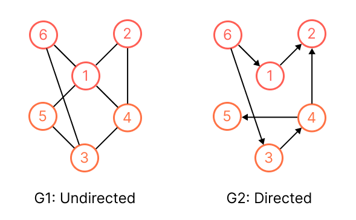

# Graph
A graph `G = (V, E)`, consists of `V` (set of *vertices*) and `E` (*edges* of vertices). 

* There are *undirected* and *directed* graph, the pair `(x, y)` and `(y, x)` represent the same edge in a undirected graph, whereas, that are two different edges in directed graph, where `(x, y)` represents `x` (head) to `y` (tail). 
* For the edge `e = (x, y)`, we will say `e` is an *incoming* edge of `y` and an *outgoing* edge of `x`.
* The *in-degree* and *out-degree* of a vertex denotes the number of incoming and outgoing edges of the vertex. 

> We refer to *out-degree* when mentioned witout specified.



* G1: Undirected 
    * V(G1) = {1, 2, 3, 4, 5, 6}
    * E(G1) = {(1, 2), (1, 4), (1, 5), (1, 6), (2, 4), (3, 4), (3, 5), (3, 6)}
* G2: Directed
    * V(G2) = {1, 2, 3, 4, 5, 6}
    * E(G2) = {(1, 2), (3, 4), (4, 5), (6, 1), (6, 3)}

> V and E are set, the item in the set is unordered.

## Representation
We can represent a graph `G = (V, E)` in adjacency list or matrix.

There are three criteria to determine the graph representation:
1. Space complexity to store a graph.
2. How long to determine whether a given edge exists in the graph.
3. How long to find all the adjacent vertices (neighbors) of a given vertex.

### Adjacency List
We define a list that contains all the vertices such that there is an edge between the vertices.

|      | Undirected                                                                                                 | Directed                                                                 |
|------|------------------------------------------------------------------------------------------------------------|--------------------------------------------------------------------------|
| List | 1 -> 2 -> 4 -> 5 -> 6<br>2 -> 1 -> 4<br>3 -> 4 -> 5 -> 6<br>4 -> 1 -> 2 -> 3<br>5 -> 1 -> 3<br>6 -> 1 -> 3 | 1 -> 2<br>2 -> null<br>3 -> 4<br>4 -> 2 -> 5<br>5 -> null<br>6 -> 1 -> 3 |

```kotlin
A1 = [
    [2, 4, 5 ,6],
    [1, 4],
    ...
]
 ```

* The vertices in each adjacency list are typically stored in a arbitrary order.
* For both undirected and directed graph, the amount of memory is `Θ(|V| + |E|)` space complexity. (`|V| + |E|` for directed, `|V| + 2 * |E|` for undirected)
* It takes `Ω(|V|)` time to determine if an edge `(x, y)` is in the graph. (Loop for each vertices takes `O(1)` and `O(|V|)` for searching the adjacent vertices of the vertex `x`)
* We prefer adjacency matrix when the graph are *sparse*.
* We also can associate *weight* on the edge by storing the weight on the node of the adjacency list. (linked list node can attach extra properties)

> |V| means the size of V.

### Adjacency Matrix
We define a |V| x |V| matrix `A`such that `A(i, j) = 1` if there is an edge, `0` otherwise.

```
Undirected          Directed
   1 2 3 4 5 6         1 2 3 4 5 6
 -------------       -------------
1| 0 1 0 1 1 1      1| 0 1 0 0 0 0
2| 1 0 0 1 0 0      2| 0 0 0 0 0 0
3| 0 0 0 1 1 0      3| 0 0 0 1 0 0
4| 1 1 1 0 0 0      4| 0 0 0 0 1 0
5| 1 0 1 0 0 0      5| 0 0 0 0 0 0
6| 1 0 1 0 0 0      6| 1 0 1 0 0 0
```

```kotlin
val directedGraph = arrayOf(
    intArrayOf(0, 1, 0, 1, 1),
    intArrayOf(1, 0, 0, 1, 0),
    intArrayOf(0, 1, 1, 1, 0),
    intArrayOf(0, 0, 1, 0, 0),
    intArrayOf(1, 0, 0, 0, 1)
)
```

* It requires `Θ(|V|^2)` space complexity. (The undirected graph has a symmetric matrix, it has additional space to store `(x, y)` and `(y, x)` of the same edge, some applications will store only in half to save memory or use *sparse* matrix)
* We prefer adjacency matrix when the graph are *dense*.
* We can update the edge or check the existence of edge in constant time.
* `A` is equal to the *transpose* of matrix `A` for undirected graph.
* We also can define `A(i, j) = w` for weighted graph.

### Hash Tables
It takes `O(1)` to check edge existence and still takes `Θ(|V| + |E|)` space to store in hash table.

```python
S1 = {
    1: {2, 4, 5, 6},
    2: {1, 4}
    ...
}
```

## Breadth-first Search (BFS)
Given a graph `G = (V, E)` (undirected or directed) and source `s`, we "discover" every vertex that is reachable from `s`. It visits all vertices at level `k` before visiting level `k+1`. It computes the *distance* from `s` to each reachable vertex, and produces a *breadth-first tree* (shortest path) with root `s` with all reachable vertices.

For our algorithm, we store some properties to the vertex:
* To track the visit, we color each vertex "white" (not visited yet), "gray" (enqueue to visit next) and "black" (visited). (Here we use `VisitState` enum to represent)
* We also store the distance and it predecessor (parent) in the breadth-first tree.

```kotlin
enum class VisitState { NOT_VISIT, DISCOVERED, VISITED }

data class Node<T>(
    val data: T
) {
    // Initialize all vertices with color, inifinite distance and null predecessor.
    var visitState: VisitState = NOT_VISIT
    // Store the distance from source to this node
    var distance: Int = Int.MAX
    // Store to construct the shortest path
    var predecessor: Node<T>? = null
}

fun <T> breadthFirstSearch(graph: Map<Node<T>, Set<Node<T>>>, source: Node<T>) {
    // We define a queue for each vertex to visit next, and enqueue the source vertex.
    val queue = Queue.create<Node<T>>()
    source.visitState = DISCOVERED
    source.distance = 0
    source.predecessor = null
    queue.enqueue(source)

    while (!queue.isEmpty()) {
        val vertexToVisit = queue.dequeue()

        // Queue all its non-visiting adjacent vertices.
        val adjacentVertices = graph[vertexToVisit]
        adjacentVertices.forEach { v ->
            // This check makes sure that each vertex is visited at most once.
            if (v.visitState == NOT_VISIT) {
                v.visitState = DISCOVERED
                v.distance = vertexToVisit.distance + 1
                v.predecessor = vertexToVisit
                queue.enqueue(v)
            }
        }

        // Visit the current vertex
        vertexToVisit.visitState = VISITED
    }
}
```

> The breadth-first tree may vary, depending upon the order of adjacent list visiting, but the distances of each visited vertex will not.
>
> Take a look at the sample at P.533 of CLRS

### Time Complexity
All vertices will be enqueued and dequeued at most once, it takes `O(|V|)` for all vertices. The adjacency list of each vertex is scanned only when the vertex is dequeued, it is scanned at most once, it takes `O(|E|)`, thus the total running time if `O(|V| + |E|)` (linear time).

## Depth-first Search (DFS)
For graph, We will discover all vertices (fully depth-first search) and construct depth-first search tree (forest), we use the similar color scheme (to BFS) and provides some timestapms while searching. Each vertices has two timestampes: *discover* (first discovered, and grayed) and *finish* (finishing examining its adjaceny list and blacken)

The color sheme is slightly different with BFS:
* White: Not visit yet.
* Gray: Discovered = **visited**.
* Black: Finished (finish examining it adjaceny list)

```kotlin
enum class VisitState { NOT_VISIT, VISITED, FINISHED }

// We use the similar data structure of Node from BSF.
data class Node<T>(
    val data: T
) {
    // As same as BFS
    var visitState: VisitState = NOT_VISIT
    var distance: Int = Int.MAX
    var predecessor: Node<T>? = null

    // For DFS
    var discoverTime: Int? = null
    var finishTime: Int? = null
}

var time = 0

// Used for topological sort
val topologicalSortLinkedList = LinkedList()

fun dfsAllVertices(graph: Map<Node<T>, Set<Node<T>>) {
    graph.key.forEach { vertex ->
        if (vertex.visitState == NOT_VISIT) {
            dfs(graph, vertex)
        }
    }
}

private fun dfs(graph: Map<Node<T>, Set<Node<T>>, source: Node<T>) {
    source.visitState = VISITED
    source.discoverTime = ++time
    val adjacentVertices = graph[source]
    adjacentVertices.forEach { node ->
        if (node.visitState == NOT_VISIT) {
            node.parent = source
            dfs(graph, node)
        }
    }
    source.visitState = FINISHED
    source.finishTime = ++time

    // Insert onto a linked list for topological sort.
    topologicalSortLinkedList.insertFirst(source)
}
```

### Time Complexity
The `dfsAllVertices()` takes `O(|V|)` time for every vertices (not visited yet), and for `dfs()` is invoked only on the vertices not visited yet and it take `Θ(|E|)` for summary of all vertices. Therefore the running time of DFS is `Θ(|V| + |E|)`.

> Take a look at the sameple at P.542 of CLRS.

## Topological Sort
A *topological sort* of a directed acyclic graph (DAG) is a *linear ordering * of all vertices such that `(x, y)` which `x` appears before `y` in the ordering.

It's most commonly used for job scheduling a sequence of jobs which has dependencies on the others. The jobs are represented by vertices and the edge from `x` to `y` if job `y` is dependent on `x` (`x` must be finished before `y`)

```kotlin
fun topologicalSort(graph: Map) {
    // 1. call DFS(graph) and compute finish time for every vertex
    // 2. When a vertex finished, insert to first of linked list
    // 3. Return this linked list.
}
```

In another way, you can run DFS first and sort the vertices by finish time descending order, it will be topological sort as well.

> The correct topological sort has more than one results. (DFS generates more than one orders)

### Time Complexity
It takes `O(|V| + |E|)` as same as depth-first search, since it takes `O(1)` to insert first of linked list.

## Tips for [Problem Solving](../problems/problems-solutions.md#graph)
* Track the visited nodes correctly, unless it will end up with an infinite loop.
* Corner cases:
    * Empty graph
    * Graph with one or two nodes
    * Disjoint graphs
    * Graph with cycle (might not be able to resolve recursively)

> Some nice templates + sample problems: https://leetcode.com/discuss/general-discussion/655708/graph-for-beginners-problems-pattern-sample-solutions/

## Connected Components
The *connected component* is a set of nodes with paths from any nodes of the component to any other.

> Skip first, study if necessary in the future.

## Minimum Spanning Tree
> Skip first, study if necessary.

## Shortest Path
See topic: [Shortest Path](../topics/shortest-path.md)

## Resources
- [X] Fundamental of Data Structure
- [X] CLRS
- [X] [Khan Academy](https://www.khanacademy.org/computing/computer-science/algorithms/graph-representation/a/describing-graphs)
- [X] MIT
    - [X] [DFS](https://ocw.mit.edu/courses/6-006-introduction-to-algorithms-spring-2020/resources/lecture-10-depth-first-search/)
    - [X] [BFS](https://ocw.mit.edu/courses/6-006-introduction-to-algorithms-spring-2020/resources/lecture-9-breadth-first-search/)
- [X] http://alrightchiu.github.io/SecondRound/mu-lu-yan-suan-fa-yu-zi-liao-jie-gou.html // Nice introductory note
- [X] [Stanford](http://infolab.stanford.edu/~ullman/focs/ch09.pdf) // Nice course
- [X] [Google Tech Dev Guide](https://techdevguide.withgoogle.com/paths/data-structures-and-algorithms/#sequence-6)
- [X] [Tech Interview Handbook](https://www.techinterviewhandbook.org/algorithms/graph/) // Simple note
- [X] Software Engineering Interview Preparation // Simple note
    - [X] [Data Structure](https://github.com/orrsella/soft-eng-interview-prep/blob/master/topics/data-structures.md#graphs)
    - [X] [DFS/BFS](https://github.com/orrsella/soft-eng-interview-prep/blob/master/topics/algorithms.md#graph-algorithms)
- [ ] ~~[LC Learn](https://leetcode.com/explore/learn/card/graph/)~~ // Some topics are locked!! We could try to do all the problem to lock.
    * Disjoint Set
    * DFS
    * BFS
    * Minimum Spanning Tree
    * Single Source Shortest Path
    * Topological Sort
- [ ] [Google Recuriter Recommended Problems List](https://turingplanet.org/2020/09/18/leetcode_planning_list/#Graph_Breadth-FS)
- [ ] ~~[Coding Interview University](https://github.com/jwasham/coding-interview-university#graphs)~~