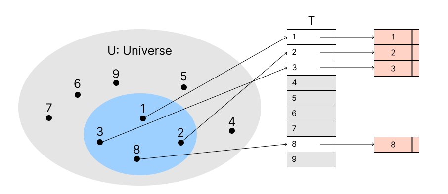
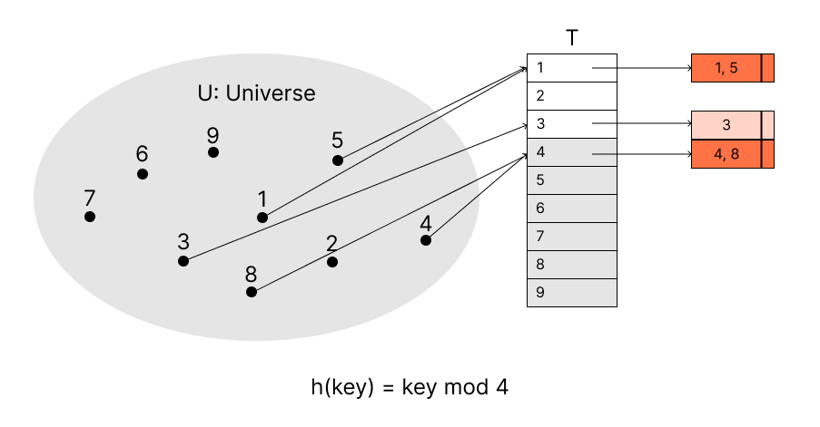
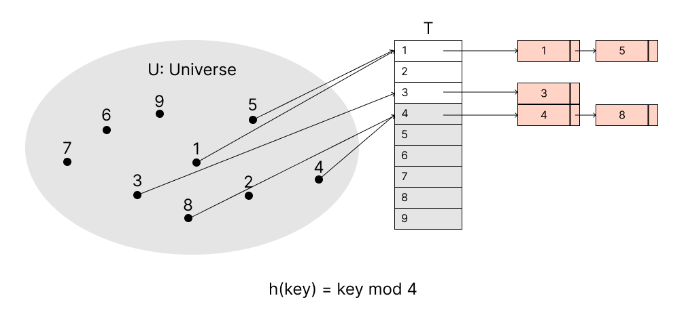

# Hash Table

## Set Interface
*Sets* maintain a collection of items in an *intrinsic* order based on a **unique key**, each item `x` has key `x.key`. Sets are generattion of `set` and `dictionary`.

| Usages    | Operations     | Descriptions                                         |
|-----------|----------------|------------------------------------------------------|
| Container | `create(X)`    | Given an iterable `X`, create set from items in `X`. |
|           | `size()`       | The number of items.                                 |
| Static    | `get(k)`       | Return items with key `k`.                           |
|           | `set_at(i, x)` | Replace the i-th item with `x`.                      |
| Dynamic   | `insert(x)`    | Add item `x` (Replace if `x.key` exists).            |
|           | `delete(k)`    | Remove and return the i-th item.                     |
| Order     | `iterator()`   | Return items one-by-one in key order.                |
|           | `find_min()`   | Return item with smallest key.                       |
|           | `find_max()`   | Return item with largest key.              

A dynamic set that supports the *dictionary* operations: `insert(x)`, `delete(k)` and `get(k)`, and there are some to fulfill this:
* **Direct access address**: it's effificent to `get(k)`, however, it takes lots of space.
* **Hashing**: We compute the array index from key.
* **Chaining**: It's a way to handle *collisions* for hashing.

> We use some symbols for the whole topic:
> 
> 1. `U`: Universe, represents all the possible keys.
> 2. `T`: Table, the array we represent the dynamic set.
> 3. `Slot`: `T[i]`, the position of the array.
> 4. `K`: Keys, the actual keys in the universe.

## Direct Access Table
It works well when the universe `U` of key is small, we use array, key as index, store the value corresponds to key index.



```kotlin

class DirectAccessAddressHashTable<T> {
    private val table = ArrayOf<T>(UNIVERSE_SIZE)

    fun get(key: Int): T? = table[key]
    fun insert(value: T): table[key(value)] = value
    fun delete(value: T) { table[key(value)] = null }
}
```

Each operations take `O(1)` time, but it requires `O(|U|)` size to save all possible keys.

## Hash Tables
The disadvantage of direct access table is obvious, the actual keys might be small relative to `U`. To fix this, we can use *hash function* `h(key)` to reduce space to `Θ(|K|)` and it still takes only `O(1)` for searching. 

The hash function `h(key)` calculates the *hash value* of key `k`, maps the universe `U` into the slots of a *hash table* `T[i]`.

For this mechanism, we will face a problem: *collision*, that is, the two different keys may hash to the same slot.



There are two ways to resolve this:
1. Chaining
2. Open Address

### Chaining
In *chaining*, we store all values that have the same hash value in a [linked list](../topics/linked-list.md)



* `insert(value: T)`: Insert to the head of list `T[h(key(value))]`.
* `get(key: Int)`: search key  in list `T[h(key)]`.
* `delete(value: T)`: Delete from list `T[h(key(value))]`.

The running time of insertion is `O(1)` and deletion is also `O(1)` if the list is doubly linked list. How about searching? It needs analysis based on some factor.

> We assume that hash function calculation takes `O(1)` time.

#### Analysis of Searching
> It might be OK to skip this part for interview preparation.

Given a hash table `T` with `m` slots that stores `n` elements, *load factor* `n / m` (i.e. `items size / table size`) defines the average number of elements stored in the chain of one slot.

The worst case running time is `Θ(n)` when all elements storing to the same slot. 

The average running time depends the list length of a slot, and the list length depends on **how well the hash function** distributes key among the slots, we assume that any element is **equally likely** to hash into any slots, independently of where any other element hash hashed to, it called *simple uniform hashing*, the list length will be `n / m` mentioned above on average, so successful or unsuccessful search takes `Θ(1 + n / m)` time. (`Θ(1)` for hash function calculation).

If the number of slots `m` is proportional to the number of elements `n`, that is, `n` = `O(m)`, then `n / m` will be 1, and `Θ(1 + n / m)` will be `O(1)`. The searching takes `O(1)` constant time.

### Open Addressing
We store all element directly in the hash table itself and we keep looking for next empty slot to insert the key until we find it or the table is full. (called *probe*)

To determine which slots to probe, we extend the has function to include the probe number, i.e. `h(key, probe)` where 0 <= `probe` <= `m` (slots)

```kotlin
class OpenAddress<T> {
    private val table = ArrayOf<T>(UNIVERSE_SIZE)

    fun insert(key: Int): Int {
        var probe = 0
        do {
            val hash = h(key(value), probe)
            if (table[hash] == null) {
                table[hash] = value
                return hash
            }
            probe++
        } while (probe < table.size)
        throw OverflowException()
    }

    fun get(key: Int): Int? {
        var probe = 0
        do {
            var hash = h(key, probe)
            if (table[hash] == key) {
                return hash
            }
            probe++
        } while (table[hash] == null || probe == table.size)
        return null
    }
}
```

### Probing Methods
1. **Linear Probling**: `h(key, probe) = (h1(key) + probe) mod m`.
2. **Quadratic Probling**: `h(key, probe) = (h1(key) + c1 * probe + c2 * probe^2) mod m`.
3. **Double Hashing**: `h(key, probe) = (h1(key) + probe * h2(key)) mod m`.

> Sample problems
>
> * [705. Design HashSet](../leetcode/705.design-hashset.md)
> * [706. Design HashMap](../leetcode/706.design-hashmap.md)

## Hash Functions
A good hash function should distribute keys **uniformly** across the buckt while **minimizing collisions**, and it should be easy and fast to compute. 

There are some key properties of a good hash function:
1. **Deterministic**: The same key should always produce the same hash value.
2. **Uniformity**: The hash function should distribute keys uniformly across the buckets.
3. **Efficiency**: The hash function should be fast to compute.
4. **Minimize Collisions**: The hash function should minimize the number of collisions.


## Hash Table API
### Python
> TODO

### Kotlin
#### `HashSet`

```kotlin
val set = HashSet<Int>()
set.size
set.add(123)
123 in set // Equivalent to set.contains(123)
set.isEmpty()
set.remove(123)
```

#### `HashMap`
```kotlin
val map = HashMap<Int, Int>()
map.size
map.keys
map.values
map.isEmpty()
123 in map // Equivalent to map.containsKey(123)
map[123] = 999
map.remove(123)

// Iterate keys, values or entries
for (key in map.keys) { ... }
for (value in map.values) { ... }
for ((key, value) in map) { ... }
for (entry in map.entries) { ... }
map.forEach { key, value -> ... }

// Get the maximum entry sorted by value
val maxEntry: T? = map.maxByOrNull { it.value }

// Sort the map by key
val sortedMap = map.toSortedMap()

// Sort the map by value
val sortedMap = map.toList().sortedBy(Descending) { (_, value) -> value }.toMap()
```