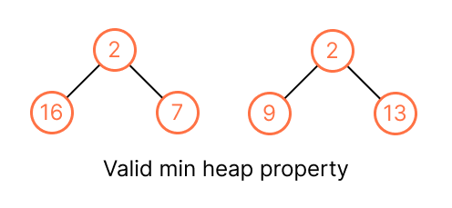

# Heap
A *(binary) heap* a is specialized [tree](../topics/tree.md)-based data structure that meets the following criteria:

1. It's a complete binary tree.
2. The value of each node satifies a **heap property**, there are two kinds of heap: max / min. In a max heap, the value of every parent is greater than or equals to it all chidren. The largest element in a max heap is at the root.


We use array to represent the binary heap, so that
* `A[1]` is the root, it represents the max or min value.

And given `i` index of node:
* `floor(i / 2)` is the parent index.
* `i * 2` is the left index.
* `i * 2 + 1` is right index.
* `heapSize` return the actual used size of heap in the array.

> The index implicitly plays the role of the pointers.

```kotlin
// We also can use this as min heap.
class MaxHeap<T> {
    private val capacity = 10
    private var heapSize = 0
    private val items = Array<T>(capacity).apply {
        // We don't use 0-th item to better track the indices of the binary tree.
        this[0] = Int.MAX
    }

    private fun leftIndex(parentIndex: Int) = 2 * parentIndex
    private fun rightIndex(parentIndex: Int) = 2 * parentIndex + 1
    private fun parentIndex(childIndex: Int) = floor(childrenIndex / 2)

    private fun hasLeft(index: Int) = leftIndex(index) < heapSize
    private fun hasRight(index: Int) = rightIndex(index) < heapSize
    private fun hasParent(index: Int) = parentIndex(index) > 0

    private fun leftChild(index: Int): T? = items[leftIndex(index)]
    private fun rightChild(index: Int): T? = items[rightIndex(index)]
    private fun parent(index: Int): T? = items[parentIndex(index)]
}
```

And the max heap property is `A[parentIndex(i)] >= A[i]`, and min heap property is `A[parentIndex(i)] <= A[i]`, we don't care about (don't know) the relation between left and right child, only care the relation between parent and child, we just make sure the the value of parent >= all it children (max heap).



## Heapify
When we modify the element of the heap, for example, inserting a new value, might violate the max/min heap property, so we have to heapify until it meets the property again.

```kotlin
// We "float down" A[i] so that the subtree rooted at index i becomes a max heap.
fun maxHeapify(A, i: Int): Int {
    leftIndex = leftIndex(i)
    rightIndex = rightIndex(i)
    var largestIndex = i

    // Compare A[i] with the left and right child
    if (A[leftIndex] != null && A[largestIndex] < A[leftIndex]) {
        largestIndex = leftIndex
    }
    
    if (A[rightIndex] != null && A[largestIndex] < A[rightIndex]) {
        largestIndex = rightIndex
    }
    
    if (largestIndex != i) {
        swap(A[largestIndex], A[i])
        maxHeapify(A, largestIndex)
    }
}
```

It takes `O(lg n)`, since it goes down at most the height of the binary tree.

## Build Heap
We build a max heap by running `maxHeapify()` from the bottom to up of the array. That is, all the nodes having children nodes, from index `floor(A.size / 2)` down to 0. (from the last item to the first is also right)

```kotlin
fun buildMapHeap(A) {
    for (i in floor(A.size / 2) downTo 0) {
        maxHeap(A, i)
    }
}
```

It takes `O(n)` for building a heap from an array. (this is tight analysis, `O(n lg n)` is also right but not tight).

> See example and time complexity proof at P.134 on CLRS.

## Resources
- [ ] CLRS
- [ ] [MIT](https://ocw.mit.edu/courses/6-006-introduction-to-algorithms-spring-2020/resources/lecture-8-binary-heaps/)
- [ ] [Google Tech Dev Guide](https://techdevguide.withgoogle.com/paths/data-structures-and-algorithms/#sequence-5)
- [ ] [LC Learn](https://leetcode.com/explore/learn/card/heap/) // Some sections are locked.
- [ ] [Google Recuriter Recommended Problems List](https://turingplanet.org/2020/09/18/leetcode_planning_list/#Heap)
- [ ] https://leetcode-solution-leetcode-pp.gitbook.io/leetcode-solution/thinkings/heap
- [ ] [Software Engineer Interview Preparation // Introductory notes
    - [X] [Data Structure](https://github.com/orrsella/soft-eng-interview-prep/blob/master/topics/data-structures.md#heap)
    - [ ] [Algorithm](https://github.com/orrsella/soft-eng-interview-prep/blob/master/topics/algorithms.md#heapsort)