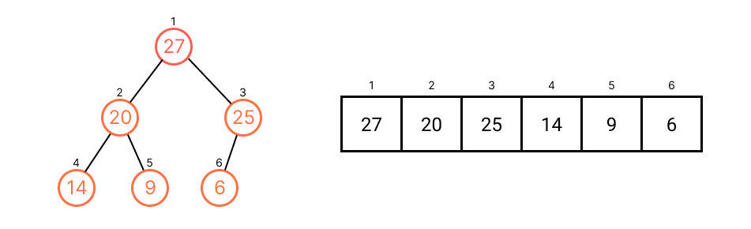
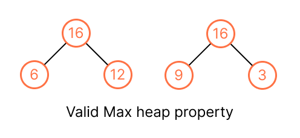
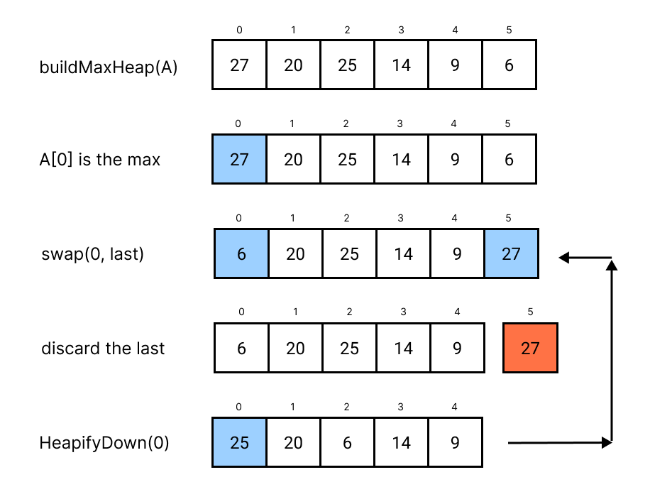

# Heap
A *(binary) heap* a is specialized [tree](../topics/tree.md)-based data structure that meets the following criteria:

1. It's a complete binary tree.
2. The value of each node satifies a **heap property**, there are two kinds of heap: max / min. In a max heap, the value of every parent is greater than or equals to it all chidren. The largest element in a max heap is at the root.



We use array to represent the binary heap, so that
* `A[0]` is the root, it represents the max or min value.

And given `i` index of node:
* `floor((i - 1) / 2` is the parent index. (`floor(i / 2)` for 1-based index)
* `i * 2 + 1` is the left index. (`2 * i`)
* `i * 2 + 2` is right index. (`2 * i + 1`)
* `heapSize` return the actual used size of heap in the array, which `heapSize <= A.size`

> * We might use 1-based index for convenient.
> * The index implicitly plays the role of the pointers.

```kotlin
// We also can use this as min heap.
class MaxHeap<T> {
    private var capacity = 10
    private var heapSize = 0
    private var items = Array<T>(capacity).apply {
        // We add this if we use 1-based index
        // this[0] = Int.MAX
    }

    private fun leftIndex(parentIndex: Int) = 2 * parentIndex + 1
    private fun rightIndex(parentIndex: Int) = 2 * parentIndex + 2
    private fun parentIndex(childIndex: Int) = (childrenIndex - 1) / 2

    private fun hasLeft(index: Int) = leftIndex(index) < heapSize
    private fun hasRight(index: Int) = rightIndex(index) < heapSize
    private fun hasParent(index: Int) = parentIndex(index) >= 0

    private fun leftChild(index: Int): T? = items[leftIndex(index)]
    private fun rightChild(index: Int): T? = items[rightIndex(index)]
    private fun parent(index: Int): T? = items[parentIndex(index)]
}
```

And the max heap property is `A[parentIndex(i)] >= A[i]`, and min heap property is `A[parentIndex(i)] <= A[i]`, we don't care about (don't know) the relation between left and right child, only care the relation between parent and child, we just make sure the the value of parent >= all it children (max heap).



> We will use max heap as example in the whoe

## Heapify
When we modify the element of the heap, for example, inserting a new value, might violate the max/min heap property, so we have to heapify until it meets the property again.

```kotlin
// We "float down" A[i] so that the subtree rooted at index i becomes a max heap.
fun heapifyDown(A, i: Int) {
    val leftIndex = leftIndex(i)
    val rightIndex = rightIndex(i)
    var largestIndex = i

    // Compare A[i] with the left and right child
    if (A[leftIndex] != null && A[largestIndex] < A[leftIndex]) {
        largestIndex = leftIndex
    }
    
    if (A[rightIndex] != null && A[largestIndex] < A[rightIndex]) {
        largestIndex = rightIndex
    }
    
    if (largestIndex != i) {
        swap(A[largestIndex], A[i])
        heapifyDown(A, largestIndex)
    }
}

// We compare with it parent and shift up
fun heapifyUp(A, i: Int) { 
    while (hasParent(i) && A[parentIndex(i)] < A[i]) {
        swap(parentIndex(i), i)
        i = parentIndex(i)
    }
}

private fun swap(first: Int, second: Int) {
    val temp = this[first]
    this[first] = this[second]
    this[secon] = temp
}
```

It takes `O(lg n)`, since it goes down at most the height of the binary tree.

## Priority Queue
The *priority queue* ADT keeps track of the order of items so that it's capable of accessing/removing the most important item quickly. It's the most popular application of heap.

```kotlin
interface PriorityQueue<T> {
    fun build(A)
    fun peek(A): T
    fun poll(A): T?
    fun add(A, item: T)
    fun increasePriority(A, i: Int, newPriority: Int)
}
```

## Operations
* Build the heap: We build a max heap by running `heapifyDown()` from the bottom to up of the array. That is, all the nodes having children nodes, from index `floor(A.size / 2)` down to 0. (from the last item to the first is also right, just wasting time on the leaf)

```kotlin
fun buildMaxHeap(A) {
    heapSize = A.size
    for (i in floor(A.size / 2) downTo 0) {
        heapifyDown(A, i)
    }
}
```

It takes `O(n)` for building a heap from an array. (this is tight analysis, `O(n lg n)` is also right but not tight).

> See example and time complexity proof at P.134 on CLRS.

```kotlin
// Just return the max, it takes O(1)
fun peek(A): T? = A.getOrNull(1)

// Return the max and delete from heap
// Similar to delete(i) function
fun poll(A): T? {
    if (heapSize <= 1) return null
    val max = A[1]
    // We move the last item to the first
    A[1] = A[heapSize - 1]
    heapSize--
    heapifyDown(A, 1)
    return max
}

fun add(A, item: T) {
    ensureExtraCapacity()
    A[heapSize] = item
    heapSize++
    heapifyUp(A, heapSize - 1)
}

fun increasePriority(A, i: Int, newPriority: Int) {
    if (A[i] >= newPriority) throw IllegalStateException("The new priority should be greater than current one")

    A[i] = newPriority
    heapifyUp(A, i)
}

private fun ensureExtraCapacity() {
    if (heapSize == capacity) {
        capacity *= 2
        items = items.copyOf(capacity)
    }
}
```

All operations takes `O(lg n)` except for `peek()`, which takes `O(1)` only.

Different time complexity of different implementation of priority queue:
| Operations         | peek   | insert    | poll/delete|
|--------------------|--------|-----------|-----------|
| Linked List        | `O(1)` | `O(n)`    | `O(1)`    |
| Binary Search Tree | `O(1)` | `O(lg n)` | `O(lg n)` |
| Binary Heap        | `O(1)` | `O(lg n)` | `O(lg n)` |

## Heap Sort
Max heap property shows that the value of first item is the maximum, and other part is unordered, so if we would to sort in ascending order, there are our steps:

1. Run `buildMaxHeap(A)` so that `A[1]` will be the largest item. (`[Largest item | Unordered items]`)
2. Then swap `A[1]` with the last item of array. (`[Unordered items | Largest item]`)
3. "Discard" the largest item (now it moved to the last item), since it's sorted. (`[Unordered items]`)
4. Keep heapify down from the first item of the array that just discards the largest item until all items are discarded.

```kotlin
fun heapSort(A) {
    buildMaxHeap(A)
    for (i in A.size downTo 2) {
        swap(1, i)
        // Discard the last item (the largest one)
        heapSize--
        heapifyDown(A, 1)
    }
}
```



* **Time Complexity**: `buildMapHeap(A)` takes `O(n)`, and `n - 1` elements run `heapifyDown()`, which takes `O(n - 1) * O(lg n)` = `O(n lg n)`.

## Tips for [Problem Solving](../problems/problems-solutions.md#heap)
* Good at find the top/smallest K of xxx or median. (or using binary search if there is sorted list) We also can use **Quickselect** to find *k*th smallest item in an unordered list. (See problem [215. Kth Largest Element in an Array](../leetcode/215.kth-largest-element-in-an-array.md))
* For frequency sorting, we can use *bucket sort*, see problem [347. Top K Frequent Elements](../leetcode/347.top-k-frequent-elements.md)
* For some problems to find the max/min value dynamically (after some operations, such adding some numbers then find the max number), then it might be able to use heap to solve. ([264. Ugly Number II](https://leetcode.com/problems/ugly-number-ii/))
* Heap in Kotlin:
```kotlin
val minHeap = PriorityQueue<Int>() { n1, n2 -> n1 - n1 })
val maxHeap = PriorityQueue<Int>(Comparator<Int> { n1, n2 -> n2 - n1 })
// or
val maxHeap = PriorityQueue<Int>() { n1, n2 -> 
    when {
        n1 < n2 -> -1
        n2 < n1 -> 1
        else 0
    }
}
```
* Sorting on array / collections: See [My Kotlin Note](https://docs.google.com/document/d/1JxZ40YPi_R5unTUeCbk2JErvJVHMWbev50IJfvlE2Ls/edit#heading=h.cgfoyq7qxhnz)
* For top k problems, you can use:
    * Build max heap from all items, and pop `k - 1` times, and the peek will be the top K result.
    * Using min heap with `k` items, we add item one by one, and pop (the min value) if heap size > `k` as adding item. The remaining heap will be top K results **but in reversed order**, make sure to reverse the result.

## Resources
- [X] CLRS
- [X] [MIT](https://ocw.mit.edu/courses/6-006-introduction-to-algorithms-spring-2020/resources/lecture-8-binary-heaps/)
- [X] [Google Tech Dev Guide](https://techdevguide.withgoogle.com/paths/data-structures-and-algorithms/#sequence-5)
- [X] [LC Learn](https://leetcode.com/explore/learn/card/heap/) // Some sections are locked.
- [X] [Google Recuriter Recommended Problems List](https://turingplanet.org/2020/09/18/leetcode_planning_list/#Heap)
- [X] https://leetcode-solution-leetcode-pp.gitbook.io/leetcode-solution/thinkings/heap
- [X] [Software Engineer Interview Preparation // Introductory notes
    - [X] [Data Structure](https://github.com/orrsella/soft-eng-interview-prep/blob/master/topics/data-structures.md#heap)
    - [X] [Algorithm](https://github.com/orrsella/soft-eng-interview-prep/blob/master/topics/algorithms.md#heapsort)

## Full Code
```kotlin

interface MyPriorityQueue {
    fun buildMaxHeap(array: IntArray)
    fun peek(): Int?
    fun poll(): Int?
    fun insert(item: Int)
    fun increasePriority(index: Int, priority: Int)
}

class MyPriorityQueueImpl : MyPriorityQueue {
    private var capacity = 10
    private var heapSize = 0
    private var A = IntArray(capacity) { Int.MIN_VALUE }

    override fun buildMaxHeap(array: IntArray) {
        heapSize = array.size
        ensureCapacity(array.size)
        for (i in 0 until array.size) {
            A[i] = array[i]
        }
        for (i in array.size / 2 downTo 0) {
            heapifyDown(i)
        }
    }

    override fun peek(): Int? = A[0]

    override fun poll(): Int? {
        val peek = peek()
        A[0] = A[heapSize - 1]
        heapSize--
        heapifyDown(0)
        return peek
    }

    override fun insert(item: Int) {
        ensureCapacity()
        A[heapSize] = item
        heapSize++
        heapifyUp(heapSize - 1)
    }

    override fun increasePriority(index: Int, priority: Int) {
        if (A[index] < priority) {
            A[index] = priority
            heapifyUp(index)
        }
    }

    private fun leftIndex(index: Int) = index * 2 + 1
    private fun rightIndex(index: Int) = index * 2 + 2
    private fun parentIndex(index: Int) = (index - 1) / 2

    private fun hasLeft(index: Int) = leftIndex(index) in (0 until heapSize)
    private fun hasRight(index: Int) = rightIndex(index) in (0 until heapSize)
    private fun hasParent(index: Int) = parentIndex(index) in (0 until heapSize)

    private fun leftChild(index: Int) = if (hasLeft(index)) A[leftIndex(index)] else null
    private fun rightChild(index: Int) = if (hasRight(index)) A[rightIndex(index)] else null
    private fun parent(index: Int) = if (hasParent(index)) A[parentIndex(index)] else null

    private fun heapifyDown(index: Int) {
        val leftIndex = index * 2 + 1
        val rightIndex = index * 2 + 2
        var maxIndex = index
        if (hasLeft(index) && A[leftIndex] > A[maxIndex]) {
            maxIndex = leftIndex
        }
        if (hasLeft(index) && A[rightIndex] > A[maxIndex]) {
            maxIndex = rightIndex
        }
        if (maxIndex != index) {
            swap(maxIndex, index)
            heapifyDown(maxIndex)
        }
    }

    private fun heapifyUp(index: Int) {
        var i = index
        while (hasParent(i) && A[parentIndex(i)] < A[i]) {
            swap(parentIndex(i), i)
            i = parentIndex(i)
        }
    }

    private fun swap(i: Int, j: Int) {
        val temp = A[i]
        A[i] = A[j]
        A[j] = temp
    }

    private fun ensureCapacity(newCapacity: Int? = null) {
        if (heapSize >= capacity) {
            if (newCapacity != null) capacity = newCapacity
            else capacity *= 2
            A = Arrays.copyOf(A, capacity)
        }
    }
}
```