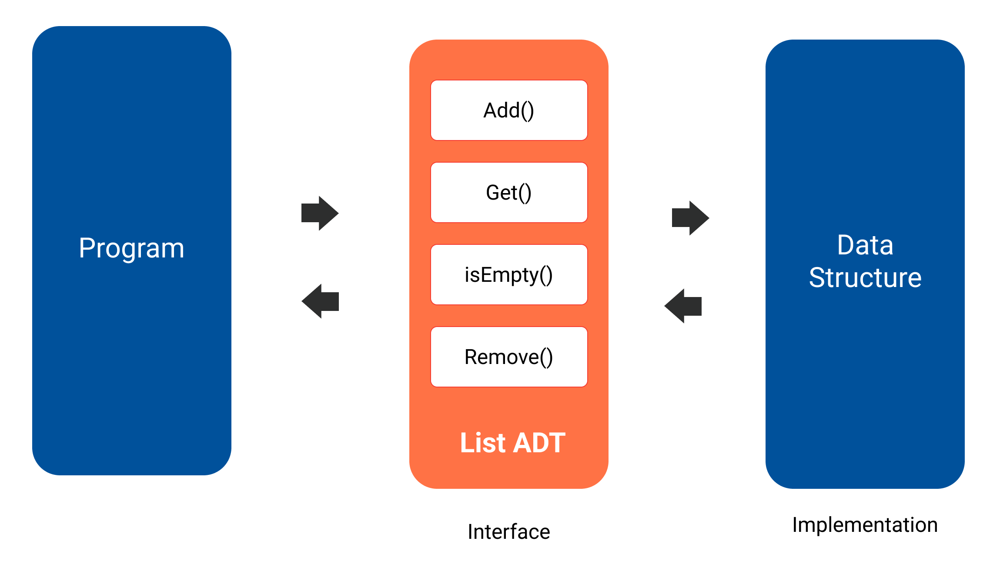
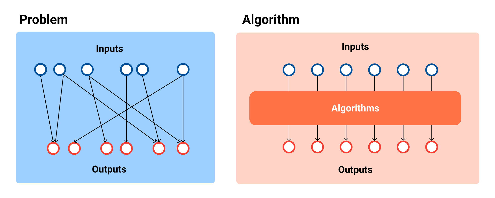
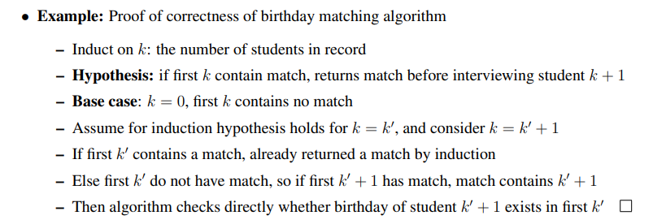

# Introduction
## Goals of Learning Data Structure
1. Be able to describe DSA in high-level and abstract way.
2. Design and implement the DSA.
3. Analysis of DSA: average and worst case.

## Abstract Data Structure (ADT)
1. The first step to design data structure: to know the **specification** (i.e. its behavior) ot how to implement from the user perspective, that is, to comprehend in **abstract** way (or mathematical). 
2. For ADT, we define the logical behavior by a set of values (`Domain`) and operations (`Functions` + `Axiom`), we just define **what** to store/operate the data, not **how** to implement the way to store/operate the data.

> // TODO: translate into English and organize.
> Source: // https://en.wikipedia.org/wiki/Abstract_data_type

```
1. 設計資料結構的第一步：知道規格而不需要知道如何實作，也就是以「抽象」的（數學模型）方式去理解和設計，可以當作純粹理論的實體，用來簡化描述抽象演算法、分類和評價資料結構，抽象資料結構的選擇決定了演算法的設計以及評估複雜度。
2. 定義的時候，我們需要知道 `Domain` + `Functions` + `Axiom`，這時候我們只定義「行為」+「介面」，不定義實作細節（介面實作分離，使用者只關心公開的介面，不知道且不在意如何實作、也不受實作影響）。
3. 資料結構就是一個 ADT 不斷做 refinement 的過程，一直到所有運算都能夠「直接執行的函式」表示出來為止。
```



For the abstract `List` specification：

```md
# Domain
1. A collection with the same type.
2. The items in the list are ordered.

# Function
1. Get(i): Return the i-th item.
2. Add(i, element): Add element to the i-th index.
3. Replace(i, element): Replace the i-th item with element.
4. Remove(i): Remove item from the list.
5. Size(i): Get the list size.
```

Or the abstract `Set`：

```md
# Domain
1. A collection with the same type.
2. The items in the set are unordered and unique.

# Function
1. Add(i, element)
2. Remove(i)
3. Search(element)
```

## Goals of Learning Algorithms
The goal is not only to know how to **solve** problem, but also to know how to **communicate** to people the solutions and convince them that they are **correct** and **efficient** (better than other things).

So learning algorithm is trying to:
1. Solve computational problems.
2. Prove correctness
3. Argue efficiency

### Problems && Algorithms
* A *problem* is a binary relation from **inputs** to **outputs** (one input may have multiple outputs)
* A (deterministic) *algorithm* is a procedure that maps inputs into single correct outputs.



For example, let's solve the problem: `"In a classroom, find the students with same birthday?"`. Then an algorithm to solve this problem will be:

```md
1. Maintain a record of (name, birthday).
2. Go to ask all the students:
    2.1 If birthday exists in the record, return the student.
    2.2 Else add (name, birthday) to record.
3. Return null if no pair found.
```

An *algorithms* is a finite set of instructions that accomplish a particular task. And it meets the following criteria:
1. Input
2. Output
3. Definiteness: Each steps must be concise.
4. Finiteness: It will terminate within a finite steps.
5. Effectiveness: Be carried out by only pen and paper + feasible.

### Correctness
We will say that the algorithm said to be **correct** if it halts with correct output for every input.

How to prove correctness of algorithm? For arbitrarily large inputs, algorithms repeat the instructions via loops or **recursion**, so we have to prove correctness via **induction**. One of the nice things about `induction` is that is isolates our problem to not consider everthing all at once, but break it down into smaller interface so that we can do less work at each step.

> // TODO: We don't spend too much time on induction, may take a close look back later.



### Efficiency
See [Complexity](./complexity.md) topic.

## Resources
- [X] Fundamental of Data Structure - Introduction
- [X] CLRS - Introduction
- [X] [MIT 6.006 Introduction to Algorithm - Lecture 1: Algorithms and Computation](https://ocw.mit.edu/courses/electrical-engineering-and-computer-science/6-006-introduction-to-algorithms-spring-2020/lecture-videos/lecture-1-algorithms-and-computation/)
- [ ] [MIT 6.006 Introduction to Algorithm - Lecture 2: Data Structures and Dynamic Arrays](https://ocw.mit.edu/courses/electrical-engineering-and-computer-science/6-006-introduction-to-algorithms-spring-2020/lecture-videos/lecture-2-data-structures-and-dynamic-arrays/)
