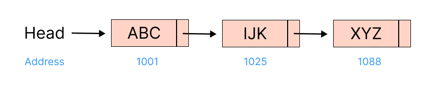
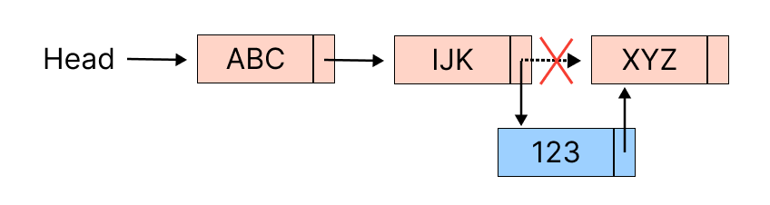
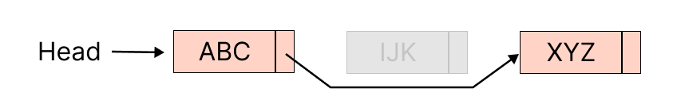
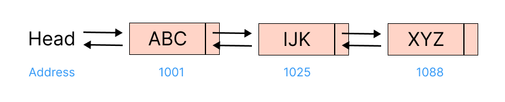

# Linked List
A *linked list* is a pointer-based data structure that store each item in a *node* with two properties: `item` storing the data itself, and `next` storing the address of next item. 



> For linked list, we don't have to store item in contiguous memory address like array anymore, we can store item anywhere in memory since we have pointer to next item.

## Pros. & Cons.
| Pros.                                                                   | Cons.                                                            | Usages                                                                                           |
|-------------------------------------------------------------------------|------------------------------------------------------------------|--------------------------------------------------------------------------------------------------|
| 1. Fast when inserting/deleting at the beginning.<br>2. Easy to resize. | 1. Bad at random access<br>2. Extra space to store `next` field. | 1. Dynamic size<br>2. Insert/delete frequently<br>3. Don't need to access element very much. |

> Comparison to array, see [Array](../topics/array.md) topic.

## Singly Linked List

### ADT
```kotlin
data class Node<T>(
    val value: T,
    var next: Node<T>? = null
)

interface LinkedList<T> {
    val head: Node<T>
}
```

### Operations
For the following operations, we have to mind the boundary and corner cases:
* Empty linked list (`head` is null)
* Linked list with only one or two nodes.
* Head or last node.

#### Insertion
Linked list takes `O(1)` for inserting or deleting first item simply by relinking the pointer.



```kotlin
fun insertFirst(value: T) {
    val newNode = Node(value)
    newNode.next = this.head
    this.head = newNode
}
```

It also takes `O(1)` to insert after a specific node.

```kotlin
fun insertAfter(node: Node, value: T) {
    val newNode = Node(value)
    newNode.next = node.next
    node.next = newNode
}
```

However, it takes `O(n)` to insert a new node at the index `i` or the end, because it has to iterate some (all) nodes to find the node to insert.

```kotlin
fun insertLast(value: T) {
    val newNode = Node(value)
    var lastNode = this.head

    // We have to consider the empty list since we can't find the last node, the insertion will not execute below.
    if (lastNode == null) {
        this.head = newNode
        return
    }

    while (lastNode?.next != null) {
        lastNode = lastNode.next
    }
    lastNode?.next = newNode
}

fun insertAt(index: Int, value: T) {
    val newNode = Node(value)
    if (index == 0) {
        insertFirst(value)
        return
    }

    // Find the (index - 1)-th node
    // i = index - 2, node will move to index - 1, this is what we're looking for.
    // i = index - 1 node will move to index, since we have to find the previous node to insert, so this round is not what we're looking for.
    var node = this.head
    for (i in 0 until index - 1) {
        node = node?.next
    }
    newNode.next = node?.next
    node?.next = newNode
}

// We also can write in while loop, see insertAt() in doubly linked list.
```

#### Deletion

To delete the first node, we simply **assign the next node to head**, it takes `O(1)`.

> We have to mind the boundary, such as first or last.

```kotlin
fun deleteFirst() {
    val nextNode = this.head?.next
    this.head = nextNode
}
```

To delete specific node from the linked list, we have to iterate to find the previous node before the node to delete and relink to delete. It takes `O(n)` because it iterates the list to locate the node to delete.

```kotlin
fun deleteNode(node: Node<T>) {
    // We find the node to delete at the beginning.
    if (head == node) {
        deleteFirst()
        return
    }
    var nodeToDelete = this.head
    var previousNode: Node<T>? = null

    // Iterate to find the node to delete
    while (nodeToDelete != null && nodeToDelete != node) {
        previousNode = nodeToDelete
        nodeToDelete = nodeToDelete.next
    }

    // If we found it, relink the node
    previousNode?.next = nodeToDelete?.next
}
```

To delete at the specific index, we have to iterate the linked list to locate the previous node of that index, it also takes `O(n)`.

```kotlin
fun deleteAt(indexToDelete: Int) {
    if (indexToDelete == 0) {
        deleteFirst()
        return
    }

    // Equivalence to find the previous node of index-th:
    // var node = this.head
    // for (i in 0 until index - 1) {
    //    node = node?.next
    // }
    // See `insertAt()` function above.
    var currentIndex = 0
    var previousNode: Node<T>? = null
    var currentNode: Node<T>? = this.head
    while (currentIndex < indexToDelete && currentNode != null) {
        currentIndex++
        previousNode = currentNode
        currentNode = currentNode.next
    }
    previousNode?.next = currentNode?.next
}

fun deleteLast() {
    // For linked list has only one node
    if (this.head?.next == null) {
        this.head = null
        return
    }
    var previous: Node<T>? = null
    var current = this.head
    while (current?.next != null) {
        previous = current
        current = current.next
    }
    previous?.next = null
}
```

#### Get Length
There are two ways: iterative and recursive to calculate the number of nodes, both take `O(n)` time complexity.

We start with iterative way, it's very straightforward:

```kotlin
fun getSize(): Int {
    var size = 0
    var node = this.head

    while (node != null) {
        size++
        node = node.next
    }
    return size
}
```

And for recursive way, suppose we define the function `getSize(node: Node): Int`:
1. If `head` is null, return 0.
2. Else return `1 + getSize(node.next)`.

```kotlin
fun getSize(node: Node<T>? = this.head): Int {
    return if (node == null) 0
    else 1 + getSize(node.next)
}
```

#### Search
```kotlin
// Iteratively
fun contains(value: T): Boolean {
    var node = this.head
    while (node != null) {
        if (node.value == value) return true
        node = node.next
    }
    return false
}

// Recursively
fun contains(node: Node? = head, value: T): Boolean {
    // Base cases
    if (node == null) return false
    if (node.value == value) return true

    // Recursive case
    return searchRecursively(node.next, value)
}
```
## Doubly Linked List
It contains the extra *previous* pointer and the data + *next* pointer in singly linked list.



### ADT
```kotlin
data class Node<T>(
    var value: T? = null,
    var previous: Node<T>? = null,
    var next: Node<T>? = null
)
```

> // TODO: add `tail` node to linked list
> ```
> interface LinkedList<T> {
>    val head: Node<T>
>    val tail: Node<T>
> }
> ```
>
> Then update the following operations for this `tail` update.

### Operations

#### Insertion
```kotlin
// head <- -> node
// head <- -> new <- -> node
fun insertFirst(value: T) {
    val newNode = Node(value, next = this.head, previous = null)
    this.head?.previous = newNode
    this.head = newNode
}

// last -> null
// last <- -> new -> null
fun insertLast(value: T) {
    val newNode(value, next = null)
    var lastNode = this.head
    if (lastNode == null) {
        this.head = newNode
        return
    }

    while (lastNode?.next != null) {
        lastNode = lastNode.next
    }
    newNode.previous = lastNode
    lastNode?.next = newNode
}

// node <- -> next
// node <- -> new <- -> next
fun insertAfter(node: Node, value: T) {
    val nextNode = node?.next
    val newNode = Node(value, next = nextNode, previous = node)
    nextNode?.previous = newNode
    node?.next = newNode
}

// previous (index - 1) <- -> current (index) <- -> next (index + 1)
// previous <- -> new <- -> current <- -> next
fun insertAt(index: Int, value: T) {
    if (index == 0) {
        insertFirst(value)
        return
    }

    var previous = head
    for (i in 0 until index - 1) {
        previous = previous?.next
    }

    val newNode = Node(value)
    val currentNode = previous?.next
    currentNode?.previous = newNode
    newNode.next = currentNode
    newNode.previous = previous
    previous?.next = newNode
}

// Equivalence written in while loop
fun insertAt(index: Int, value: T) {
    if (index == 0) {
        insertFirst(value)
        return
    }

    var previous: Node<T>? = null
    var current: Node<T>? = head
    var i = 0
    while (current != null && i < index) {
        i++
        previous = current
        current = current.next
    }

    val newNode = Node(data = value)
    newNode.previous = previous
    newNode.next = current
    previous?.next = newNode
    current?.previous = newNode
}
```

> NOTE: If we use while loop (the equivalence) but don't keep the previous node pointer (we trace current node pointer only), we will fail to insert when index = size since the the current node pointer will be null and it can't get the previous node. (See below code)
>
> ```kotlin
> linkedList.insertFirst(0)
> linkedList.insertLast(1)
> // For now, list is 0 -> 1, size = 2
> 
> // It will fail but should succeed, 0 -> 1 -> 2
> linkedList.insertAt(2, 2)
> ```

```kotlin
// This does not work when insert after the last index.
fun insertAt(index: Int, value: T) {
    if (index == 0) {
        insertFirst(value)
        return
    }

    var node: Node<T>? = head
    var i = 0
    while (i < index) {
        i++
        node = node?.next
    }
    // node moves to the next of last node, which is null when leaving the while loop.

    val newNode = Node(data = value)
    // This is null, since node is null.
    val previousNode = node?.previous
    newNode.previous = previousNode
    newNode.next = node
    previousNode?.next = newNode
    // It won't execute since node is null so the insertAt() will fail
    node?.previous = newNode
}
```

#### Deletion
```kotlin
// head = current <- -> next (null)
// head = next <- -> next.next (null)
fun deleteFirst() {
    val nextNode = this.head?.next
    nextNode?.previous = null
    this.head = nextNode
}

// previous <- -> current <- -> null
// previous <- -> null
fun deleteLast() {
    if (head?.next == null) {
        deleteFirst()
        return
    }
    var previous: Node<T>? = null
    var current: Node<T>? = head
    while (current?.next != null) {
        previous = current
        current = current.next
    }
    previous?.next = null
}

// previous <- -> current <- -> next
// previous <- -> next
fun deleteNode(node: Node) {
    val previousNode: Node<T>? = node.previous
    val nextNode: Node<T>? = node.next
    // Consider the corner cases
    if (previousNode == null) {
        deleteFirst()
        return
    } else if (nextNode == null) {
        deleteLast()
        return
    }
    previousNode.next = nextNode
    nextNode.previous = previousNode
}

fun deleteAt(index: Int) {
    if (index == 0) {
        deleteFirst()
        return
    }

    var previous: Node<T>? = null
    var current: Node<T>? = head
    var i = 0
    while (i < index && current != null) {
        i++
        previous = current
        current = current.next
    }

    val next = current?.next
    previous?.next = next
    next?.previous = previous
}
```

### With Tail Node
We use singly linked list as example.

```kotlin
private var tail: Node? = null
private var size: Int = 0

fun insertFirst(value: T) {
    val newNode = Node(item, next = head)
    if (head == null) {
        tail = newNode
    }
    head = newNode
    size++
}

fun insertLast(value: T) {
    val newNode = Node(item)
    size++
    if (head == null) {
        head = newNode
        tail = newNode
        return
    }
    tail?.next = newNode
    tail = newNode
}

fun insertAt(index: Int, value: T) {
    if (index == 0) {
        insertFirst(value)
        return
    } else if (index == size) {
        insertLast(value)
        return
    }
    size++

    // look for index-th node to insert
    // ...
}

fun deleteFirst() {
    // Empty or list with only one node
    if (head == tail) {
        tail = tail?.next
    }
    head = head?.next
    size--
}

fun deleteLast() {
    // Empty or list with only one node
    if (head == tail) {
        head = null
        tail = null
        if (size == 1) size--
        return
    }
    val previous: Node? = null
    // looking for previous node of last node
    
    previous?.next = null
    tail = previous
}

fun deleteAt(index: Int) {
    if (index == 0) {
        deleteFirst()
        return
    } else if (index == size - 1) {
        deleteLast()
        return
    }
    size--
    // run normal deleteAt(index) operation 
}
```

## Comparision
Let compare the time complexity among array, singly linked list and doubly linked list:

> For doubly linked list, we store the both `head` and `tail` reference to achieve the most-efficient time complexity, otherwise, addition and deletion of last node will be `O(n)`.

| Operations |                   | Array  | Singly Linked List | Doubly Linked List                           |
|------------|-------------------|--------|--------------------|----------------------------------------------|
| Access     | by index          | `O(1)` | O(n)               | O(n)                                         |
| Addition   | before first node | O(n)   | `O(1)`             | `O(1)`                                       |
| Addition   | after given node  | O(n)   | `O(1)`             | `O(1)`                                       |
| Addition   | after last node   | `O(1)` | O(n)               | `O(1)` // optimized by storing `tail` node   |
| Deletion   | the first node    | O(n)   | `O(1)`             | `O(1)`                                       |
| Deletion   | a given node      | O(n)   | O(n)               | `O(1)`                                       |
| Deletion   | the last node     | `O(1)` | O(n)               | `O(1)` // optimized by storing  `tail`  node |
| Search     | a given node      | O(n)   | O(n)               | O(n)                                         |

## Sentinel Node
The code would be simpler if we could ignore the boundary conditions at the head and tail (such checking if `head` is null since the statement will not be executed `head?.next = ...`). A *sentinel* is a dummy node that help us to simiplify the boundary conditions so that we can apply the same flow or logic without worring about if `head` is null. For more example, please see [203. Remove Linked List Elements](../leetcode/203.remove-linked-list-elements.md) and [82. Remove Duplicates from Sorted List II](../leetcode/82.remove-dpulicates-from-sorted-list-ii.md).

## Circular Linked List
Linked list with the last node has reference to the head.

> // TODO

## Tips for Problem Solving
* Corner cases:
    * **Empty linked list** (before operation or **after!**, such as deleting the only node)
    * Linked list with **one / two nodes**
    * Linked list has cycles. Clarify before solving problem! And pay attention to the result after performing the functions.

```js
1. head -> null
2. head -> A -> null
3. head -> A -> B -> null
```
For some cases we have to insert when head is null or deleting head and after that the head will be null, then we can introduct *sentinel node* to help.

```kotlin
fun solveProblem(head?: Node): Node? {
    val sentinel = Node(-1)
    var node: Node? = sentinel
    /// do something to modify the `node`

    return sentinel.next
}
```

* Pay attention to operate on the specific node before or after, especially on head and last node or the pointer nodoe after while loop.
* **Drawing** could be really help!!
* Get familiar with the following operations:
    * Reverse in-place or update the node references (be careful of cycle references)
    * Merge (connect/chain) two linked lists
    * Count the node number
    * Find the middle node using two pointers technique
* Fast/slow pointers to solve cycle or interaction problems.

> [Nice post](https://leetcode-solution-leetcode-pp.gitbook.io/leetcode-solution/thinkings/linked-list) to read that need to keep in mind.

## Resources
- [X] Fundamental of Data Structure
- [X] CLRS (Simple)
- [ ] CTCI
- [X] [Google Tech Dev Guide](https://techdevguide.withgoogle.com/paths/data-structures-and-algorithms/#sequence-2) // Simple note + simple coding problem
- [X] [基本資料結構系列文章](http://alrightchiu.github.io/SecondRound/mu-lu-yan-suan-fa-yu-zi-liao-jie-gou.html) // Nice introductory note
- [X] https://leetcode-solution-leetcode-pp.gitbook.io/leetcode-solution/thinkings/linked-list // Nice introductory note + illustration
- [X] https://github.com/youngyangyang04/leetcode-master#%E9%93%BE%E8%A1%A8 // Nice introductory note
- [X] [LC Learn](https://leetcode.com/explore/learn/card/linked-list/) 
- [X] [Google Recuriter Recommended Problems List](https://turingplanet.org/2020/09/18/leetcode_planning_list/#Linked_List)
- [X] [LC Top Interview Questions](https://leetcode.com/explore/interview/) // Coding questions with easy/medium/hard levels
- [ ] ~~[Coding Interview University](https://github.com/jwasham/coding-interview-university#linked-lists)~~ // Simple note + few videos
- [X] [Tech Interview Handbook](https://www.techinterviewhandbook.org/algorithms/linked-list) // Simple note + some relative LC coding questions
- [X] [Software Engineering Interview Preparation](https://github.com/orrsella/soft-eng-interview-prep/blob/master/topics/data-structures.md#linked-lists) // Simple note, like cheat sheet
- [X] https://github.com/TSiege/Tech-Interview-Cheat-Sheet#linked-list // // Simple note, like cheat sheet