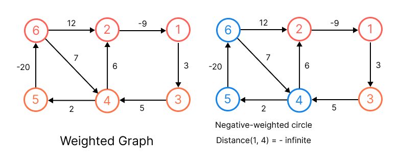
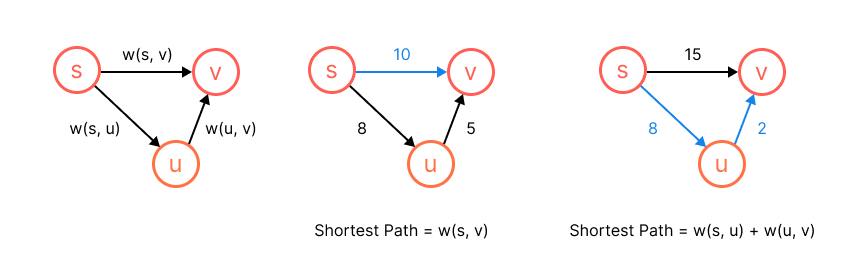
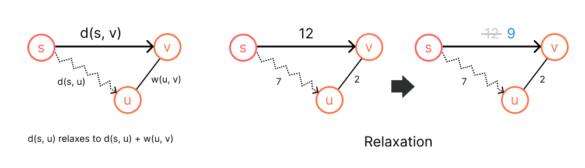

# Shortest Path


* For weighted directed graph, we define the shorted path is the lowest weight path from source `s` to each vertex `v`.
* The [BFS](../topics/graph.md#breadth-first-search-bfs) is a shortest path algorithm on unweighted graph (unit weight).
* A *negative-weight cycle* is a path starting and ending at the same vertex with the weight of path is less than 0, and if there is a egative-weight cycle reachable from `s`, then the shortest-path weight are not well defined. (We can keep going from 4 -> 5 -> 6 and back to 4, the total distance keeps decreasing by -11 for this circle) So there is no the shortest path for the graph with negative-weight cycle. (But positive-weight cycle is allowed)

For the most simple case, how to find the shortest path from `s` to `v` of the graph containing only three vertices `s`, `u`, `v`? The shortest path is either `weight(s, v)` (arriving directly) or `weight(s, u)` + `weight(u, v)` (passing through `u`)



```js
if distance(s, v) > distance(s, u) + weight(u, v)
    distance(s, v) = distance(s, u) + weight(u, v)
```

If the distance of the path passing `u` is less than the current path, then we can find a shorter path through edge `(u, v)`, and we have to update the current path. This gives us the general idea of finding the shortest path: **Relaxation**.

## Relaxation
The process of *relaxing* an edge `(u, v)` consists of testing whether we can improve the current shortest path from `s` to `v` found so far by "going through the edge `(u, v)`".



> The distance of `(s, v)` is 12, and we can reduce the distance by passing `u`, so the distance of `(s, v)` can relax to distance of `(s, u)` = 7 + edge weight of `(u, v)` = 2, that becomes 9.

That is, if we can find the shortest path of `s(s, v)` = `s(s, u)` + `w(u, v)`, then there exists a shortest path through edge `(u, v)`.

```kotlin
fun relax(s: Node<T>, u: Node<T>, v: Node<T>) {
    if (distance(s, v) > distance(s, u) + weight(u, v)) {
        distance(s, v) = distance(s, u) + weight(u, v)
    }
```

## Resources
- [ ] Fundamental of Data Structure
- [ ] CLRS
    - [ ] Single-Source Shortest Paths
    - [ ] All-Pairs Shortest Paths
- [ ] MIT
    - [ ] [Shortest Path](https://ocw.mit.edu/courses/6-006-introduction-to-algorithms-spring-2020/resources/lecture-11-weighted-shortest-paths/)
    - [ ] [Bellman-Ford](https://ocw.mit.edu/courses/6-006-introduction-to-algorithms-spring-2020/resources/lecture-12-bellman-ford/)
    - [ ] [Dijkstra](https://ocw.mit.edu/courses/6-006-introduction-to-algorithms-spring-2020/resources/lecture-13-dijkstra/)
    - [ ] [All Pair Shortest Path](https://ocw.mit.edu/courses/6-006-introduction-to-algorithms-spring-2020/resources/lecture-14-apsp-and-johnson/)
- [ ] http://alrightchiu.github.io/SecondRound/mu-lu-yan-suan-fa-yu-zi-liao-jie-gou.html // Nice introductory note
- [ ] [Stanford](http://infolab.stanford.edu/~ullman/focs/ch09.pdf) // Nice course
- [ ] [Software Engineering Interview Preparation](https://github.com/orrsella/soft-eng-interview-prep/blob/master/topics/algorithms.md#shortest-paths)
- [ ] ~~[LC Learn](https://leetcode.com/explore/learn/card/graph/)~~ // Some topics are locked!! We could try to do all the problem to lock.
    * Disjoint Set
    * DFS
    * BFS
    * Minimum Spanning Tree
    * Single Source Shortest Path
    * Topological Sort
- [ ] [Google Recuriter Recommended Problems List](https://turingplanet.org/2020/09/18/leetcode_planning_list/#Graph_Breadth-FS)
- [ ] ~~[Coding Interview University](https://github.com/jwasham/coding-interview-university#graphs)~~