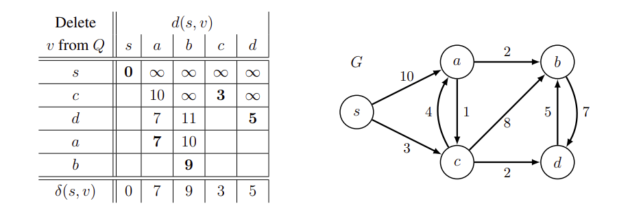
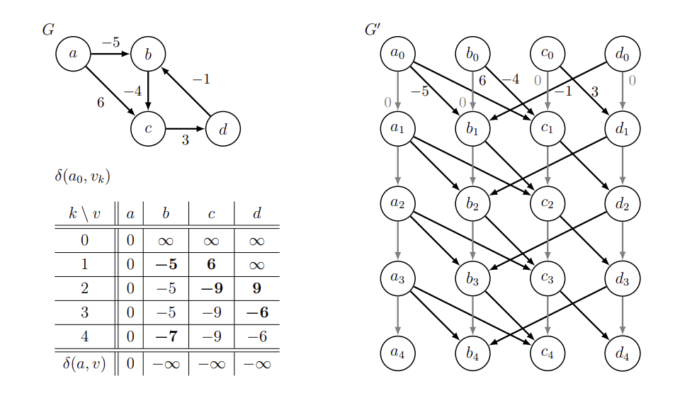

# Shortest Path


- For weighted directed graph, we define the shorted path is the lowest weight path from source `s` to each vertex `v`.
- The [BFS](../topics/graph.md#breadth-first-search-bfs) is a shortest path algorithm on unweighted graph (unit weight).
- A _negative-weight cycle_ is a path starting and ending at the same vertex with the weight of path is less than 0, and if there is a egative-weight cycle reachable from `s`, then the shortest-path weight are not well defined. (We can keep going from 4 -> 5 -> 6 and back to 4, the total distance keeps decreasing by -11 for this circle) So there is no the shortest path for the graph with negative-weight cycle. (But positive-weight cycle is allowed)

To find the shortest path, we maintain two attributes for every node in the graph:

- `v.distance`: upper bound weight of path from source `s` to `v`. (distance estimate of the shortest path)
- `v.predecessor`: the chain of predecessors originating at the vertex `v` runs backwards along a shortest path from `s` to `v`. (used to backtrace to find the shortest path)

> Notation: `d` means distance, `w` means weight for short in the following note.

For the most simple case, how to find the shortest path from `s` to `v` of the graph containing only three vertices `s`, `u`, `v`? The shortest path is either `w(s, v)` (arriving directly) or `w(s, u)` + `w(u, v)` (passing through `u`)


```js
if d(s, v) > d(s, u) + w(u, v)
    d(s, v) = d(s, u) + w(u, v)
```

If the distance of the path passing `u` is less than the current path, then we can find a shorter path through edge `(u, v)`, and we have to update the current path. This gives us the general idea of finding the shortest path: **Relaxation**.

## Relaxation

The single-source shortest path algorithm use the technique of _relaxation_, the process of _relaxing_ an edge `(u, v)` consists of testing whether we can improve the current shortest path from `s` to `v` found so far by "going through the edge `(u, v)`".

If `d(s, v)` > `d(s, u)` + `w(u, v)` for some edge `u`, then triangle inequality is violated, and we have to fix by lowering `d(s, v)` = `d(s, u)` + `w(u, v)`, that is, _relaxing_ edge by passing through `u`.

> Triangle inequality: `s(s, v)` <= `s(s, u)` + `w(u, v)`, means that we can't find the shortest path from `s` to `v` through another vertex `u` anymore.


> The distance of `(s, v)` is 12, and we can reduce the distance by passing `u`, so the distance of `(s, v)` can relax to distance of `(s, u)` = 7 + edge weight of `(u, v)` = 2, that becomes 9.

That is, if we can find the shortest path of `s(s, v)` = `s(s, u)` + `w(u, v)`, then there exists a shortest path through edge `(u, v)`.

```kotlin
fun relax(u: Node<T>, v: Node<T>) {
    if (distance(s, v) > distance(s, u) + weight(u, v)) {
        // Relaxation is to update the distance estimation and the predecessor
        distance(s, v) = distance(s, u) + weight(u, v)
        v.parent = u
    }
}
```

Before relaxation, we have to initialize:

```kotlin
fun initializeRelaxation(G, s) {
    val vertices = G.keys
    vertices.forEach { v ->
        v.distance = Int.MAX
        v.parent = null
    }
    s.distance = 0
}
```

The shortest path algorithms, including _Bellman-Ford_, _DAG Relaxation_, and _Dijkstra_, all call the `initialize()` and repeatedly call `relax()` on edges, they differ in how many times and the order in which they relax edges.

## Dijkstra's Algorithm

Dijkstra's algorithm is a greedy algorithm that finds the shortest path from a source node to all other nodes in a graph. The _Dijkstra's algorithm_ is asymptotically faster than Bellman-Ford, but only applies to graphs containing non-negative edge weights. It works when:

- Graph is weighted.
- All edge weights are non-negative.
- Single source shortest path.

**Analogy!** Think of a graph as a network of pipes, we turn one a water faucet at source `s`, and the water will reach each vertex in the order of their shortest distance from source.

> We always choose the "closest" vertex with minumum distance estimate, we say that is uses a greedy strategy.

Here is the pseudo code:

```kotlin
fun dijkstra(G, s) {
    val verticesQueue = PriorityQueue()
    initializeRelaxation(G)
    for (v in G.vertices) {
        verticesQueue.enqueue(v)
    }
    while (!verticesQueue.isEmpty()) {
        val vertex = verticesQueue.extractMin()
        val adjacentVertices = G[vertex]
        adjacentVertices.forEach { adj ->
            relax(vertex, adj)
        }
    }
}
```



> Source: [MIT Open Courseware - Introduction To Algorithms - Dijkstra's Algorithm](https://ocw.mit.edu/courses/6-006-introduction-to-algorithms-spring-2020/resources/mit6_006s20_lec13/)

1. Enqueue `s`, `a`, `b`, `c`, `d` into queue.
2. Initialize relaxation with `s` as source.
3. Extract minimum from queue: `s`.
4. Relax all out-going edges of `s`, update distance estimate of `a` and `c`.
5. Extract minimum from queue: `c`.
6. Relax all out-going edges of `c`, update distance estimate of `a`, `b` and `d`.
7. And so on.
   > Take a look at the sameple at P.596 of CLRS.

### Implementation

```kotlin
data class Edge(val weight: Int, val to: Int)

fun dijkstra(n: Int, graph: List<List<Edge>>, source: Int): IntArray {
    val distance = IntArray(n) { Int.MAX_VALUE }
    val minHeap = PriorityQueue(compareBy<Pair<Int, Int>> { it.first })
    distance[source] = 0
    minHeap.add(0 to source)

    while (minHeap.isNotEmpty()) {
        val (dist, node) = minHeap.poll()
        if (distance[node] < dist) continue // Skip stale item
        for ((w, adj) in graph[node]) {
            if (distance[node] + w < distance[adj]) {
                distance[adj] = distance[node] + w
                minHeap.add(distance[adj] to adj)
            }
        }
    }
    return distance
}
```

### Complexity Analysis

- **Time Complexity**: `O((V + E) * log V)`

  - Heap pop: `<= (V + E)` total pops x `O(log V)` per pop = `O((E + V) * log V)`
  - Edge scanning + relaxation: `O(E)`
  - Heap push for relaxation: `E` pushes x `O(log V)` per push = `O(E log V)`

- **Space Complexity**: `O(V + E)`
  - Graph: `O(V + E)` for adjacency list, or `O(V^2)` for adjacency matrix.
  - Distance array: `O(V)`
  - MinHeap: `O(V)` in the worst case (all nodes in heap)

> There is an [template](../topics/dijkstra-template.md) or [canonical implementation](../topics/shortest-path.md#dijkstra-canonical) of Dijkstra's algorithm for reference.

## Bellman-Ford Algorithm

The _Bellman-Ford_ algorithm solves the single source shortest path problem in the graph in which edge weights may be negative. (also might contain cycle) The algorithm can not only find the path, but also detect if there is negative-weight cycle in the graph.

The algorithm is straightforward: initialize relaxation, and then relax every edges in `|V| - 1` times.

```kotlin
/**
 * Return true means the graph does not contain negative-weight cycle.
 */
fun bellmanFord(G, s): Boolean {
    initializeRelaxation(G, s)
    for (i in 1 to G.vertices - 1) {
        for ((u, v) in G.edges) {
            relax(u, v)
        }
    }

    // Check if any edge is still relaxable for negative-weight cycle.
    // (still violates the triangle inequality)
    for (e in G.edges) {
        if (distance(s, v) > distance(s, u) + weight(u, s)) {
            return false
        }
    }
    return true
}
```

> Take a look at the sameple at P.589 of CLRS.

**Idea!** The shortest path contains at most `|V| - 1` edges as it traverses any vertex of the graph at most once. Here we can conduct _graph duplication_: make `|V| + 1` level of copies. (Level 0 is for initialization, Level 1 ~ (`|V|` - 1) for relaxation, and last level for check negative-weight cycle.)



> Source: [MIT Open Courseware - Introduction To Algorithms - Bellman-Ford](https://ocw.mit.edu/courses/6-006-introduction-to-algorithms-spring-2020/resources/mit6_006s20_lec12/)

1. `k` represents level. `k` = 0 for relax initialization.
2. For `k` = 1 ~ 3, relax all edges from the duplication levels.
3. For `k` = 4, check if negative-weight cycle, since there is an edge still able to relax (-7), the graph contains negative-weight cycle.

For the graph copy, we run `|V| + 1` round of relaxation for every edges. At level `|V| - 1`, we will get the shortest path, and the last round will know if the graph contains negative-weight cycle. (still can relax, violates triangle inequality)

### Time Complexity

The algorithm runs `|V|` rounds and each round performs on each edges, so it takes `O(|V|*|E|)` time. However, we can obtain significatn savings by stoping relaxation round for which no edge relaxation is modifying.

### Space Complexity

We duplciate the graph `O(|V|)` times, so the space complexity will be `O(|V| * (|V| + |E|))`.

## DAG Relaxation

**Idea!** Maintain a distance estimation `d(s, v)` (initially infinite) for each vertex, then find an edge violates the _triangle inequality_, go through that edge to gradually lower the distance estimation until `d(s, v)` is the shortest-path weight `s(s, v)`. It takes `O(|V| + |E|)` time.

> DAG = Directed Acyclic Graph, negative weight may exist, but there is no any cycle.

```kotlin
fun dagShortestPath(G, s) {
    val topologicalSortList = topologicalSort(G)    // O(V + E)
    initializeRelaxation(G, s)                      // O(V)
    topologicalSortList.forEach { vertex ->         // O(E)
        val adjacentVertices = G[vertex]
        adjacentVertices.forEach { adj ->
            relax(vertex, adj)
        }
    }
}
```

> Take a look at the sameple at P.593 of CLRS.

## All-Pairs Shortest Path

> TODO: study if necessary.

## Dijkstra Canonical
```kotlin
/**
 * A canonical and correct implementation of Dijkstra's algorithm.
 * This version is highly suitable for competitive programming and general use.
 */

// A data class is a concise way to define a class that just holds data.
// Here, it represents a directed edge with a destination (`to`) and a cost (`weight`).
data class Edge(val to: Int, val weight: Int)

/**
 * Finds the shortest paths from a single source node to all other nodes in a weighted graph.
 *
 * @param n The total number of nodes in the graph. Nodes are assumed to be 0-indexed (0 to n-1).
 * @param graph The graph represented as an adjacency list. `graph[i]` contains a list of `Edge` objects starting from node `i`.
 * @param source The node from which to start the search.
 * @return An IntArray where `distance[i]` is the shortest distance from `source` to node `i`.
 *         If a node is unreachable, its distance will be `Int.MAX_VALUE`.
 */
fun dijkstraCanonical(n: Int, graph: List<List<Edge>>, source: Int): IntArray {
    // --- 1. Initialization ---

    // `distance` array stores the shortest distance from the `source` to every other node.
    // Initialize all distances to a value representing infinity, as we haven't found any paths yet.
    val distance = IntArray(n) { Int.MAX_VALUE }

    // The priority queue is the core of Dijkstra's. It stores pairs of (distance, node).
    // It's a MIN-priority queue, so it will always allow us to retrieve the node
    // with the smallest current distance. This is the "greedy" part of the algorithm.
    val minHeap = PriorityQueue<Pair<Int, Int>>(compareBy { it.first })

    // The distance from the source node to itself is always 0.
    distance[source] = 0
    // We start our search from the source node, so we add it to the heap with a distance of 0.
    minHeap.add(0 to source)

    // --- 2. Main Loop ---

    // The algorithm continues as long as there are nodes to process in the priority queue.
    while (minHeap.isNotEmpty()) {
        // Extract the node with the smallest distance from the source found so far.
        // `dist` is the distance, `node` is the node's index.
        val (dist, node) = minHeap.poll()

        // *** THIS IS A CRUCIAL OPTIMIZATION ***
        // If the distance we just pulled from the heap (`dist`) is greater than the shortest
        // distance we've already recorded for this `node`, it means we've found a better
        // path to this `node` already. This heap entry is "stale" or "outdated," so we ignore it and continue.
        if (dist > distance[node]) {
            continue
        }

        // --- 3. Relaxation Step ---

        // Now, we look at all the neighbors of the current `node`.
        for (edge in graph[node]) {
            val neighbor = edge.to
            val weight = edge.weight

            // Calculate the distance to the neighbor if we go through the current `node`.
            val newDist = distance[node] + weight // or `dist + weight`, they are equivalent here.

            // If the new path is shorter than any path we've found to the neighbor so far...
            if (newDist < distance[neighbor]) {
                // ...we update the shortest distance for the neighbor.
                distance[neighbor] = newDist
                // And we add the neighbor to the priority queue with its new, shorter distance.
                // This ensures we will explore its neighbors in a future step.
                minHeap.add(newDist to neighbor)
            }
        }
    }

    // After the loop finishes, the `distance` array contains the shortest path from the source to all reachable nodes.
    return distance
}
```