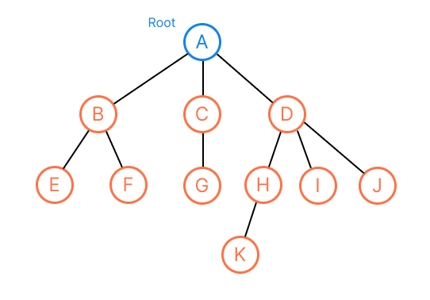
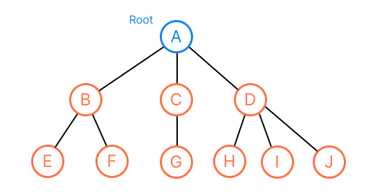
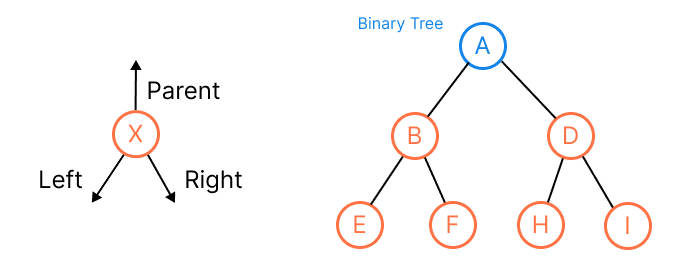

# Tree
## Definitions & Terminology
A *tree* is a finite set of *nodes* such that:
* Specially designated node called the *root*.
* The remaining nodes are the disjoint sets `T1, ..., Tn` where `Ti` is a tree, they are called the *subtrees* of the root. `T1, ..., Tn` are disjoint sets prohibits subtrees from connecting together (no cross breeding).



* A *node* stands for the item of data and branches to other nodes.
* The number of subtrees of a node is called its *degree*. For example, the degree of `A` is 3, `C` is 1, `E` is 0. The degree of a tree is the maximum degree, for this tree is degree 3.
* For node that has no parent is *root*. (`A`)
* For those nodes that have no child (degree zero) are called *leaf*. (`{E, F, G, K, I, J}`)
* The root of the subtree is the *parent*, and the subtree is the *children*. (`B` is parent of `{E, F}`, whereas `{E, F}` are children of `B`)
* Children of the same parent are called *siblings*. (`{B, C, D}`, `{E, F}`, `{H, I, J}`)
* The *ancestor* of a node are all the nodes along the path from the root to that node (the ancestor for node `K` are `{A, D, H}`).
* The *depth* (measuring downward) of a node `X` is the number of ancestors = the number of edges in the path from `X` up to the root. (depth of `H` is 2, `K` is 3)
* The *height* (measuing upward) of a node `X` is the number of edge in the longest downward path from `X` = the max depth of subtree of `X`. (the heights of all leaf are 0, `C` is 1, `D` is 2).
* A *forest* is the disjoint sets `T1, ..., Tn` that remove the root of the tree. (`{B, E, F}`, `{C, G}`, `{D, H, I, J, K}`)

## Type of Trees
| General Tree                                                  | Binary Tree                                                                         | Binary Search Tree                                                                                                | AVL Tree                                                                                      | Red-Black Tree                                                                                             | N-ary Tree                                                                                                                         |
|---------------------------------------------------------------|-------------------------------------------------------------------------------------|-------------------------------------------------------------------------------------------------------------------|-----------------------------------------------------------------------------------------------|------------------------------------------------------------------------------------------------------------|------------------------------------------------------------------------------------------------------------------------------------|
| A tree with no constraints imposed on the hierarchy or nodes. | A tree in which each parents can have at most 2 children.                           | An extension of binary tree, where the value fo left child <= parent <= right child. It can be used in searching. | A self-balancing binary search tree, the heights of two child subtrees differ by at most one. | A self-balancing binary search tree, each node will be painted in "red" or "black" based on the balancing. | A tree of that the max number of children is limited to N. Binary tree is 2-ary tree. `Trie` is used implementation of N-ary tree. |
|                         |  |                            |       |        |                                                            |

## Binary Tree
A *binary tree* is a tree of binary nodes.



```kotlin
data class BinaryNode<T>(
    val item: T,
    val parent: Binary<T>? = null,
    val left: BinaryNode<T>? = null,
    val right: BInaryNode<T>? = null
)
```

**Idea**: We're going to design operations that runs in `O(H)` time for height `H`, and maintain `H = O(lg n)`. (For [Array](../topics/array.md) or [Linked List](../topics/linked-list.md), there are good and bad running time of different operations. Here we want a better running time for all operations)


## Sub-toptics
* Heap
* Priority
* Binary Tree
* Binary Search Tree
* BFS/DFS

## Resources
- [ ] Fundamental of Data Structure
- [ ] CLRS (Simple)
- [ ] CTCI
- [ ] [MIT 6.006 Introduction to Algorithm - Lecture 6: Binary Trees, Part 1](https://ocw.mit.edu/courses/electrical-engineering-and-computer-science/6-006-introduction-to-algorithms-spring-2020/lecture-videos/lecture-6-binary-trees-part-1/)
- [ ] [基本資料結構系列文章](http://alrightchiu.github.io/SecondRound/treeshu-introjian-jie.html) // Nice introductory note
- [ ] https://leetcode-solution-leetcode-pp.gitbook.io/leetcode-solution/thinkings/tree // Nice introductory note
- [ ] https://github.com/youngyangyang04/leetcode-master#%E4%BA%8C%E5%8F%89%E6%A0%91 // Nice introductory note
- [ ] [Google Tech Dev Guide](https://techdevguide.withgoogle.com/paths/data-structures-and-algorithms/#sequence-3)
- [ ] [LC Learn](https://leetcode.com/explore/learn/card/data-structure-tree/) 
- [ ] [LC Top Interview Questions](https://leetcode.com/explore/interview/card/top-interview-questions-easy/94/trees/) // Coding problems With easy/medium/hard levels
- [ ] [Google Recuriter Recommended Problems List](https://turingplanet.org/2020/09/18/leetcode_planning_list/#Tree) 
- [ ] [Coding Interview University](https://github.com/jwasham/coding-interview-university#trees) // Simple note
- [ ] [Tech Interview Handbook](https://www.techinterviewhandbook.org/algorithms/tree) // Simple note + relative coding problems
- [ ] [Software Engineering Interview Preparation](https://github.com/orrsella/soft-eng-interview-prep/blob/master/topics/data-structures.md#binary-search-trees) // Binary search tree, cheat sheet
- [ ] https://github.com/TSiege/Tech-Interview-Cheat-Sheet#binary-tree // Simple note
- [ ] [Stadford Foundations of Computer Science - The Tree Data Model](http://infolab.stanford.edu/~ullman/focs/ch05.pdf)
