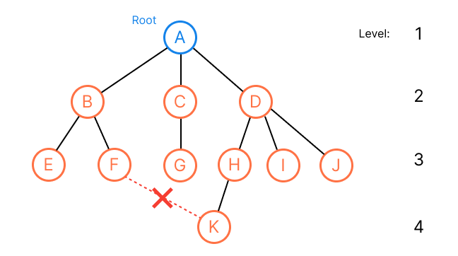
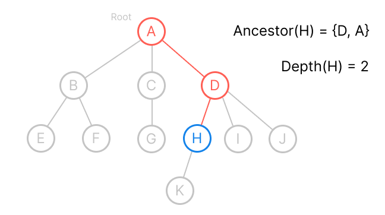
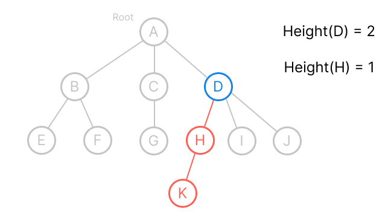
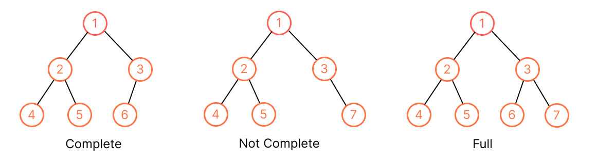
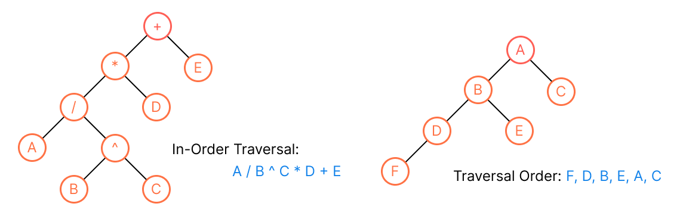
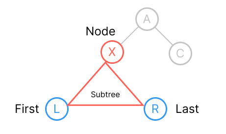
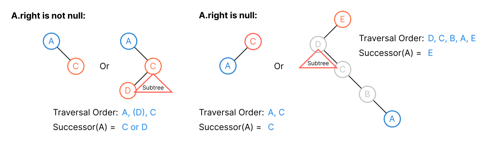

# Tree
## Definitions
A *tree* is a finite set of *nodes* such that:
* Specially designated node called the *root*.
* The remaining nodes are the disjoint sets `T1, ..., Tn` where `Ti` is a tree, they are called the *subtrees* of the root. The disjoint sets `T1, ..., Tn` prohibit subtrees from connecting together (no cross breeding or no cycle).


> It looks upside down in computer science world.

We can use [linked list](../topics/linked-list.md) to represent the tree:

```kotlin
data class Node<T>(
    val item: T,
    val children: List<Node>? = emptyListOf()
)

data class GeneralTree<T>(
    val root: Node<T>
)
```


## Terminology


* A *node* stands for the item of data and branches to other nodes.
* The number of subtrees of a node is called its *degree*. For example, the degree of `A` is 3, `C` is 1, `E` is 0. The degree of a tree is the maximum degree, for this tree is degree 3.
* For node that has no parent is *root*. (`A`)
* For those nodes that have no child (degree zero) are called *leaf*. (`{E, F, G, K, I, J}`)
* The root of the subtree is the *parent*, and the subtree is the *children* (branch). (`B` is parent of `{E, F}`, whereas `{E, F}` are children of `B`)
* Children of the same parent are called *siblings*. (`{B, C, D}`, `{E, F}`, `{H, I, J}`)
* The *ancestor* of a node `X` are all the nodes along the path from `X` to the root (the ancestor for node `K` are `{H, D, A}`).
* The *depth* (measuring downward in real world) of a node `X` is the number of edges of the path to its root. (depth of `H` is 2, `K` is 3)


* The *height* (measuing upward in real world) of a node `X` is the number of edge in the longest path to its leaf. (the heights of all leaf are 0, `C` is 1, `D` is 2, `A` = `the height of tree` is 3)


* A *forest* is the disjoint sets `T1, ..., Tn` that remove the root of the tree. (`{B, E, F}`, `{C, G}`, `{D, H, I, J, K}`)

## Type of Trees
| General Tree                                                  | Binary Tree                                                                         | Binary Search Tree                                                                                                | AVL Tree                                                                                      | Red-Black Tree                                                                                             | N-ary Tree                                                                                                                         |
|---------------------------------------------------------------|-------------------------------------------------------------------------------------|-------------------------------------------------------------------------------------------------------------------|-----------------------------------------------------------------------------------------------|------------------------------------------------------------------------------------------------------------|------------------------------------------------------------------------------------------------------------------------------------|
| A tree with no constraints imposed on the hierarchy or nodes. | A tree in which each parents can have at most 2 children.                           | An extension of binary tree, where the value fo left child <= parent <= right child. It can be used in searching. | A self-balancing binary search tree, the heights of two child subtrees differ by at most one. | A self-balancing binary search tree, each node will be painted in "red" or "black" based on the balancing. | A tree of that the max number of children is limited to N. Binary tree is 2-ary tree. `Trie` is used implementation of N-ary tree. |
|                         |  |                            |       |        |                                                            |

> Source: [Wikipedia](https://en.wikipedia.org/wiki/Binary_tree)

## Binary Tree
A *binary tree* is a tree of binary nodes (every node has at most two children).


```kotlin
data class BinaryNode<T>(
    val data: T,
    val parent: Binary<T>? = null,
    val left: BinaryNode<T>? = null,
    val right: BInaryNode<T>? = null
)

data class BinaryTree<T> (
    val root: BinaryNode<T>
)
```

**Idea**: We're going to design operations that runs in `O(h)` time for height `h`, and maintain `O(h) = O(lg n)`. For [Array](../topics/array.md) or [Linked List](../topics/linked-list.md), there are good and bad running time of different operations. Here we want a better running time for all operations.

### Complete/Full Binary Tree


A *full*  binary tree of level `k` is a binary tree that has `2^k - 1` nodes.

* Each nodes have two children.
* Each leafs are at the same depth (or height).

A binary tree with `n` nodes of level `k` is *complete* iff its nodes are numbered 1 to `n` in the full binary tree of level `k`.

## Traversal
Traversal of a binary tree means to **visit each node in the tree exactly once** (get a linear order of node data). We define a binary tree's *traversal order* (also called *in-order*) based on the following characterization:

* Each node in the left subtree of node `X` visits **before** `X`.
* Each node in the right subtree of node `X` visits **after** `X`.

That is, given a binary node `X`, we can list all the nodes by recursively listing the nodes in `X`'s left subtree, list `X` itself, and then recursively listing the nodes in `X`'s right subtree. (It takes `O(n)` where `n` is the number of nodes.)

```kotlin
fun subtreeIteration(node: Node<T>) {
    if (node.left != null) subtreeIteration(node.left)
    print(node.data)
    if (node.right != null) subtreeIteration(node.right)
}

val tree = BinaryTree(A)
subtreeIteration(tree.root)
```



> We store data in tree structure, NOT storing the real traversal order which maintaining costs is more than tree structure itself.

### Traversal Operations
#### Find First / Last
To find the first (last is symmetric) node in the traversal order of node `X`'s subtree, we just go left (right) as much as possible to find the left most (right most) leaf.



```kotlin
fun subtreeFirst(node: Node<T>): Node {
    return if (node.left != null) subtreeFirst(node.left)
    else node
}

fun subtreeLast(node: Node<T>): Node {
    return if (node.right != null) subtreeLast(node.right)
    else node
}

val tree = BinaryTree(A)
subtreeFirst(tree.root)
subtreeLast(tree.root)
``` 

Both operations take `O(h) = O(lg n)` because each step of th recursion moves down the tree. (at most `h` times)

#### Find Successor / Predecessor
The *successor* (*predecessor* is symmetric) is the next (previous) node after node `X` in traversal order. There are two cases:
1. If the node has right child: we find the left most node of it subtree of right child, that is, `subtreeFirst(node.right)`.
2. Otherwise, go to find the parent. We walk up tree from the parent of node `X` until reaching a node `K` where `K == K.parent.left` (left branch). (Find the lowest ancestor of node `X` such that `X` is in the ancestor's left subtree)



```kotlin
fun successor(node: Node<T>): Node {
    if (node.right != null) return subtreeFirst(node.right)
    else {
        var parentNode = node
        while (parentNode != null && parentNode == parentNode.parent?.right) {
            parentNode = parentNode?.parent
        }
        return parentNode.parent
    }
}

fun predecessor(node: Node<T>): Node {
    if (node.left != null) return substreeLast(node.left)
    else {
        var parentNode = node
        while (parentNode != null && parentNode == parentNode?.parent?.left) {
            parentNode = parentNode.parent
        }
        return parentNode.parent
    }
}
```

Both operations also take `O(h) = O(lg n)` since the worst case is to run the height of tree.

### Insertion
**We must preserve the traversal order after inserting or deleting a node in a binary tree.**

To insert a new node after (before is symmetric) the node `X`, there also are two cases:
1. If the right (left) child is not there, we just add the new node to right (left) child.
2. Otherwise, find the `subtreeFirst(node.right)` which is also the `successor(node)` and add the new node as a left child to it, since `subtreeFirst(node.right)` will find the left most node, this guarantees the left most node has no left node anymore, we just add new node as new left child of that left most node.


```kotlin
fun insertAfter(node: Node<T>, newNode: Node<T>) {
    if (node.right == null) {
        node.right = newNode
        newNode.parent = node
    } else {
        val leftMostNode = subtreeFirst(node.right)
        leftMostNode.left = newNode
        newNode.parent = leftMostNode
    }
}

fun insertBefore(node: Node<T>, newNode: Node<T>) {
    if (node.left == null) {
        node.left = newNode
        newNode.parent = node
    } else {
        val rightMostNode = subtreeLast(node.left)
        rightMostNode.right = newNode
        newNode.parent = rightMostNode
    }
}
```

Both takes `O(h)` since the worst case is to call `subtreeFirst()` or `subtreeLast()`.

## Sub-toptics
* Heap
* Priority
* Binary Tree
* Binary Search Tree
* BFS/DFS

## Resources
- [ ] Fundamental of Data Structure
- [ ] CLRS (Simple)
- [ ] CTCI
- [ ] [MIT 6.006 Introduction to Algorithm - Lecture 6: Binary Trees, Part 1](https://ocw.mit.edu/courses/electrical-engineering-and-computer-science/6-006-introduction-to-algorithms-spring-2020/lecture-videos/lecture-6-binary-trees-part-1/)
- [ ] [基本資料結構系列文章](http://alrightchiu.github.io/SecondRound/treeshu-introjian-jie.html) // Nice introductory note
- [ ] https://leetcode-solution-leetcode-pp.gitbook.io/leetcode-solution/thinkings/tree // Nice introductory note
- [ ] https://github.com/youngyangyang04/leetcode-master#%E4%BA%8C%E5%8F%89%E6%A0%91 // Nice introductory note
- [X] [Google Tech Dev Guide](https://techdevguide.withgoogle.com/paths/data-structures-and-algorithms/#sequence-3)
- [ ] [LC Learn](https://leetcode.com/explore/learn/card/data-structure-tree/) 
- [ ] [LC Top Interview Questions](https://leetcode.com/explore/interview/card/top-interview-questions-easy/94/trees/) // Coding problems With easy/medium/hard levels
- [ ] [Google Recuriter Recommended Problems List](https://turingplanet.org/2020/09/18/leetcode_planning_list/#Tree) 
- [ ] [Coding Interview University](https://github.com/jwasham/coding-interview-university#trees) // Simple note
- [ ] [Tech Interview Handbook](https://www.techinterviewhandbook.org/algorithms/tree) // Simple note + relative coding problems
- [ ] [Software Engineering Interview Preparation](https://github.com/orrsella/soft-eng-interview-prep/blob/master/topics/data-structures.md#binary-search-trees) // Binary search tree, cheat sheet
- [ ] https://github.com/TSiege/Tech-Interview-Cheat-Sheet#binary-tree // Simple note
- [ ] [Stadford Foundations of Computer Science - The Tree Data Model](http://infolab.stanford.edu/~ullman/focs/ch05.pdf)
