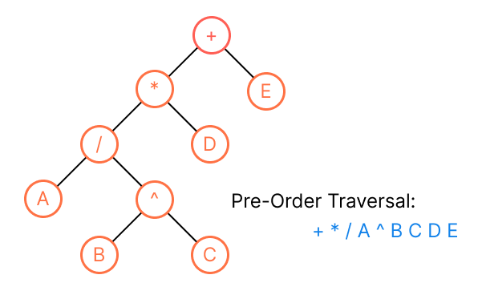
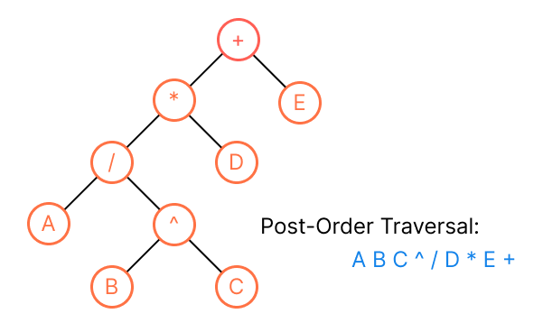
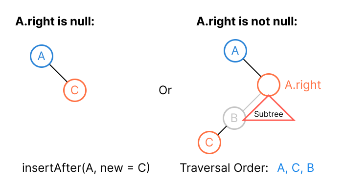
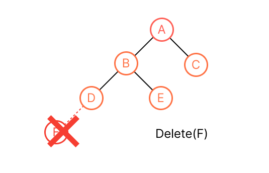
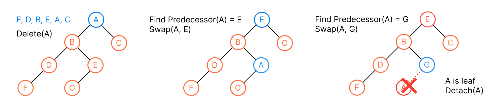
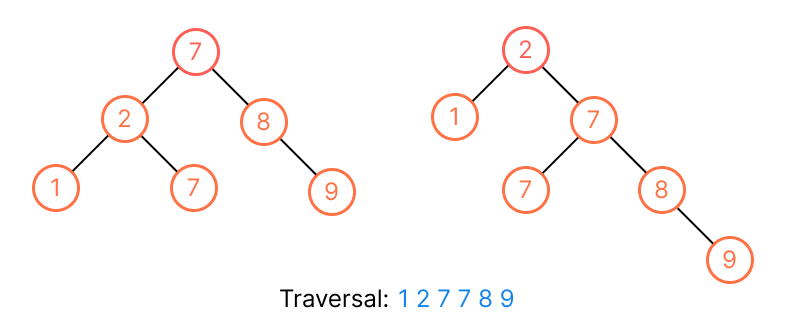

# Tree
## Definitions
A *tree* is a finite set of *nodes* such that:
* Specially designated node called the *root*.
* The remaining nodes are the disjoint sets `T1, ..., Tn` where `Ti` is a tree, they are called the *subtrees* of the root. The disjoint sets `T1, ..., Tn` prohibit subtrees from connecting together (no cross breeding or no cycle).


> It looks upside down in computer science world.

We can use [linked list](../topics/linked-list.md) to represent the tree:

```kotlin
data class Node<T>(
    val item: T,
    val children: List<Node>? = emptyListOf()
)

data class GeneralTree<T>(
    val root: Node<T>
)
```


## Terminology


* A *node* stands for the item of data and branches to other nodes.
* The number of subtrees of a node is called its *degree*. For example, the degree of `A` is 3, `C` is 1, `E` is 0. The degree of a tree is the maximum degree, for this tree is degree 3.
* For node that has no parent is *root*. (`A`)
* For those nodes that have no child (degree zero) are called *leaf*. (`{E, F, G, K, I, J}`)
* The root of the subtree is the *parent*, and the subtree is the *children* (branch). (`B` is parent of `{E, F}`, whereas `{E, F}` are children of `B`)
* Children of the same parent are called *siblings*. (`{B, C, D}`, `{E, F}`, `{H, I, J}`)
* The *ancestor* of a node `X` are all the nodes along the path from `X` to the root (the ancestor for node `K` are `{H, D, A}`).
* The *depth* (measuring downward in real world) of a node `X` is the number of edges of the path to its root. (depth of `H` is 2, `K` is 3)


* The *height* (measuing upward in real world) of a node `X` is the number of edge in the longest path to its leaf. (the heights of all leaf are 0, `C` is 1, `D` is 2, `A` = `the height of tree` is 3)


* A *forest* is the disjoint sets `T1, ..., Tn` that remove the root of the tree. (`{B, E, F}`, `{C, G}`, `{D, H, I, J, K}`)

## Type of Trees
| General Tree                                                  | Binary Tree                                                                         | Binary Search Tree                                                                                                | AVL Tree                                                                                      | Red-Black Tree                                                                                             | N-ary Tree                                                                                                                         |
|---------------------------------------------------------------|-------------------------------------------------------------------------------------|-------------------------------------------------------------------------------------------------------------------|-----------------------------------------------------------------------------------------------|------------------------------------------------------------------------------------------------------------|------------------------------------------------------------------------------------------------------------------------------------|
| A tree with no constraints imposed on the hierarchy or nodes. | A tree in which each parents can have at most 2 children.                           | An extension of binary tree, where the value of left child <= parent <= right child. It can be used in searching. | A self-balancing binary search tree, the heights of two children subtrees differ by at most one. | A self-balancing binary search tree, each node will be painted in "red" or "black" based on the balancing. | A tree of that the max number of children is limited to N. Binary tree is 2-ary tree. `Trie` is used implementation of N-ary tree. |
|                         |  |                            |       |        |                                                            |

> Source: [Wikipedia](https://en.wikipedia.org/wiki/Binary_tree)

## Binary Tree
A *binary tree* is a tree of binary nodes (every node has at most two children).


```kotlin
data class Node<T>(
    var data: T,
    var left: BinaryNode<T>? = null,
    var right: BInaryNode<T>? = null

    // Most of problems won't provide the parent pointer
    var parent: Binary<T>? = null,
)

data class BinaryTree<T> (
    val root: BinaryNode<T>
)
```

**Idea**: We're going to design operations that runs in `O(h)` time for height `h`, and maintain `O(h)`. For [Array](../topics/array.md) or [Linked List](../topics/linked-list.md), there are good and bad running time of different operations. Here we want a better running time for all operations.

> The `h` is `lg n` for average case (balanced), but `n` for skewed tree, it doesn't guarantee to be `lg n`.

### Complete/Full Binary Tree


A *full*  binary tree of level `k` is a binary tree that has `2^k - 1` nodes.

* Each nodes have two children.
* Each leafs are at the same depth (or height).

A binary tree with `n` nodes of level `k` is *complete* iff its nodes are numbered 1 to `n` in the full binary tree of level `k`.

## Traversal
Traversal of a binary tree means to **visit each node in the tree exactly once** (get a linear order of node data). Let `L`, `D`, `R` stand for moving left, print the data, moving right, repectively, and we adopt the convention that we traverse left before right, then we have three traversals: `DLR`, `LDR`, `LRD`, that are *preorder*, *inorder* and *postorder* (depends on `D`) (also known as *depth-first search*, *DFS*).

### Inorder Traversal
We define a binary tree's *traversal order* (*inorder* as default) based on the following characterization:

* Each node in the left subtree of node `X` visits **before** `X`.
* Each node in the right subtree of node `X` visits **after** `X`.

That is, given a binary node `X`, we can list all the nodes by recursively listing the nodes in `X`'s left subtree, list `X` itself, and then recursively listing the nodes in `X`'s right subtree. (It takes `O(n)` where `n` is the number of nodes.)

```kotlin
fun inorderTraversal(node: Node<T>?) {
    if (node?.left != null) inorderTraversal(node.left!!)
    print(node?.data)
    if (node?.right != null) inorderTraversal(node.right!!)
}

val tree = BinaryTree(A)
inorderTraversal(tree.root)

fun inorderTraversalIterative(root: Node<T>?) {
    if (root == null) return
    val stack = Stack<Node>()
    // We don't push root here!!
    var node: Node<T>? = root
    while (!stack.isEmpty() || node != null) {
        // Traverse all left child
        while (node != null) {
            stack.push(node)
            node = node.left
        }
        node = stack.pop()
        println(node.data)
        node = node.right
    }
}
```


> We store data in tree structure, NOT storing the real traversal order which maintaining costs is more than tree structure itself.

#### Find First / Last
To find the first (last is symmetric) node in the traversal order of node `X`'s subtree, we just go left (right) as much as possible to find the left most (right most) leaf.


```kotlin
fun subtreeFirst(node: Node<T>): Node? {
    return if (node.left != null) subtreeFirst(node.left)
    else node
}

// Iteratively
fun treeFirst(node: Node<T>): Node { 
    var first = node
    while (first.left != null) {
        first = first.left
    }
    return first
}

fun subtreeLast(node: Node<T>): Node {
    return if (node.right != null) subtreeLast(node.right)
    else node
}

val tree = BinaryTree(A)
subtreeFirst(tree.root)
subtreeLast(tree.root)
``` 

Both operations take `O(h)` because each step of th recursion moves down the tree. (at most `h` times)

#### Find Successor / Predecessor
The *successor* (*predecessor* is symmetric) is the next (previous) node after node `X` in traversal order. There are two cases:
1. If the node has right child: we find the left most node of it subtree of right child, that is, `subtreeFirst(node.right)`.
2. Otherwise, go to find the parent. We walk up tree from the parent of node `X` until reaching a node `K` where `K == K.parent.left` (left branch). (*Find the lowest ancestor of node `X` such that `X` is in the ancestor's left subtree*)


```kotlin
fun successor(node: Node<T>): Node? {
    if (node.right != null) return subtreeFirst(node.right)
    else {
        var parentNode = node
        while (parentNode != null && parentNode == parentNode.parent?.right) {
            parentNode = parentNode?.parent
        }
        return parentNode.parent
    }
}

fun predecessor(node: Node<T>): Node? {
    if (node.left != null) return substreeLast(node.left)
    else {
        var parentNode = node
        while (parentNode != null && parentNode == parentNode?.parent?.left) {
            parentNode = parentNode.parent
        }
        return parentNode.parent
    }
}
```

Both operations also take `O(h)` since the worst case is to run the height of tree.

### Preorder Traversal


```kotlin
fun preorderTraversal(node: Node<T>?) {
    print(node?.data)
    if (node?.left != null) preorderTraversal(node.left!!)
    if (node?.right != null) preorderTraversal(node.right!!)
}

fun preorderTraversalIteratively(node: Node<T>?) {
    if (node == null) return
    val stack = Stack<Node>()
    stack.push(node)
    while (!stack.isEmpty()) {
        val n = stack.pop()
        println(n.data)
        // Mind the order, right goes first (stack)
        if (n.right != null) stack.push(n.right!!)
        if (n.left != null) stack.push(n.left!!)
    }
}
```

### Postorder Traversal


```kotlin
fun postorderTraversal(node: Node<T>?) {
    if (node?.left != null) postorderTraversal(node.left!!)
    if (node?.right != null) postorderTraversal(node.right!!)
    print(node?.data)
}

/** 
 * Idea:
 *  Preorder = DLR, we modify the preorderTraversalIterative(), we push left child first, so the order will become DRL, then we reverse it so  it becomes LRD in the final.
 */
fun postorderTraversal(root: Node<T>?): Node<T>? {
    if (root == null) return null
    val results = mutableListOf<T>()
    val stack = Stack<Node>()
    stack.push(root)
    while (!stack.isEmpty()) {
        val node = stack.pop()
        println(node.`val`)
        if (node.left != null) stack.push(node.left!!)
        if (node.right != null) stack.push(node.right!!)
    }
    results.reverse()
    return results
}
```

### Level-Order Traversal (BFS)
```kotlin
fun breadthFirstSearch(node: Node<T>) {
    val queue = Queue()
    queue.enqueue(node)
    while (!queue.isEmpty()) {
        val nextNode = queue.dequeue()
        if (nextNode.left != null) queue.enqueue(nextNode.left)
        if (nextNode.right != null) queue.enqueue(nextNode.right)
        print(nextNode.data)
    }
}

val tree = BinaryTree()
breadthFirstSearch(tree.node)
```

## Insertion
**We must preserve the traversal order after inserting or deleting a node in a binary tree.**

To insert a new node after (before is symmetric) the node `X`, there also are two cases:
1. If the right (left) child is not there, we just add the new node to right (left) child.
2. Otherwise, find the `subtreeFirst(node.right)` which is also the `successor(node)` and add the new node as a left child to it, since `subtreeFirst(node.right)` will find the left most node, this guarantees the left most node has no left node anymore, we just add new node as new left child of that left most node.



```kotlin
fun insertAfter(node: Node<T>, newNode: Node<T>) {
    if (node.right == null) {
        node.right = newNode
        newNode.parent = node
    } else {
        val leftMostNode = subtreeFirst(node.right)
        leftMostNode.left = newNode
        newNode.parent = leftMostNode
    }
}

fun insertBefore(node: Node<T>, newNode: Node<T>) {
    if (node.left == null) {
        node.left = newNode
        newNode.parent = node
    } else {
        val rightMostNode = subtreeLast(node.left)
        rightMostNode.right = newNode
        newNode.parent = rightMostNode
    }
}
```

Both takes `O(h)` since the worst case is to call `subtreeFirst()` or `subtreeLast()`.

## Deletion
To delete a node `X`, there are two cases:

* Leaves are easy to delete, just detach (removing the child reference from parent node)


* For root (most tricky one) or node that is not leaf, we have to find its predecessor/successor, and **move down `X` by swapping with its predecessor/successor until `X` becomes the leaf**, and detach. 
    * We want the node to delete to keep moving down until it becomes the leaf, then detach.
    * We just **change the `data` field, not change the node** directly when swipping.



```kotlin
fun delete(node: Node<T>) {
    if (node.left != null || node.right != null) {
        val nodeToSwap = if (node.left != null) predecessor(node)
        else successor(node)

        val temp = nodeToSwap.data
        nodeToSwap.data = node.data
        node.data = temp

        // Recursively moving down the node to delete until it becomes leaf
        delete(nodeToSwap)
    }

    val parent = node.parent
    if (parent != null) {
        if (parent.left == node) parent.left = null
        else parent.right = null
    } 
}
```

## Binary Search Tree
A *binary search tree* is an extension of binary tree that its keys are always stored in such a way to satisfy the property:
* `L` is the node in left subtree of node `X`, then `L.data` <= `X.data`.
* `R` is the node in right subtree of node `X`, then `R.data` >= `X.data`.



> The same traversal order but the rigth tree will be less efficient.

### Query Operations
* To *search* a key in the binary search tree, it takes `O(h)` and acts similarly to binary search in array.

```kotlin
fun search(node: Node<T>?, k: T): Node? {
    return when {
        node == null -> null
        k < node.data -> search(node.left, k)
        k == node.data -> node
        k > node.data -> search(node.right, k)
    }
}

// We also can write in iteratively. (this version is more efficient in most computer.
fun searchIteratively(node: Node<T>?, k: T): Node? {
    var searchNode = node
    while (searchNode != null && k != searchNode.data) {
        if (k < searchNode?.data) {
            searchNode = searchNode.left
        } else {
            searchNode = searchNode.right
        }
    }
    return searchNode
}

search(tree.root, k)
searchIteratively(tree.root, k)
```

* To find the *minimum / maximum* is very straightforward, just find the left / right most node. (Simply use `subtreeFirst()` and `subtreeLast()` in binary tree)
* To find the *successor / predecessor*, we also simply use `successor()` and `predecessor()` in binary tree)
* The inorder traversal of BST will be in ascending order, the order of every nodes in binary search tree is as same as "inorder" traversal order.

### Insertion & Deletion
The insertion and deletion cause the binary search tree to change to hold the binary-search-tree property continues to hold. It also take `O(h)` time.

```kotlin
fun BinarySearchTree.insert(k: <T>) {
    val newNode = Node(data = k)
    
    // Locate the correct place to insert:
    //  `node` traces the path, and
    //  `nodeParent` traces the `node`'s parent.
    var node = this.root
    var nodeParent: Node<T>? = null
    while (node != null) {
        nodeParent = node
        if (k < node.data) {
            node = node.left
        } else {
            node = node.right
        }
    }

    // Find the parent node to insert
    newNode.parent = nodeParent

    // The tree is empty
    if (nodeParent == null) {
        this.root = newNode
    } else {
        // Determine to insert left or right child
        if (k < nodeParent.data) {
            nodeParent.left = newNode
        } else {
            nodeParent.right = newNode
        }
    }
}
```

> For full implementation, take a look at [701. Insert into a Binary Search Tree](../leetcode/701.insert-into-a-binary-search-tree.md).

The deletion operations considers the tree cases:
1. Leaves (node has no child): It's easy to delete, just detach. (Like binary tree deletion)
2. Node has one child: We splice out by modifying pointer from parent to its child.

3. Node have two children: We perform the same operation as [binary tree deletion](#deletion), we keep moving down the `X` by swapping with `X` and its successor (its successor will never be the parent of `X`, it never goes up), until `X` reaches the leaf, then detach.


```kotlin
fun BinarySearchTree.delete(node: Node<T>) {
    if (node.left == null && node.right == null) {
        val parent = node.parent
        if (paret.left == node) parent.left = null else parent.right = null
        return
    }

    // Determine the left or right child of the node to delete for splicing out
    if (node.left == null || node.right == null) {
        val child = if (node.left != null) node.left else node.right
        var parent = node.parent
        if (parent?.left == node) parent?.left = child else parent?.right = child
        child.parent = parent
        return 
    }

    // Keep moving down the node by swapping with its successor
    var successorNode = successor(node)
    while (successorNode != null) {
        swapData(node, successNode)
        // Move successor
        node = successorNode
        successorNode = successor(node)
    }
    // Detach leaf node
    delete(node)
}

private fun successor(node: Node<T>): Node<T>? {
    return if (node.right != null) substreeFirst(node.right!!)
    // Different from binary free, we don't find the lowest ancestor.
    else null
}

private fun swapData(node1: Node<T>, node2: Node<T>) {
    val temp = node1.data
    node1.data = node2.data
    node1.data = temp
}
```

> Above is rough pseudocode, for the full implementation that covered every test cases and null-safety (and without `parent` pointer), we can see problem [450. Delete Node in a BST](../leetcode/450.delete-node-in-a-bst.md).

## Tips for [Problem Solving](../problems/problems-solutions.md#tree)
* [Recursion](../topics/recursion.md) is one of the most powerful and frequently used techniques to solve tree problems. (also natural features of a tree) There are two approaches for solving tree problem recursively:
    * *Top-Down* solution: It can be considered as **preorder** traversal order.
        ```kotlin
        fun topDown(node) {
            1. Update the answer from current node (like `print(node.data)`
            2. Left answer = topDown(node.left)
            3. Right answer = topDown(node.right)
            4. Return answer
        }
        ```
    * *Bottom-Up* solution: We call function for all the children recursively, it regards as *postorder* traversal order.
        ```kotlin
        fun buttomUp(node) {
            1. Left answer = buttomUp(node.left)
            2. Right answer = buttomUp(node.right)
            3. Update the answer from current node
            4. Return answer
        }
        ```
* Corner cases:
    * Empty tree (`node == null`)
    * Single node (`node!!.left == null || node!!.right == null`)
    * Two nodes 
    * Skewed tree (like a linked list), height will be `n`, not `lg n`.
* The node in problems doesn't have the parent pointer, we can run DFS/BFS once and use hash table to store its parent.
* DFS template (recursive):

```kotlin
fun dfs(root: TreeNode?) {
    // Some termaination condition or end of search path (base case)
    if (root == null || ...) {
        // Do somthing and return
    }
    
    // We push right child first (stack FILO)
    if (root?.right != null) dfs(root.right!!)
    if (root?.left != null) dfs(root.left!!)

    // Might do somthin extra
}
```

* BFS template with level annotation (remove the inner for loop for non-level annotation):

```kotlin
fun bfs(root: TreeNode?) {
    if (root == null) return
    val queue = ArrayDeque<TreeNode>()
    queue.addLast(root)
    while (!queue.isEmpty()) {
        // Do something in the same level
        val size = queue.size()
        for (i in 0 until size) {
            val node = queue.removeFirst()
            // do something or update result
            
            if (node.left != null) queue.addLast(node.left!!)
            if (node.right != null) queue.addLast(node.right!!)
        }

        // Do something extra
    }
}
```

> Some nice templates: https://leetcode.com/discuss/general-discussion/937307/iterative-recursive-dfs-bfs-tree-traversal-in-pre-post-levelorder-views

* [Inorder traversal (**iterative**)](#inorder-traversal) template might be helpful when solving BST problem.

## Sub-Toptics
* [BFS/DFS](../topics/graph.md#breadth-first-search-bfs)
* [Heap](../topics/heap.md)
* [Priority Queue](../topics/heap.md#priority-queue)
> TODO: see if we have to study those topis.
* [Trie](../topics/other.md)

## Resources
- [X] Fundamental of Data Structure
- [ ] CTCI
- [X] [MIT 6.006 Introduction to Algorithm - Lecture 6: Binary Trees, Part 1](https://ocw.mit.edu/courses/electrical-engineering-and-computer-science/6-006-introduction-to-algorithms-spring-2020/lecture-videos/lecture-6-binary-trees-part-1/)
- [X] [基本資料結構系列文章](http://alrightchiu.github.io/SecondRound/treeshu-introjian-jie.html) // Nice introductory note
- [X] https://leetcode-solution-leetcode-pp.gitbook.io/leetcode-solution/thinkings/tree // Traversal + BFS/DFS
- [X] [Google Tech Dev Guide](https://techdevguide.withgoogle.com/paths/data-structures-and-algorithms/#sequence-3)
- [X] [LC Learn](https://leetcode.com/explore/learn/card/data-structure-tree/) 
- [X] [LC Top Interview Questions](https://leetcode.com/explore/interview/card/top-interview-questions-easy/94/trees/) // Coding problems With easy/medium/hard levels
- [X] https://github.com/youngyangyang04/leetcode-master#%E4%BA%8C%E5%8F%89%E6%A0%91 // Nice problem illustrations
- [X] [Google Recuriter Recommended Problems List](https://turingplanet.org/2020/09/18/leetcode_planning_list/#Tree) 
- [X] [Tech Interview Handbook](https://www.techinterviewhandbook.org/algorithms/tree) // Simple note + relative coding problems
- [X] [Software Engineering Interview Preparation](https://github.com/orrsella/soft-eng-interview-prep/blob/master/topics/data-structures.md#binary-search-trees) // Binary search tree, cheat sheet
- [X] [Tech-Interview-Cheat-Sheet](https://github.com/TSiege/Tech-Interview-Cheat-Sheet#binary-tree) // Simple note
- [X] [Stadford Foundations of Computer Science - The Tree Data Model](http://infolab.stanford.edu/~ullman/focs/ch05.pdf) // Very general and broad concepts covered for tree: general tree, binary tree, binary search tree, trie.
- [X] CLRS // Binary search tree
- [X] ~~[Coding Interview University](https://github.com/jwasham/coding-interview-university#trees)~~ // Old resources.

